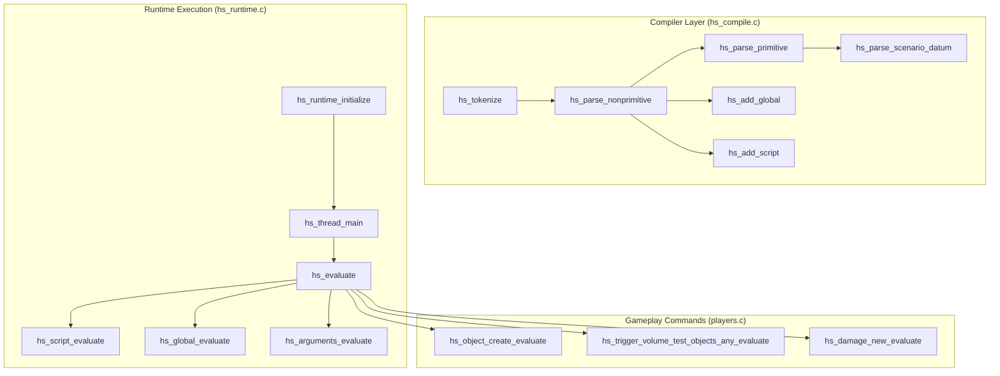

# Halo 2276 Recovery Report: Batch 1.1 HaloScript Function Recovery

> Authoritative name recovery for 112 ported HaloScript (`hs`) functions from Xbox debug build 2276 debug symbols (`halo_2276_functions.txt`).

## Executive Summary

| Metric | Value |
|---|---|
| **Target Build** | Halo Xbox debug build 2276 (`cachebeta.xbe`, MD5 `c7869590a1c64ad034e49a5ee0c02465`) |
| **Primary Evidence Source** | `halo_2276_functions.txt` (T1 direct target binary debug symbols) |
| **Functions Recovered** | **112 ported `FUN_` functions** (+ 2 misnamed functions disambiguated) |
| **Register ABI Drift** | **0 drift, 0 missing, 0 stale** (`extract_reg_args.py --check` passed) |
| **Build Status** | **Clean pass** (`cmake --build build --target halo`) |
| **Hazards** | **0 blockers / 0 new hazards** (`check_lift_hazards.py --changed-only` passed) |

---

## Subsystem Architecture Overview

HaloScript functions operate across three primary layers:
1. **Compiler & AST Parser (`src/halo/hs/hs_compile.c`)**: Tokenizes S-expressions, verifies argument types against formal signatures, parses scenario references (triggers, flags, cutscenes, objects), and builds script / global definitions.
2. **Runtime Engine (`src/halo/hs/hs_runtime.c`)**: Manages script threads, expression evaluation, global variable read/write reconciliation barriers, type coercion, and debugger inspection.
3. **Gameplay Command Evaluators (`src/halo/game/players.c`)**: Dispatches engine builtins called by scripts (object lifecycle, trigger volume queries, damage effects, audio gain control).

---

## Naming Collision Resolution

A critical naming collision was detected and resolved during recovery:
- **`0x000CA700`**: Debug symbol is `_hs_runtime_initialize`. Previously left as `FUN_000CA700` in `hs_runtime.c:2633`. It allocates the `"hs thread"` and `"hs globals"` data pools and asserts on `"raise MAXIMUM_NUMBER_OF_HS_GLOBALS."`. This is the authentic `hs_runtime_initialize`.
- **`0x000CE1C0`**: Debug symbol is `_object_lists_initialize_for_new_map`. It was previously mistakenly named `hs_runtime_initialize` in `kb.json` and `hs_runtime.c:4716` because it calls `data_delete_all` on `hs_object_list_*_data`.
- **`0x000CE1E0`**: Debug symbol is `_object_lists_dispose_from_old_map`. It was previously mistakenly named `hs_runtime_dispose` in `kb.json` and `hs_runtime.c:4728`.

**Resolution**: `0x000ce1c0` and `0x000ce1e0` were updated to their authentic debug names, allowing `0x000ca700` to take its authentic name `hs_runtime_initialize` with zero symbol conflict.

---

## Register Calling Conventions (@<reg>)

17 functions employ register-argument calling conventions. In accordance with project doctrine, all register bindings were strictly preserved:

| Address | Function Name | Register Annotations | Complete Declaration |
|---|---|---|---|
| `0xc57d0` | `hs_find_string_constant` | `@ebx` | `int FUN_000c57d0(char *str@<ebx>);` |
| `0xc5840` | `hs_parse_variable` | `@eax` | `bool FUN_000c5840(int datum_index @<eax>);` |
| `0xc6130` | `hs_parse_scenario_datum` | `@eax`, `@ebx`, `@edi` | `bool FUN_000c6130(int datum_index @<eax>, void *tag_block @<ebx>, int element_size @<edi>, short offset);` |
| `0xc6a70` | `hs_concatenate_string_constant` | `@eax` | `int FUN_000c6a70(char *str @<eax>);` |
| `0xc73a0` | `hs_parse_primitive` | `@edi` | `bool FUN_000c73a0(int datum_index @<edi>);` |
| `0xc74c0` | `hs_parse_nonprimitive` | `@ebx` | `bool FUN_000c74c0(int datum_index @<ebx>);` |
| `0xc7be0` | `hs_tokenize` | `@eax` | `int FUN_000c7be0(char **cursor@<eax>);` |
| `0xc9f90` | `hs_sound_get_gain_reference` | `@esi` | `void *FUN_000c9f90(const char *sound_name @<esi>);` |
| `0xcaa30` | `hs_thread_delete` | `@esi` | `void FUN_000caa30(int thread_handle@<esi>);` |
| `0xcada0` | `hs_find_thread_by_script` | `@edi` | `int FUN_000cada0(int16_t script_index@<edi>);` |
| `0xcb230` | `hs_global_reconcile_read` | `@edi` | `void FUN_000cb230(int loop_var@<edi>);` |
| `0xcb7b0` | `hs_global_reconcile_write` | `@ebx` | `void FUN_000cb7b0(int loop_var@<ebx>);` |
| `0xcc0a0` | `hs_global_evaluate` | `@eax` | `int FUN_000cc0a0(int16_t global_ref@<eax>);` |
| `0xcc1d0` | `hs_evaluate` | `@eax` | `void FUN_000cc1d0(int thread_handle@<eax>, int expression_index, void *dest_ptr);` |
| `0xcc340` | `hs_script_evaluate` | `@ax`, `@esi` | `void FUN_000cc340(int16_t script_index@<ax>, int thread_handle@<esi>, char init);` |
| `0xcc3a0` | `hs_arguments_evaluate` | `@eax` | `int FUN_000cc3a0(int thread_datum@<eax>, int16_t param_count, int formal_params, char init);` |
| `0xcd840` | `hs_thread_main` | `@eax` | `void FUN_000cd840(int thread_handle@<eax>);` |

---

## Full Function Inventory (112 Functions)

### 1. `hs_compile.obj` (`src/halo/hs/hs_compile.c`) — 31 Functions

| Address | Placeholder Name | Authentic Name | Signature / Description |
|---|---|---|---|
| `0xc57d0` | `FUN_000c57d0` | **`hs_find_string_constant`** | `int FUN_000c57d0(char *str@<ebx>);` *Looks up string literal in the compiler string pool, returning existing index or adding new entry.* |
| `0xc5840` | `FUN_000c5840` | **`hs_parse_variable`** | `bool FUN_000c5840(int datum_index @<eax>);` *Validates whether the identifier at datum_index names an in-scope script variable.* |
| `0xc5a20` | `FUN_000c5a20` | **`hs_parse_boolean`** | `bool FUN_000c5a20(int datum_index);` *Parses boolean literals 'true' / 'false' into AST constant datum.* |
| `0xc5b50` | `FUN_000c5b50` | **`hs_parse_real`** | `bool FUN_000c5b50(int datum_index);` *Parses floating-point literal strings into 32-bit real values.* |
| `0xc5c40` | `FUN_000c5c40` | **`hs_parse_integer`** | `bool FUN_000c5c40(int datum_index);` *Parses decimal and hexadecimal integer literal strings into long integers.* |
| `0xc5d60` | `FUN_000c5d60` | **`hs_parse_string`** | `bool FUN_000c5d60(int datum_index);` *Parses quoted string literals, handling escape characters and length limits.* |
| `0xc5de0` | `FUN_000c5de0` | **`hs_parse_script`** | `bool FUN_000c5de0(int datum_index);` *Resolves script identifier against compiled script headers in current scenario.* |
| `0xc5e90` | `FUN_000c5e90` | **`hs_parse_tag_reference`** | `bool FUN_000c5e90(int datum_index);` *Parses tag group 4-character code and tag path string reference.* |
| `0xc6130` | `FUN_000c6130` | **`hs_parse_scenario_datum`** | `bool FUN_000c6130(int datum_index @<eax>, void *tag_block @<ebx>, int element_size @<edi>, short offset);` *Generic matcher: searches scenario tag block by name string, checking element count and offset.* |
| `0xc6230` | `FUN_000c6230` | **`hs_parse_trigger_volume`** | `bool FUN_000c6230(int datum_index);` *Parses trigger volume name identifier against scenario trigger volume definitions.* |
| `0xc62a0` | `FUN_000c62a0` | **`hs_parse_cutscene_flag`** | `bool FUN_000c62a0(int datum_index);` *Parses cutscene flag identifier against scenario cutscene flag tag block.* |
| `0xc6310` | `FUN_000c6310` | **`hs_parse_cutscene_camera_point`** | `bool FUN_000c6310(int datum_index);` *Parses cutscene camera point identifier against scenario camera points block.* |
| `0xc6380` | `FUN_000c6380` | **`hs_parse_cutscene_title`** | `bool FUN_000c6380(int datum_index);` *Parses cutscene title text identifier against scenario titles block.* |
| `0xc63f0` | `FUN_000c63f0` | **`hs_parse_cutscene_recording`** | `bool FUN_000c63f0(int datum_index);` *Parses recorded animation identifier against scenario recorded animations block.* |
| `0xc6460` | `FUN_000c6460` | **`hs_parse_device_group`** | `bool FUN_000c6460(int datum_index);` *Parses device group name identifier against scenario device groups block.* |
| `0xc64d0` | `FUN_000c64d0` | **`hs_parse_ai`** | `bool FUN_000c64d0(int datum_index);` *Parses encounter or squad name identifier against scenario AI encounter structures.* |
| `0xc6580` | `FUN_000c6580` | **`hs_parse_ai_command_list`** | `bool FUN_000c6580(int datum_index);` *Parses AI command list identifier against scenario AI command lists block.* |
| `0xc65f0` | `FUN_000c65f0` | **`hs_parse_starting_profile`** | `bool FUN_000c65f0(int datum_index);` *Parses player starting profile identifier against scenario starting profiles block.* |
| `0xc6660` | `FUN_000c6660` | **`hs_parse_conversation`** | `bool FUN_000c6660(int datum_index);` *Parses conversation name identifier against scenario AI conversations block.* |
| `0xc66d0` | `FUN_000c66d0` | **`hs_parse_object_name`** | `bool FUN_000c66d0(int datum_index);` *Parses scenario object placement name identifier against scenario object definitions.* |
| `0xc6810` | `FUN_000c6810` | **`hs_parse_object`** | `bool FUN_000c6810(int datum_index);` *Parses object datum reference token into typed object handle.* |
| `0xc68b0` | `FUN_000c68b0` | **`hs_parse_navpoint`** | `bool FUN_000c68b0(int datum_index);` *Parses HUD navpoint type identifier against hud globals definitions.* |
| `0xc6940` | `FUN_000c6940` | **`hs_parse_hud_message`** | `bool FUN_000c6940(int datum_index);` *Parses HUD message index identifier against scenario hud message strings.* |
| `0xc69d0` | `FUN_000c69d0` | **`hs_parse_object_list`** | `bool FUN_000c69d0(int datum_index);` *Parses object list identifier or constructor expression into object list token.* |
| `0xc6a70` | `FUN_000c6a70` | **`hs_concatenate_string_constant`** | `int FUN_000c6a70(char *str @<eax>);` *Appends string chunk into compiler string storage buffer, asserting on overflow.* |
| `0xc6b00` | `FUN_000c6b00` | **`hs_add_global`** | `bool FUN_000c6b00(int datum_index);` *Registers global variable definition node in AST, initializing type and default value expression.* |
| `0xc6d90` | `FUN_000c6d90` | **`hs_add_script`** | `bool FUN_000c6d90(int datum_index);` *Registers top-level script definition node (startup, continuous, dormant, or command script).* |
| `0xc73a0` | `FUN_000c73a0` | **`hs_parse_primitive`** | `bool FUN_000c73a0(int datum_index @<edi>);` *Parses primitive AST tokens (constants, variables, literals) and binds data types.* |
| `0xc74c0` | `FUN_000c74c0` | **`hs_parse_nonprimitive`** | `bool FUN_000c74c0(int datum_index @<ebx>);` *Parses compound non-primitive S-expressions, dispatching function calls and special forms.* |
| `0xc7be0` | `FUN_000c7be0` | **`hs_tokenize`** | `int FUN_000c7be0(char **cursor@<eax>);` *Lexer: consumes whitespace, comments, delimiters, and extracts next script token substring.* |
| `0xc85b0` | `FUN_000c85b0` | **`hs_parse_logical`** | `bool FUN_000c85b0(int16_t function_index, int datum_index);` *Validates and parses short-circuiting logical operations ('and', 'or').* |

### 2. `hs_runtime.obj` (`src/halo/hs/hs_runtime.c`) — 54 Functions

| Address | Placeholder Name | Authentic Name | Signature / Description |
|---|---|---|---|
| `0xc8720` | `FUN_000c8720` | **`hs_parse_arithmetic`** | `bool FUN_000c8720(int16_t function_index, int expression_index);` *Typechecks and binds arithmetic operator syntax (+, -, *, /, min, max).* |
| `0xc88b0` | `FUN_000c88b0` | **`hs_parse_equality`** | `bool FUN_000c88b0(int function_index, int expression_index);` *Typechecks and binds equality operator syntax (=).* |
| `0xc89c0` | `FUN_000c89c0` | **`hs_parse_inequality`** | `bool FUN_000c89c0(int function_index, int expression_index);` *Typechecks and binds relational inequality operator syntax (<, >, <=, >=).* |
| `0xc8d30` | `FUN_000c8d30` | **`hs_parse_wake`** | `bool FUN_000c8d30(int function_index, int script_node);` *Typechecks arguments for 'wake' script activation command.* |
| `0xc8f40` | `FUN_000c8f40` | **`hs_parse_debug_string`** | `bool FUN_000c8f40(int16_t function_index, int expression_index);` *Validates format string and arguments for debug print statements.* |
| `0xc95c0` | `FUN_000c95c0` | **`hs_not`** | `unsigned char FUN_000c95c0(unsigned char value);` *Runtime execution of boolean logical NOT operator.* |
| `0xc95d0` | `FUN_000c95d0` | **`hs_print`** | `void FUN_000c95d0(int param_1);` *Emits string or numeric argument to game console and debug log buffer.* |
| `0xc95f0` | `FUN_000c95f0` | **`hs_players`** | `int FUN_000c95f0(void);` *Collects all active local and remote player object handles into an object list datum.* |
| `0xc9650` | `FUN_000c9650` | **`hs_trigger_volume_test_objects`** | `unsigned char FUN_000c9650(int16_t bit_index, int object_list, int state);` *Tests whether any object in list intersects specified trigger volume bounds.* |
| `0xc9700` | `FUN_000c9700` | **`hs_unit_can_see_object`** | `char FUN_000c9700(int param_1, int param_2, float param_3);` *Tests line-of-sight and cone-of-vision visibility between unit and object.* |
| `0xc9770` | `FUN_000c9770` | **`hs_objects_can_see_object`** | `unsigned char FUN_000c9770(int arg0, int arg1, float arg2);` *Tests visibility between two arbitrary object handles considering obstacles.* |
| `0xc9840` | `FUN_000c9840` | **`hs_objects_can_see_flag`** | `unsigned char FUN_000c9840(int arg0, short flag_index, float arg2);` *Tests line-of-sight visibility between an object and a scenario cutscene flag position.* |
| `0xc9990` | `FUN_000c9990` | **`hs_object_create`** | `void FUN_000c9990(int16_t index);` *Spawns a scenario-placed object by index into the active game simulation world.* |
| `0xc99e0` | `FUN_000c99e0` | **`hs_object_destroy`** | `void FUN_000c99e0(int datum);` *Despawns and deletes an active object datum from the object pool.* |
| `0xc9a20` | `FUN_000c9a20` | **`hs_object_destroy_by_name`** | `void FUN_000c9a20(int16_t index);` *Finds and despawns a scenario object given its scenario object name index.* |
| `0xc9a50` | `FUN_000c9a50` | **`hs_object_destroy_all`** | `void FUN_000c9a50(void);` *Despawns and deletes all scenario-placed objects currently in the game world.* |
| `0xc9b90` | `FUN_000c9b90` | **`hs_object_create_containing`** | `void FUN_000c9b90(int substring);` *Spawns all scenario-placed objects whose names contain the given substring.* |
| `0xc9bb0` | `FUN_000c9bb0` | **`hs_object_destroy_containing`** | `void FUN_000c9bb0(int substring);` *Despawns all scenario-placed objects whose names contain the given substring.* |
| `0xc9bd0` | `FUN_000c9bd0` | **`hs_object_list_get_element`** | `int FUN_000c9bd0(int object_list, short index);` *Extracts the object handle at the specified index from an object list datum.* |
| `0xc9c10` | `FUN_000c9c10` | **`hs_object_set_shield`** | `void FUN_000c9c10(int object_handle, float fraction);` *Sets current shield vitality fraction [0.0, 1.0] for the specified object.* |
| `0xc9c80` | `FUN_000c9c80` | **`hs_object_set_permutation`** | `void FUN_000c9c80(int object_handle, int region_name, int permutation_name);` *Applies model permutation switch to the specified object render region.* |
| `0xc9d40` | `FUN_000c9d40` | **`hs_objects_predict`** | `void FUN_000c9d40(int object_list);` *Triggers background resource pre-fetching/prediction for object tag data.* |
| `0xc9d80` | `FUN_000c9d80` | **`hs_objects_delete_by_definition`** | `void FUN_000c9d80(int tag_index);` *Deletes all active game objects matching the specified tag definition index.* |
| `0xc9de0` | `FUN_000c9de0` | **`hs_effect_new`** | `void FUN_000c9de0(int effect_tag_index, short flag_index);` *Spawns visual/particle effect at scenario cutscene flag location.* |
| `0xc9e50` | `FUN_000c9e50` | **`hs_effect_new_from_object_marker`** | `void FUN_000c9e50(int effect_tag_index, int object_handle, int marker_name);` *Spawns effect attached to named marker position on a specified object.* |
| `0xc9ec0` | `FUN_000c9ec0` | **`hs_damage_new`** | `void FUN_000c9ec0(int damage_effect_tag_index, short flag_index);` *Applies damage effect to scenario location specified by cutscene flag.* |
| `0xc9f30` | `FUN_000c9f30` | **`hs_damage_object`** | `void FUN_000c9f30(int damage_effect_tag_index, int object_handle);` *Applies damage effect directly to a targeted object datum.* |
| `0xc9f90` | `FUN_000c9f90` | **`hs_sound_get_gain_reference`** | `void *FUN_000c9f90(const char *sound_name @<esi>);` *Looks up sound tag definition and returns pointer to runtime gain multiplier field.* |
| `0xca050` | `FUN_000ca050` | **`hs_trigger_volume_test_objects_all`** | `unsigned char FUN_000ca050(int16_t bit_index, int object_list);` *Tests whether all objects in the specified list are contained within trigger volume.* |
| `0xca0f0` | `FUN_000ca0f0` | **`hs_trigger_volume_test_objects_any`** | `unsigned char FUN_000ca0f0(int16_t, int);` *Tests whether any object in the specified list is contained within trigger volume.* |
| `0xca110` | `FUN_000ca110` | **`hs_object_create_anew`** | `void FUN_000ca110(int16_t index);` *Deletes existing instance of scenario object (if alive) and respawns it anew at default transform.* |
| `0xca3f0` | `FUN_000ca3f0` | **`hs_object_teleport`** | `void FUN_000ca3f0(int a, int b);` *Teleports specified object to coordinate transform of target cutscene flag.* |
| `0xca430` | `FUN_000ca430` | **`hs_teleport_players_not_in_trigger_volume`** | `void FUN_000ca430(int cluster_index, int param_2);` *Identifies players outside trigger volume and teleports them to designated rally point.* |
| `0xca4e0` | `FUN_000ca4e0` | **`hs_inspect_boolean`** | `void FUN_000ca4e0(int16_t type, bool value, char *buffer);` *Formats boolean value into human-readable string buffer for script debugger.* |
| `0xca530` | `FUN_000ca530` | **`hs_inspect_real`** | `void FUN_000ca530(int16_t type, float value, char *buffer);` *Formats real floating-point value into string buffer for script debugger.* |
| `0xca580` | `FUN_000ca580` | **`hs_inspect_short_integer`** | `void FUN_000ca580(int16_t type, int16_t value, char *buffer);` *Formats 16-bit short integer into decimal string for script debugger.* |
| `0xca5d0` | `FUN_000ca5d0` | **`hs_inspect_long_integer`** | `void FUN_000ca5d0(int16_t type, long value, char *buffer);` *Formats 32-bit long integer into decimal string for script debugger.* |
| `0xca620` | `FUN_000ca620` | **`hs_inspect_string`** | `void FUN_000ca620(int16_t type, const char *value, char *buffer);` *Copies and sanitizes script string value for debugger display buffer.* |
| `0xca670` | `FUN_000ca670` | **`hs_inspect_enum`** | `void FUN_000ca670(int16_t type, int16_t enum_value, char *buffer);` *Looks up enum definition table and formats enum integer to string token.* |
| `0xca700` | `FUN_000CA700` | **`hs_runtime_initialize`** | `void FUN_000CA700(void);` *Core HaloScript subsystem initialization: allocates 'hs thread' and 'hs globals' game state data pools.* |
| `0xcaa30` | `FUN_000caa30` | **`hs_thread_delete`** | `void FUN_000caa30(int thread_handle@<esi>);` *Terminates and destroys a HaloScript execution thread datum, freeing call stack.* |
| `0xcada0` | `FUN_000cada0` | **`hs_find_thread_by_script`** | `int FUN_000cada0(int16_t script_index@<edi>);` *Finds the active thread datum executing a given scenario script index.* |
| `0xcae80` | `FUN_000cae80` | **`hs_long_to_boolean`** | `int FUN_000cae80(int param_1);` *Coerces 32-bit integer value to boolean (0 -> false, non-zero -> true).* |
| `0xcaea0` | `FUN_000caea0` | **`hs_short_to_boolean`** | `int FUN_000caea0(int param_1);` *Coerces 16-bit integer value to boolean (0 -> false, non-zero -> true).* |
| `0xcaf20` | `FUN_000caf20` | **`hs_enum_to_real`** | `int FUN_000caf20(int16_t param_1);` *Coerces 16-bit enumeration value to 32-bit real floating point representation.* |
| `0xcaf80` | `FUN_000caf80` | **`hs_object_name_to_object_list`** | `int FUN_000caf80(int16_t index);` *Resolves scenario object name index into a singleton object list handle.* |
| `0xcafc0` | `FUN_000cafc0` | **`hs_object_to_object_list`** | `int FUN_000cafc0(int object_handle);` *Wraps an individual object handle into a singleton object list datum.* |
| `0xcb230` | `FUN_000cb230` | **`hs_global_reconcile_read`** | `void FUN_000cb230(int loop_var@<edi>);` *Global read barrier: synchronizes external game engine variables into HaloScript globals.* |
| `0xcb7b0` | `FUN_000cb7b0` | **`hs_global_reconcile_write`** | `void FUN_000cb7b0(int loop_var@<ebx>);` *Global write barrier: synchronizes mutated HaloScript globals back to engine subsystems.* |
| `0xcc0a0` | `FUN_000cc0a0` | **`hs_global_evaluate`** | `int FUN_000cc0a0(int16_t global_ref@<eax>);` *Evaluates the current runtime value of a global variable reference node.* |
| `0xcc1d0` | `FUN_000cc1d0` | **`hs_evaluate`** | `void FUN_000cc1d0(int thread_handle@<eax>, int expression_index, void *dest_ptr);` *Recursive expression evaluator: dispatches AST node evaluation within thread context.* |
| `0xcc340` | `FUN_000cc340` | **`hs_script_evaluate`** | `void FUN_000cc340(int16_t script_index@<ax>, int thread_handle@<esi>, char init);` *Initializes thread call frame and begins evaluation of script body.* |
| `0xcc3a0` | `FUN_000cc3a0` | **`hs_arguments_evaluate`** | `int FUN_000cc3a0(int thread_datum@<eax>, int16_t param_count, int formal_params, char init);` *Evaluates parameter expressions and populates formal argument array for callee.* |
| `0xcd840` | `FUN_000cd840` | **`hs_thread_main`** | `void FUN_000cd840(int thread_handle@<eax>);` *Main interpreter loop: advances instruction pointer, handles sleeps and yields for thread.* |

### 3. `players.obj` (`src/halo/game/players.c`) — 27 Functions

| Address | Placeholder Name | Authentic Name | Signature / Description |
|---|---|---|---|
| `0xbdef0` | `FUN_000bdef0` | **`hs_not_evaluate`** | `void FUN_000bdef0(int16_t function_index, int thread_datum, char init);` *HaloScript command evaluator for '(not ...)' expression.* |
| `0xbdf40` | `FUN_000bdf40` | **`hs_print_evaluate`** | `void FUN_000bdf40(int16_t function_index, int thread_datum, char init);` *HaloScript command evaluator for '(print ...)' debug output.* |
| `0xbdf80` | `FUN_000bdf80` | **`hs_players_evaluate`** | `void FUN_000bdf80(int16_t function_index, int thread_handle);` *HaloScript command evaluator for '(players)' object list query.* |
| `0xbdfa0` | `FUN_000bdfa0` | **`hs_teleport_players_not_in_trigger_volume_evaluate`** | `void FUN_000bdfa0(int16_t function_index, int thread_datum, char init);` *HaloScript command evaluator for teleporting players outside a trigger volume.* |
| `0xbe030` | `FUN_000be030` | **`hs_trigger_volume_test_objects_any_evaluate`** | `void FUN_000be030(int16_t function_index, int thread_datum, char init);` *HaloScript command evaluator for '(volume_test_objects_any ...)' query.* |
| `0xbe080` | `FUN_000be080` | **`hs_trigger_volume_test_objects_all_evaluate`** | `void FUN_000be080(int16_t function_index, int thread_datum, char init);` *HaloScript command evaluator for '(volume_test_objects_all ...)' query.* |
| `0xbe0d0` | `FUN_000be0d0` | **`hs_object_create_evaluate`** | `void FUN_000be0d0(int16_t function_index, int thread_datum, char init);` *HaloScript command evaluator for '(object_create ...)' spawn command.* |
| `0xbe110` | `FUN_000be110` | **`hs_object_destroy_evaluate`** | `void FUN_000be110(int16_t function_index, int thread_datum, char init);` *HaloScript command evaluator for '(object_destroy ...)' despawn command.* |
| `0xbe150` | `FUN_000be150` | **`hs_object_create_anew_evaluate`** | `void FUN_000be150(int16_t function_index, int thread_datum, char init);` *HaloScript command evaluator for '(object_create_anew ...)' respawn command.* |
| `0xbe190` | `FUN_000be190` | **`hs_object_create_containing_evaluate`** | `void FUN_000be190(int16_t function_index, int thread_datum, char init);` *HaloScript command evaluator for '(object_create_containing ...)' substring spawn.* |
| `0xbe1d0` | `FUN_000be1d0` | **`hs_object_create_anew_containing_evaluate`** | `void FUN_000be1d0(int16_t function_index, int thread_datum, char init);` *HaloScript command evaluator for '(object_create_anew_containing ...)' substring respawn.* |
| `0xbe210` | `FUN_000be210` | **`hs_object_destroy_containing_evaluate`** | `void FUN_000be210(int16_t function_index, int thread_datum, char init);` *HaloScript command evaluator for '(object_destroy_containing ...)' substring despawn.* |
| `0xbe250` | `FUN_000be250` | **`hs_object_destroy_all_evaluate`** | `void FUN_000be250(int16_t function_index, int thread_datum, char init);` *HaloScript command evaluator for '(object_destroy_all)' global despawn.* |
| `0xbe270` | `FUN_000be270` | **`hs_object_teleport_evaluate`** | `void FUN_000be270(int16_t function_index, int thread_datum, char init);` *HaloScript command evaluator for '(object_teleport ...)' movement command.* |
| `0xbe2b0` | `FUN_000be2b0` | **`hs_object_set_facing_evaluate`** | `void FUN_000be2b0(int16_t function_index, int thread_datum, char init);` *HaloScript command evaluator for '(object_set_facing ...)' orientation command.* |
| `0xbe2f0` | `FUN_000be2f0` | **`hs_object_set_shield_evaluate`** | `void FUN_000be2f0(int16_t function_index, int thread_datum, char init);` *HaloScript command evaluator for '(object_set_shield ...)' vitality command.* |
| `0xbe330` | `FUN_000be330` | **`hs_object_set_permutation_evaluate`** | `void FUN_000be330(int16_t function_index, int thread_datum, char init);` *HaloScript command evaluator for '(object_set_permutation ...)' mesh variation command.* |
| `0xbe370` | `FUN_000be370` | **`hs_object_list_get_element_evaluate`** | `void FUN_000be370(int16_t function_index, int thread_datum, char init);` *HaloScript command evaluator for '(list_get ...)' element retrieval command.* |
| `0xbe440` | `FUN_000be440` | **`hs_effect_new_from_object_marker_evaluate`** | `void FUN_000be440(int16_t function_index, int thread_datum, char init);` *HaloScript command evaluator for '(effect_new_on_object_marker ...)' spawning.* |
| `0xbe480` | `FUN_000be480` | **`hs_damage_new_evaluate`** | `void FUN_000be480(int16_t function_index, int thread_datum, char init);` *HaloScript command evaluator for '(damage_new ...)' point damage application.* |
| `0xbe4c0` | `FUN_000be4c0` | **`hs_damage_object_evaluate`** | `void FUN_000be4c0(int16_t function_index, int thread_datum, char init);` *HaloScript command evaluator for '(damage_object ...)' targeted object damage.* |
| `0xbe500` | `FUN_000be500` | **`hs_objects_can_see_object_evaluate`** | `void FUN_000be500(int16_t function_index, int thread_datum, char init);` *HaloScript command evaluator for '(objects_can_see_object ...)' visibility query.* |
| `0xbe550` | `FUN_000be550` | **`hs_objects_can_see_flag_evaluate`** | `void FUN_000be550(int16_t function_index, int thread_datum, char init);` *HaloScript command evaluator for '(objects_can_see_flag ...)' flag visibility query.* |
| `0xbe5a0` | `FUN_000be5a0` | **`hs_objects_delete_by_definition_evaluate`** | `void FUN_000be5a0(int16_t function_index, int thread_datum, char init);` *HaloScript command evaluator for '(objects_delete_by_definition ...)' mass cleanup.* |
| `0xbe5e0` | `FUN_000be5e0` | **`hs_sound_set_gain_evaluate`** | `void FUN_000be5e0(int16_t function_index, int thread_handle, char init);` *HaloScript command evaluator for '(sound_set_gain ...)' audio level command.* |
| `0xbe620` | `FUN_000be620` | **`hs_sound_get_gain_evaluate`** | `void FUN_000be620(int16_t function_index, int thread_handle, char init);` *HaloScript command evaluator for '(sound_get_gain ...)' audio query command.* |
| `0xbeb70` | `FUN_000beb70` | **`hs_objects_predict_evaluate`** | `void FUN_000beb70(int16_t function_index, int thread_datum, char init);` *HaloScript command evaluator for '(predict_objects ...)' texture/sound preload.* |

---

## Evidence Ledger & Verification

| Tier | Source | Role in Decision |
|---|---|---|
| **T1 Direct Binary** | `halo_2276_functions.txt` | Ground-truth symbol table extracted from debug build 2276 (`cachebeta.xbe`). CONFIRMED identity for all 112 functions. |
| **T2 Repository** | `src/halo/hs/hs_compile.c`, `src/halo/hs/hs_runtime.c`, `src/halo/game/players.c` | Corroborating implementation bodies, assert strings (`"c:\\halo\\SOURCE\\hs\\hs_runtime.c"`), and call hierarchies. |
| **T2 Audit** | `tools/audit/extract_reg_args.py --check` | Verified zero calling convention or register argument drift across all 886 registered `@<reg>` symbols. |
| **T2 Build** | `cmake --build build --target halo` | Verified clean compilation and binary linking into patched XBE without missing export symbols. |
| **T2 Audit** | `tools/audit/check_lift_hazards.py --changed-only` | Verified 0 blockers or regressions in touched translation units. |
