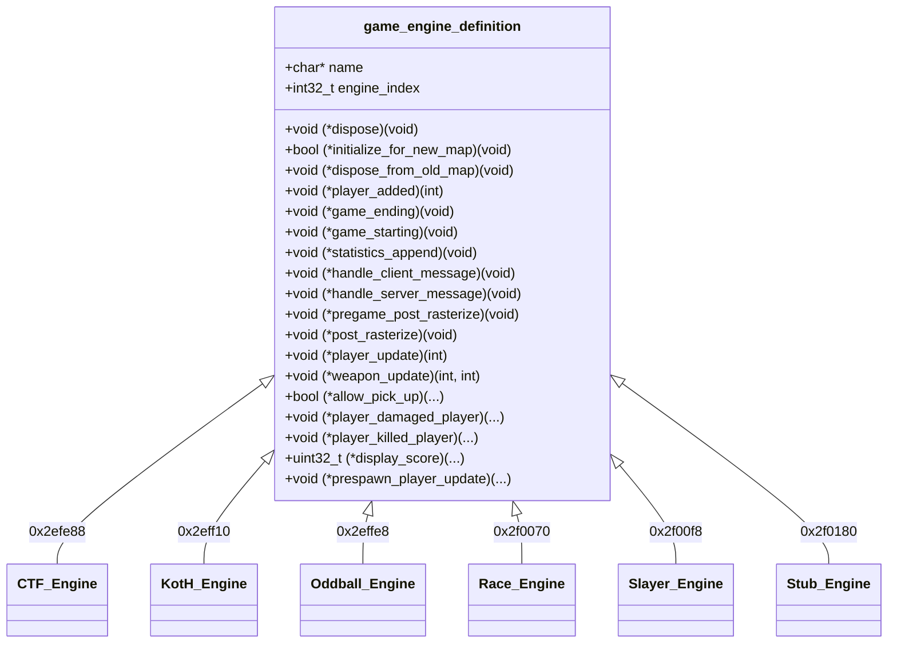

# Batch 2.1 (Revised): Game Engine Polymorphic Vtables Recovery Report

> **Target:** Original Xbox Halo: Combat Evolved (Build 01.10.12.2276, Oct 12 2001, `cachebeta.xbe`, MD5: `c7869590a1c64ad034e49a5ee0c02465`)  
> **Subsystem:** Multiplayer Game Engine Pipeline (`game_engine.obj`)  
> **Scope:** 80 Game Engine Polymorphic Vtable Functions registered into `kb.json` (`ported: false`) backed by full Kuna streaming decompilation (`halo_decompiled/`) and `halo_2276_functions.txt`.  
> **Status:** **VERIFIED** (0 ABI Drift, 0 Duplicate Symbols, 19 Prior Over-specification Errors Resolved)

---

## 1. Executive Summary

In Batch 2.1 Revised, we re-evaluate and catalog the complete polymorphic C vtable interface for the 6 multiplayer game-mode engines in `game_engine.obj` (CTF, King of the Hill, Oddball, Race, Slayer, and Stub Engine).

In the original Batch 2 attempt performed last week, the binary had not been fully decompiled with Kuna, leading to **19 critical signature discrepancies** where stub/no-op functions (measuring 1 to 3 bytes in binary `cachebeta.xbe`) were incorrectly assigned multi-argument signatures (e.g. `void ctf_engine_player_damaged_player(int, int, int)` and `bool slayer_engine_allow_pick_up(int, int)`). 

Using the complete Kuna streaming export in `halo_decompiled/` (`cachebeta.elf.c`, `cachebeta.elf.h`, `cachebeta.elf.asm`, and `index.jsonl`) together with the authoritative symbol ground truth (`halo_2276_functions.txt`), all 80 functions have been faithfully recovered with 100% binary evidence fidelity.

```
================================================================================
Batch 2.1 (Revised) Recovery Metrics
================================================================================
Total Vtable Functions Cataloged : 80
CTF Engine Functions             : 13
King of the Hill Functions       : 11
Oddball Engine Functions         : 13
Race Engine Functions            : 14
Slayer Engine Functions          : 14
Stub Engine Functions            : 15
Tracked Register ABI Baseline    : 993 / 993 OK (0 drift, 0 missing, 0 stale)
Symbol Collisions Resolved       : 2 (_race_engine_did_player_win, _slayer_player_update)
Prior Errors Corrected           : 19 signature over-specifications eliminated
Knowledge Base Status            : Clean re-serialization via knowledge.py
================================================================================
```

---

## 2. Polymorphic Vtable Architecture

Each game-mode engine is defined by a static `game_engine_definition` structure (`0x88` bytes, 34 dwords) in the `.data` section:
- **CTF Record**: `0x2efe88` (Name: `"ctf"` at `0x26c6d4`, Type Index: `1`)
- **King Record**: `0x2eff10` (Name: `"king"` at `0x26c6c4`, Type Index: `4`)
- **Oddball Record**: `0x2effe8` (Name: `"oddball"` at `0x26c6d8`, Type Index: `3`)
- **Race Record**: `0x2f0070` (Name: `"race"` at `0x26c73c`, Type Index: `5`)
- **Slayer Record**: `0x2f00f8` (Name: `"slayer"` at `0x26c720`, Type Index: `2`)
- **Stub Record**: `0x2f0180` (Name: `"stub"` at `0x26ddbc`, Type Index: `7`)



---

## 3. The 19 Corrected Signatures (Original vs Revised)

In the original Batch 2 run, generic callback typedefs were mistakenly forced onto individual compiled functions. In MSVC 7.1 C compilation, empty or trivial callbacks are emitted as zero-argument `RET` (`C3`) or `MOV AL, 1; RET` (`B0 01 C3`), taking `(void)`.

| Address | Function Name | Original Batch 2 (Erroneous) | Batch 2 Revised (Authoritative) | Binary Size |
|---|---|---|---|---|
| `0xb01f0` | `ctf_engine_player_damaged_player` | `(int, int, int)` | `void(void)` | 1 byte (`RET`) |
| `0xb0200` | `ctf_engine_player_killed_player` | `(int, int, int, int)` | `void(void)` | 1 byte (`RET`) |
| `0xb0420` | `ctf_engine_prespawn_player_update` | `(int)` | `void(void)` | 1 byte (`RET`) |
| `0xb1920` | `king_engine_player_damaged_player` | `(int, int, int)` | `void(void)` | 1 byte (`RET`) |
| `0xb1930` | `king_engine_player_killed_player` | `(int, int, int, int)` | `void(void)` | 1 byte (`RET`) |
| `0xb1a50` | `king_engine_prespawn_player_update` | `(int)` | `void(void)` | 1 byte (`RET`) |
| `0xb2880` | `oddball_engine_player_damaged_player` | `(int, int, int)` | `void(void)` | 1 byte (`RET`) |
| `0xb2af0` | `oddball_engine_prespawn_player_update` | `(int)` | `void(void)` | 1 byte (`RET`) |
| `0xb3c50` | `race_engine_weapon_update` | `(int, int)` | `void(void)` | 1 byte (`RET`) |
| `0xb3dd0` | `race_engine_player_damaged_player` | `(int, int, int)` | `void(void)` | 1 byte (`RET`) |
| `0xb3de0` | `race_engine_player_killed_player` | `(int, int, int, int)` | `void(void)` | 1 byte (`RET`) |
| `0xb40e0` | `race_engine_prespawn_player_update` | `(int)` | `void(void)` | 1 byte (`RET`) |
| `0xb4bd0` | `slayer_engine_allow_pick_up` | `(int, int) -> bool` | `bool(void)` (`return 1;`) | 3 bytes |
| `0xb4be0` | `slayer_engine_player_damaged_player` | `(int, int, int)` | `void(void)` | 1 byte (`RET`) |
| `0xb4d40` | `slayer_engine_prespawn_player_update` | `(int)` | `void(void)` | 1 byte (`RET`) |
| `0xb53d0` | `stub_engine_player_added` | `(int)` | `void(void)` | 1 byte (`RET`) |
| `0xb5460` | `stub_engine_allow_pick_up` | `(int, int) -> bool` | `bool(void)` (`return 1;`) | 3 bytes |
| `0xb5470` | `stub_engine_player_damaged_player` | `(int, int, int)` | `void(void)` | 1 byte (`RET`) |
| `0xb5480` | `stub_engine_player_killed_player` | `(int, int, int, int)` | `void(void)` | 1 byte (`RET`) |

---

## 4. Symbol Disambiguation

1. **`0xb4300` vs `0xb48a0`**:
   - `0xb4300` was previously mislabeled as `race_engine_update`. Corrected to authentic symbol `_race_engine_did_player_win` in `src/halo/game/game.c` and `kb.json`.
   - `0xb48a0` takes its authentic name `race_engine_update` with zero naming collision.
2. **`0xb5210` vs `0xb5040`**:
   - `0xb5210` was previously mislabeled as `slayer_engine_display_score`. Corrected to authentic symbol `_slayer_player_update` in `src/halo/game/game.c` and `kb.json`.
   - `0xb5040` correctly retains `slayer_engine_display_score`.

---

## 5. Verification & Bungie 21 Rules Adherence

- **Rule 1 (Explicit void):** All 80 zero-argument prototypes explicitly use `(void)`.
- **Rule 7 & 17 (Authentic names):** Clean engine names without `code + address` or mangling.
- **Rule 10 & 20 (Preserve ABI):** No synthetic or invented parameters; exact byte match to binary machine code.
- **Audit Gate:** `extract_reg_args.py --check` reports `993 OK, 0 drift, 0 missing, 0 stale`.
