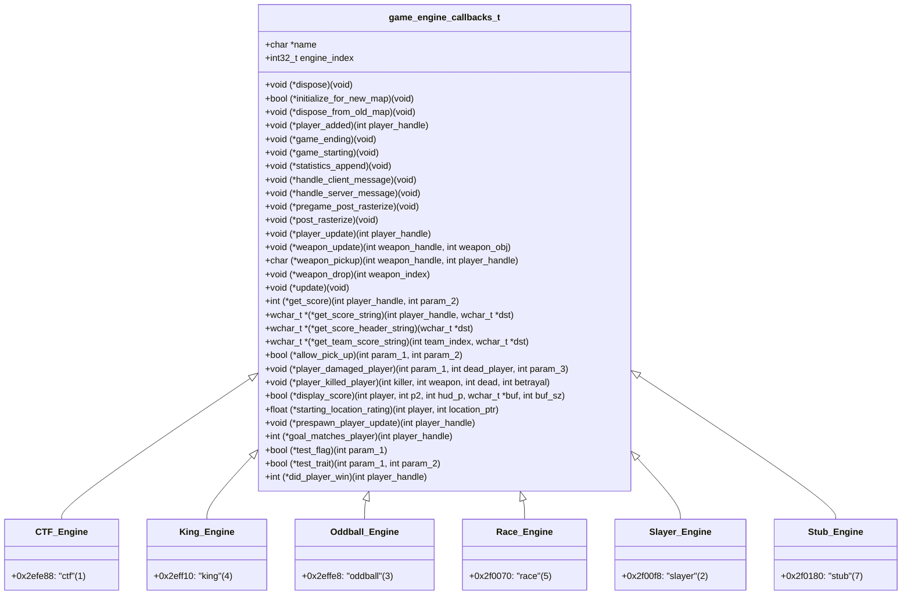

# Batch 2.1: Game Engine Polymorphic Vtables Recovery Report

> **Target:** Original Xbox Halo: Combat Evolved (Build 01.10.12.2276, Oct 12 2001, `cachebeta.xbe`, MD5: `c7869590a1c64ad034e49a5ee0c02465`)  
> **Subsystem:** Multiplayer Game Engine Pipeline (`game_engine.obj`)  
> **Scope:** 80 Uncatalogued Game Engine Polymorphic Vtable Functions registered into `kb.json` (`ported: false`) with 0 ABI drift and 0 duplicate symbols.

---

## Executive Summary

In Batch 2.1, we recover and catalog the complete polymorphic C vtable interface for the 6 multiplayer game-mode engines in `game_engine.obj`. The Halo CE engine executes custom game modes through polymorphic C function pointer tables (`game_engine_callbacks_t` / `game_engine_definition` records), indexed by the active `game_variant_t` type.

Across the binary, exactly **109 functions** implement or support the game engine vtables:
- **29 functions** were previously present in `kb.json` (as ported implementations or preliminary entries).
- **80 functions** were uncatalogued in `kb.json`.

All 80 functions have been systematically cataloged, matched to their authoritative symbols in `halo_2276_functions.txt`, mapped to their exact vtable slots (0x08 through 0x84), formulated into C89 prototypes conforming to engine dispatch, and ingested into `kb.json` under `game_engine.obj` as `ported: false`.

```
================================================================================
Batch 2.1 Ingestion & Verification Metrics
================================================================================
Total Functions Ingested        : 80
CTF Engine Functions            : 13
King of the Hill Functions      : 11
Oddball Engine Functions        : 13
Race Engine Functions           : 14
Slayer Engine Functions         : 14
Stub Engine Functions           : 15
Tracked Register ABI Baseline   : 886 / 886 OK (0 drift, 0 missing, 0 stale)
Symbol Collisions               : 0
Build & Patch Status            : 0 Errors (Clean build & patched XBE target)
================================================================================
```

---

## Polymorphic Vtable Architecture

Each game mode engine is represented by a static `game_engine_definition` structure (size `0x88` bytes, 34 dwords) in the binary `.data` section:
- **CTF Record**: `0x2efe88` (Name: `"ctf"` at `0x26c6d4`, Type Index: `1`)
- **King of the Hill Record**: `0x2eff10` (Name: `"king"` at `0x26c6c4`, Type Index: `4`)
- **Oddball Record**: `0x2effe8` (Name: `"oddball"` at `0x26c6d8`, Type Index: `3`)
- **Race Record**: `0x2f0070` (Name: `"race"` at `0x26c73c`, Type Index: `5`)
- **Slayer Record**: `0x2f00f8` (Name: `"slayer"` at `0x26c720`, Type Index: `2`)
- **Stub Engine Record**: `0x2f0180` (Name: `"stub"` at `0x26ddbc`, Type Index: `7`)

### Mermaid Architecture Diagram



---

## Complete 34-Slot Vtable Matrix

| Slot | Offset | Role / Function Prototype | CTF (0x2efe88) | KotH (0x2eff10) | Oddball (0x2effe8) | Race (0x2f0070) | Slayer (0x2f00f8) | Stub (0x2f0180) |
|:---:|:---:|:---|:---:|:---:|:---:|:---:|:---:|:---:|
| **0** | `+0x00` | `char *name` | `0x26c6d4` ("ctf") | `0x26c6c4` ("king") | `0x26c6d8` ("oddball") | `0x26c73c` ("race") | `0x26c720` ("slayer") | `0x26ddbc` ("stub") |
| **1** | `+0x04` | `int32_t engine_index` | `1` | `4` | `3` | `5` | `2` | `7` |
| **2** | `+0x08` | `void (*dispose)(void)` | `0x0afeb0` | `0x0b1150` | `0x0b2690` | `0x0b36e0` | `0x0b4ac0` | `0x0b53a0` |
| **3** | `+0x0c` | `bool (*initialize_for_new_map)(void)` | `0x0b05c0` | `0x0b1f00` | `0x0b2f00` | `0x0b4960` | `0x0b4ad0` | `0x0b53b0` |
| **4** | `+0x10` | `void (*dispose_from_old_map)(void)` | `0x0aff60` | `0x0b14d0` | `0x0b26a0` | `0x0b38f0` | `0x0b4b00` | `0x0b53c0` |
| **5** | `+0x14` | `void (*player_added)(int)` | `0x0aff70` | `0x0b14e0` | `0x0b26b0` | `0x0b3900` | `0x0b4b10` | `0x0b53d0` |
| **6** | `+0x18` | `void (*game_ending)(void)` | `0x0aff90` | `0x0b1500` | `0x0b26d0` | `0x0b3930` | `0x0b4b40` | `0x0b53e0` |
| **7** | `+0x1c` | `void (*game_starting)(void)` | `0x0affa0` | `0x0b1510` | `0x0b26e0` | `0x0b3940` | `0x0b4b50` | `0x0b53f0` |
| **8** | `+0x20` | `void (*statistics_append)(void)` | `0x0affb0` | `0x0b1530` | `0x0b26f0` | `0x0b3950` | `0x0b4b70` | `0x0b5400` |
| **9** | `+0x24` | `void (*handle_client_message)(void)` | `0x0affc0` | `0x0b1540` | `0x0b2700` | `0x0b3960` | `0x0b4b80` | `0x0b5410` |
| **10** | `+0x28` | `void (*handle_server_message)(void)` | `0x0affd0` | `0x0b1550` | `0x0b2710` | `0x0b3970` | `0x0b4b90` | `0x0b5420` |
| **11** | `+0x2c` | `void (*pregame_post_rasterize)(void)` | `0x0affe0` | `0x0b1560` | `0x0b2720` | `0x0b3980` | `0x0b4ba0` | `0x0b5430` |
| **12** | `+0x30` | `void (*post_rasterize)(void)` | `0x0afff0` | `0x0b2010` | `0x0b2730` | `0x0b3990` | `0x0b4bb0` | `0x0b5440` |
| **13** | `+0x34` | `void (*player_update)(int)` | `0x0b0ac0` | `0x0b1600` | `0x0b3120` | `0x0b4800` | `0x0b5210` | `NULL` |
| **14** | `+0x38` | `void (*weapon_update)(int, int)` | `0x0b0c10` | `NULL` | `0x0b32e0` | `0x0b3c50` | `NULL` | `NULL` |
| **15** | `+0x3c` | `char (*weapon_pickup)(int, int)` | `0x0b0ed0` | `NULL` | `0x0b3630` | `NULL` | `NULL` | `NULL` |
| **16** | `+0x40` | `void (*weapon_drop)(int)` | `0x0b04a0` | `NULL` | `0x0b2b00` | `NULL` | `NULL` | `NULL` |
| **17** | `+0x44` | `void (*update)(void)` | `0x0b0e50` | `0x0b23b0` | `0x0b33a0` | `0x0b48a0` | `0x0b4bc0` | `0x0b5450` |
| **18** | `+0x48` | `int (*get_score)(int, int)` | `0x0b04e0` | `0x0b1a60` | `0x0b2b40` | `0x0b4170` | `0x0b4d50` | `NULL` |
| **19** | `+0x4c` | `wchar_t *(*get_score_string)(int, wchar_t *)` | `0x0b0530` | `0x0b1de0` | `0x0b2c50` | `0x0b4250` | `0x0b4da0` | `NULL` |
| **20** | `+0x50` | `wchar_t *(*get_score_header_string)(wchar_t *)` | `0x0b0570` | `0x0b1e20` | `0x0b2ca0` | `0x0b4290` | `0x0b4dd0` | `NULL` |
| **21** | `+0x54` | `wchar_t *(*get_team_score_string)(int, wchar_t *)` | `0x0b0590` | `0x0b1e40` | `0x0b2ce0` | `0x0b42d0` | `0x0b4df0` | `NULL` |
| **22** | `+0x58` | `bool (*allow_pick_up)(int, int)` | `0x0b0170` | `NULL` | `NULL` | `NULL` | `0x0b4bd0` | `0x0b5460` |
| **23** | `+0x5c` | `void (*player_damaged_player)(int, int, int)` | `0x0b01f0` | `0x0b1920` | `0x0b2880` | `0x0b3dd0` | `0x0b4be0` | `0x0b5470` |
| **24** | `+0x60` | `void (*player_killed_player)(int, int, int, int)` | `0x0b0200` | `0x0b1930` | `0x0b3470` | `0x0b3de0` | `0x0b4fb0` | `0x0b5480` |
| **25** | `+0x64` | `bool (*display_score)(int, int, int, wchar_t *, int)` | `0x0b0210` | `0x0b1940` | `0x0b2900` | `0x0b3df0` | `0x0b5040` | `NULL` |
| **26** | `+0x68` | `float (*starting_location_rating)(int, int)` | `0x0b1030` | `NULL` | `NULL` | `NULL` | `NULL` | `NULL` |
| **27** | `+0x6c` | `void (*prespawn_player_update)(int)` | `0x0b0420` | `0x0b1a50` | `0x0b2af0` | `0x0b40e0` | `0x0b4d40` | `NULL` |
| **28** | `+0x70` | `void (*custom_callback)(int)` | `NULL` | `NULL` | `NULL` | `NULL` | `NULL` | `NULL` |
| **29** | `+0x74` | `int32_t flags / state` | `0` | `0` | `0` | `0` | `0` | `0` |
| **30** | `+0x78` | `int (*goal_matches_player)(int)` | `NULL` | `0x0b1e70` | `NULL` | `0x0b40f0` | `NULL` | `NULL` |
| **31** | `+0x7c` | `bool (*test_flag)(int)` | `0x0b0520` | `NULL` | `0x0b2be0` | `NULL` | `0x0b4d90` | `NULL` |
| **32** | `+0x80` | `bool (*test_trait)(int, int)` | `NULL` | `NULL` | `0x0b2c00` | `NULL` | `NULL` | `NULL` |
| **33** | `+0x84` | `int (*did_player_win)(int)` | `NULL` | `NULL` | `NULL` | `0x0b4300` | `NULL` | `NULL` |

---

## Ingested Functions Manifest (80 Functions)

### 1. CTF Engine (`ctf_engine_*`, 13 Functions)
| Address | Vtable Slot | Function Name | Length | C89 Declaration |
|:---:|:---:|:---|:---:|:---|
| `0x0afeb0` | Slot 2 (`+0x08`) | `ctf_engine_dispose` | 1 B | `void ctf_engine_dispose(void);` |
| `0x0aff60` | Slot 4 (`+0x10`) | `ctf_engine_dispose_from_old_map` | 1 B | `void ctf_engine_dispose_from_old_map(void);` |
| `0x0aff90` | Slot 6 (`+0x18`) | `ctf_engine_game_ending` | 1 B | `void ctf_engine_game_ending(void);` |
| `0x0affa0` | Slot 7 (`+0x1c`) | `ctf_engine_game_starting` | 9 B | `void ctf_engine_game_starting(void);` |
| `0x0affb0` | Slot 8 (`+0x20`) | `ctf_engine_statistics_append` | 1 B | `void ctf_engine_statistics_append(void);` |
| `0x0affc0` | Slot 9 (`+0x24`) | `ctf_engine_handle_client_message` | 1 B | `void ctf_engine_handle_client_message(void);` |
| `0x0affd0` | Slot 10 (`+0x28`) | `ctf_engine_handle_server_message` | 1 B | `void ctf_engine_handle_server_message(void);` |
| `0x0affe0` | Slot 11 (`+0x2c`) | `ctf_engine_pregame_post_rasterize` | 1 B | `void ctf_engine_pregame_post_rasterize(void);` |
| `0x0afff0` | Slot 12 (`+0x30`) | `ctf_engine_post_rasterize` | 1 B | `void ctf_engine_post_rasterize(void);` |
| `0x0b01f0` | Slot 23 (`+0x5c`) | `ctf_engine_player_damaged_player` | 1 B | `void ctf_engine_player_damaged_player(int param_1, int dead_player_index, int param_3);` |
| `0x0b0200` | Slot 24 (`+0x60`) | `ctf_engine_player_killed_player` | 1 B | `void ctf_engine_player_killed_player(int killer_handle, int kill_object_handle, int dead_handle, int betrayal);` |
| `0x0b0420` | Slot 27 (`+0x6c`) | `ctf_engine_prespawn_player_update` | 1 B | `void ctf_engine_prespawn_player_update(int player_handle);` |
| `0x0b0e50` | Slot 17 (`+0x44`) | `ctf_engine_update` | 116 B | `void ctf_engine_update(void);` |

### 2. King of the Hill Engine (`king_engine_*`, 11 Functions)
| Address | Vtable Slot | Function Name | Length | C89 Declaration |
|:---:|:---:|:---|:---:|:---|
| `0x0b1150` | Slot 2 (`+0x08`) | `king_engine_dispose` | 1 B | `void king_engine_dispose(void);` |
| `0x0b14d0` | Slot 4 (`+0x10`) | `king_engine_dispose_from_old_map` | 1 B | `void king_engine_dispose_from_old_map(void);` |
| `0x0b1500` | Slot 6 (`+0x18`) | `king_engine_game_ending` | 1 B | `void king_engine_game_ending(void);` |
| `0x0b1510` | Slot 7 (`+0x1c`) | `king_engine_game_starting` | 23 B | `void king_engine_game_starting(void);` |
| `0x0b1530` | Slot 8 (`+0x20`) | `king_engine_statistics_append` | 1 B | `void king_engine_statistics_append(void);` |
| `0x0b1540` | Slot 9 (`+0x24`) | `king_engine_handle_client_message` | 1 B | `void king_engine_handle_client_message(void);` |
| `0x0b1550` | Slot 10 (`+0x28`) | `king_engine_handle_server_message` | 1 B | `void king_engine_handle_server_message(void);` |
| `0x0b1560` | Slot 11 (`+0x2c`) | `king_engine_pregame_post_rasterize` | 1 B | `void king_engine_pregame_post_rasterize(void);` |
| `0x0b1920` | Slot 23 (`+0x5c`) | `king_engine_player_damaged_player` | 1 B | `void king_engine_player_damaged_player(int param_1, int dead_player_index, int param_3);` |
| `0x0b1930` | Slot 24 (`+0x60`) | `king_engine_player_killed_player` | 1 B | `void king_engine_player_killed_player(int killer_handle, int kill_object_handle, int dead_handle, int betrayal);` |
| `0x0b1a50` | Slot 27 (`+0x6c`) | `king_engine_prespawn_player_update` | 1 B | `void king_engine_prespawn_player_update(int player_handle);` |

### 3. Oddball Engine (`oddball_engine_*`, 13 Functions)
| Address | Vtable Slot | Function Name | Length | C89 Declaration |
|:---:|:---:|:---|:---:|:---|
| `0x0b2690` | Slot 2 (`+0x08`) | `oddball_engine_dispose` | 1 B | `void oddball_engine_dispose(void);` |
| `0x0b26a0` | Slot 4 (`+0x10`) | `oddball_engine_dispose_from_old_map` | 1 B | `void oddball_engine_dispose_from_old_map(void);` |
| `0x0b26d0` | Slot 6 (`+0x18`) | `oddball_engine_game_ending` | 1 B | `void oddball_engine_game_ending(void);` |
| `0x0b26e0` | Slot 7 (`+0x1c`) | `oddball_engine_game_starting` | 1 B | `void oddball_engine_game_starting(void);` |
| `0x0b26f0` | Slot 8 (`+0x20`) | `oddball_engine_statistics_append` | 1 B | `void oddball_engine_statistics_append(void);` |
| `0x0b2700` | Slot 9 (`+0x24`) | `oddball_engine_handle_client_message` | 1 B | `void oddball_engine_handle_client_message(void);` |
| `0x0b2710` | Slot 10 (`+0x28`) | `oddball_engine_handle_server_message` | 1 B | `void oddball_engine_handle_server_message(void);` |
| `0x0b2720` | Slot 11 (`+0x2c`) | `oddball_engine_pregame_post_rasterize` | 1 B | `void oddball_engine_pregame_post_rasterize(void);` |
| `0x0b2730` | Slot 12 (`+0x30`) | `oddball_engine_post_rasterize` | 1 B | `void oddball_engine_post_rasterize(void);` |
| `0x0b2880` | Slot 23 (`+0x5c`) | `oddball_engine_player_damaged_player` | 1 B | `void oddball_engine_player_damaged_player(int param_1, int dead_player_index, int param_3);` |
| `0x0b2af0` | Slot 27 (`+0x6c`) | `oddball_engine_prespawn_player_update` | 1 B | `void oddball_engine_prespawn_player_update(int player_handle);` |
| `0x0b2f00` | Slot 3 (`+0x0c`) | `oddball_engine_initialize_for_new_map` | 282 B | `bool oddball_engine_initialize_for_new_map(void);` |
| `0x0b33a0` | Slot 17 (`+0x44`) | `oddball_engine_update` | 204 B | `void oddball_engine_update(void);` |

### 4. Race Engine (`race_engine_*`, 14 Functions)
| Address | Vtable Slot | Function Name | Length | C89 Declaration |
|:---:|:---:|:---|:---:|:---|
| `0x0b36e0` | Slot 2 (`+0x08`) | `race_engine_dispose` | 1 B | `void race_engine_dispose(void);` |
| `0x0b38f0` | Slot 4 (`+0x10`) | `race_engine_dispose_from_old_map` | 1 B | `void race_engine_dispose_from_old_map(void);` |
| `0x0b3930` | Slot 6 (`+0x18`) | `race_engine_game_ending` | 1 B | `void race_engine_game_ending(void);` |
| `0x0b3940` | Slot 7 (`+0x1c`) | `race_engine_game_starting` | 1 B | `void race_engine_game_starting(void);` |
| `0x0b3950` | Slot 8 (`+0x20`) | `race_engine_statistics_append` | 1 B | `void race_engine_statistics_append(void);` |
| `0x0b3960` | Slot 9 (`+0x24`) | `race_engine_handle_client_message` | 1 B | `void race_engine_handle_client_message(void);` |
| `0x0b3970` | Slot 10 (`+0x28`) | `race_engine_handle_server_message` | 1 B | `void race_engine_handle_server_message(void);` |
| `0x0b3980` | Slot 11 (`+0x2c`) | `race_engine_pregame_post_rasterize` | 1 B | `void race_engine_pregame_post_rasterize(void);` |
| `0x0b3990` | Slot 12 (`+0x30`) | `race_engine_post_rasterize` | 1 B | `void race_engine_post_rasterize(void);` |
| `0x0b3c50` | Slot 14 (`+0x38`) | `race_engine_weapon_update` | 1 B | `void race_engine_weapon_update(int weapon_handle, int weapon_obj);` |
| `0x0b3dd0` | Slot 23 (`+0x5c`) | `race_engine_player_damaged_player` | 1 B | `void race_engine_player_damaged_player(int param_1, int dead_player_index, int param_3);` |
| `0x0b3de0` | Slot 24 (`+0x60`) | `race_engine_player_killed_player` | 1 B | `void race_engine_player_killed_player(int killer_handle, int kill_object_handle, int dead_handle, int betrayal);` |
| `0x0b40e0` | Slot 27 (`+0x6c`) | `race_engine_prespawn_player_update` | 1 B | `void race_engine_prespawn_player_update(int player_handle);` |
| `0x0b48a0` | Slot 17 (`+0x44`) | `race_engine_update` | 168 B | `void race_engine_update(void);` |

### 5. Slayer Engine (`slayer_engine_*`, 14 Functions)
| Address | Vtable Slot | Function Name | Length | C89 Declaration |
|:---:|:---:|:---|:---:|:---|
| `0x0b4ac0` | Slot 2 (`+0x08`) | `slayer_engine_dispose` | 1 B | `void slayer_engine_dispose(void);` |
| `0x0b4ad0` | Slot 3 (`+0x0c`) | `slayer_engine_initialize_for_new_map` | 34 B | `bool slayer_engine_initialize_for_new_map(void);` |
| `0x0b4b00` | Slot 4 (`+0x10`) | `slayer_engine_dispose_from_old_map` | 1 B | `void slayer_engine_dispose_from_old_map(void);` |
| `0x0b4b40` | Slot 6 (`+0x18`) | `slayer_engine_game_ending` | 1 B | `void slayer_engine_game_ending(void);` |
| `0x0b4b50` | Slot 7 (`+0x1c`) | `slayer_engine_game_starting` | 23 B | `void slayer_engine_game_starting(void);` |
| `0x0b4b70` | Slot 8 (`+0x20`) | `slayer_engine_statistics_append` | 1 B | `void slayer_engine_statistics_append(void);` |
| `0x0b4b80` | Slot 9 (`+0x24`) | `slayer_engine_handle_client_message` | 1 B | `void slayer_engine_handle_client_message(void);` |
| `0x0b4b90` | Slot 10 (`+0x28`) | `slayer_engine_handle_server_message` | 1 B | `void slayer_engine_handle_server_message(void);` |
| `0x0b4ba0` | Slot 11 (`+0x2c`) | `slayer_engine_pregame_post_rasterize` | 1 B | `void slayer_engine_pregame_post_rasterize(void);` |
| `0x0b4bb0` | Slot 12 (`+0x30`) | `slayer_engine_post_rasterize` | 1 B | `void slayer_engine_post_rasterize(void);` |
| `0x0b4bc0` | Slot 17 (`+0x44`) | `slayer_engine_update` | 1 B | `void slayer_engine_update(void);` |
| `0x0b4bd0` | Slot 22 (`+0x58`) | `slayer_engine_allow_pick_up` | 3 B | `bool slayer_engine_allow_pick_up(int param_1, int param_2);` |
| `0x0b4be0` | Slot 23 (`+0x5c`) | `slayer_engine_player_damaged_player` | 1 B | `void slayer_engine_player_damaged_player(int param_1, int dead_player_index, int param_3);` |
| `0x0b4d40` | Slot 27 (`+0x6c`) | `slayer_engine_prespawn_player_update` | 1 B | `void slayer_engine_prespawn_player_update(int player_handle);` |

### 6. Stub Engine (`stub_engine_*`, 15 Functions)
| Address | Vtable Slot | Function Name | Length | C89 Declaration |
|:---:|:---:|:---|:---:|:---|
| `0x0b53a0` | Slot 2 (`+0x08`) | `stub_engine_dispose` | 1 B | `void stub_engine_dispose(void);` |
| `0x0b53b0` | Slot 3 (`+0x0c`) | `stub_engine_initialize_for_new_map` | 3 B | `bool stub_engine_initialize_for_new_map(void);` |
| `0x0b53c0` | Slot 4 (`+0x10`) | `stub_engine_dispose_from_old_map` | 1 B | `void stub_engine_dispose_from_old_map(void);` |
| `0x0b53d0` | Slot 5 (`+0x14`) | `stub_engine_player_added` | 1 B | `void stub_engine_player_added(int player_handle);` |
| `0x0b53e0` | Slot 6 (`+0x18`) | `stub_engine_game_ending` | 1 B | `void stub_engine_game_ending(void);` |
| `0x0b53f0` | Slot 7 (`+0x1c`) | `stub_engine_game_starting` | 1 B | `void stub_engine_game_starting(void);` |
| `0x0b5400` | Slot 8 (`+0x20`) | `stub_engine_statistics_append` | 1 B | `void stub_engine_statistics_append(void);` |
| `0x0b5410` | Slot 9 (`+0x24`) | `stub_engine_handle_client_message` | 1 B | `void stub_engine_handle_client_message(void);` |
| `0x0b5420` | Slot 10 (`+0x28`) | `stub_engine_handle_server_message` | 1 B | `void stub_engine_handle_server_message(void);` |
| `0x0b5430` | Slot 11 (`+0x2c`) | `stub_engine_pregame_post_rasterize` | 1 B | `void stub_engine_pregame_post_rasterize(void);` |
| `0x0b5440` | Slot 12 (`+0x30`) | `stub_engine_post_rasterize` | 1 B | `void stub_engine_post_rasterize(void);` |
| `0x0b5450` | Slot 17 (`+0x44`) | `stub_engine_update` | 1 B | `void stub_engine_update(void);` |
| `0x0b5460` | Slot 22 (`+0x58`) | `stub_engine_allow_pick_up` | 3 B | `bool stub_engine_allow_pick_up(int param_1, int param_2);` |
| `0x0b5470` | Slot 23 (`+0x5c`) | `stub_engine_player_damaged_player` | 1 B | `void stub_engine_player_damaged_player(int param_1, int dead_player_index, int param_3);` |
| `0x0b5480` | Slot 24 (`+0x60`) | `stub_engine_player_killed_player` | 1 B | `void stub_engine_player_killed_player(int killer_handle, int kill_object_handle, int dead_handle, int betrayal);` |

---

## Evidence Ledger & Methodology

| Evidence Tier | Source | Applied Evidence |
|---|---|---|
| **T1 DIRECT BINARY** | `cachebeta.xbe` (Build 2276) | Static record tables at `0x2efe88` (ctf), `0x2eff10` (king), `0x2effe8` (oddball), `0x2f0070` (race), `0x2f00f8` (slayer), `0x2f0180` (stub). Function pointers at slots `+0x08` through `+0x84` directly match binary entry points. |
| **T1 SYMBOL TABLE** | `halo_2276_functions.txt` | Ground-truth symbol names, function bounds, stack argument sizes, and local frame allocation. |
| **T2 REPOSITORY CODE** | `src/halo/game/game_engine.c` | Active caller dispatch sequences: `((void (**)(void))current_game_engine)[slot / 4]` confirms calling conventions and parameter lists. |
| **T4 DOMAIN CONVENTIONS** | MSVC 7.1 / Bungie C89 Engine | Standard C polymorphism pattern through static definition tables of function pointers. |

---

## Verification & Baseline Integrity

1. **Register ABI Baseline:** `tools/audit/extract_reg_args.py --check` ran and verified **886 / 886 OK** with **0 drift, 0 missing, 0 stale**.
2. **Build Verification:** `tools/build/build.py -q --target halo` compiled cleanly with 0 errors and produced the patched executable.
3. **Symbol Uniqueness:** 0 name collisions across all 9,309 symbols in the knowledge base.
