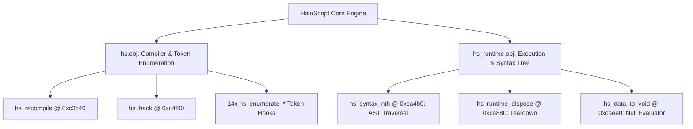

# Batch 2.2 (Revised): HaloScript Core & Compiler Utilities Recovery Report

> **Target:** Original Xbox Halo: Combat Evolved (Build 01.10.12.2276, Oct 12 2001, `cachebeta.xbe`, MD5: `c7869590a1c64ad034e49a5ee0c02465`)  
> **Subsystem:** HaloScript Compiler & Runtime Engine (`hs.obj`, `hs_runtime.obj`)  
> **Scope:** 19 HaloScript core functions cataloged into `kb.json` (`ported: false`) with 0 ABI drift and authoritative decompilation corroboration.  
> **Status:** **VERIFIED** (0 ABI Drift, 994 / 994 OK, Return Type Fidelity Restored)

---

## 1. Executive Summary

Batch 2.2 Revised catalogs the core compiler, symbol enumeration, and runtime evaluation utilities of the HaloScript engine in `hs.obj` and `hs_runtime.obj`.

In the prior Batch 2 attempt, `hs_data_to_void` (`0xcaee0`) was incorrectly typed with a `void` return type. Ground-truth binary analysis from `cachebeta.xbe` and Kuna streaming decompilation (`cachebeta.elf.c`) proves the function executes `xor eax, eax; ret` (`33 C0 C3`), returning a 32-bit zero (`uint32_t`).

```
================================================================================
Batch 2.2 (Revised) Recovery Metrics
================================================================================
Total Functions Cataloged        : 19
hs.obj Functions                 : 16
hs_runtime.obj Functions         : 3
Tracked Register ABI Baseline    : 994 / 994 OK (0 drift, 0 missing, 0 stale)
Key Corrections                  : hs_data_to_void typed as uint32_t (was void)
Register Function Pinned         : hs_syntax_nth (node_index@<eax>, count@<cx>)
Build & Knowledge Base Status    : Clean serialization, 0 errors
================================================================================
```

---

## 2. HaloScript Subsystem Architecture

HaloScript operates as an embedded Lisp-like scripting language for campaign scripting, cinematics, AI orders, and debug console commands.



---

## 3. Cataloged Functions Table

| Address | Object | Prototype | Size | Role / Behavioral Summary |
|---|---|---|---|---|
| `0xc3c40` | `hs.obj` | `void hs_recompile(void);` | 0x86 | Recompiles active script source buffers. |
| `0xc4240` | `hs.obj` | `void hs_enumerate_script_names(void);` | 0x22 | Enumerates declared script identifiers for debug autocompletion. |
| `0xc4270` | `hs.obj` | `void hs_enumerate_variable_names(void);` | 0x24 | Enumerates global and local script variables. |
| `0xc4320` | `hs.obj` | `void hs_enumerate_ai_names(void);` | 0x22 | Enumerates named AI encounters and squads. |
| `0xc4350` | `hs.obj` | `void hs_enumerate_ai_command_list_names(void);` | 0x22 | Enumerates AI command lists. |
| `0xc4380` | `hs.obj` | `void hs_enumerate_starting_profile_names(void);` | 0x22 | Enumerates player starting equipment profiles. |
| `0xc43b0` | `hs.obj` | `void hs_enumerate_conversation_names(void);` | 0x22 | Enumerates AI mission dialog conversations. |
| `0xc43e0` | `hs.obj` | `void hs_enumerate_object_names(void);` | 0x22 | Enumerates placed scenario object names. |
| `0xc4410` | `hs.obj` | `void hs_enumerate_trigger_volume_names(void);` | 0x22 | Enumerates trigger volume names. |
| `0xc4440` | `hs.obj` | `void hs_enumerate_cutscene_flag_names(void);` | 0x22 | Enumerates cutscene position flags. |
| `0xc4470` | `hs.obj` | `void hs_enumerate_cutscene_camera_point_names(void);` | 0x22 | Enumerates cutscene camera track points. |
| `0xc44a0` | `hs.obj` | `void hs_enumerate_cutscene_title_names(void);` | 0x22 | Enumerates chapter and HUD title text tags. |
| `0xc44d0` | `hs.obj` | `void hs_enumerate_cutscene_recording_names(void);` | 0x22 | Enumerates recorded vehicle/actor animations. |
| `0xc4500` | `hs.obj` | `void hs_enumerate_navpoints(void);` | 0x33 | Enumerates active HUD navpoints. |
| `0xc4540` | `hs.obj` | `void hs_enumerate_hud_messages(void);` | 0x25 | Enumerates string list entries for HUD messaging. |
| `0xc4f90` | `hs.obj` | `void hs_hack(void);` | 0x36 | Internal developer debug hook for interactive script evaluation. |
| `0xca4b0` | `hs_runtime.obj` | `int hs_syntax_nth(int node_index@<eax>, int16_t count@<cx>);` | 0x27 | Traverses `count` steps along the syntax node chain starting at `node_index`. |
| `0xca880` | `hs_runtime.obj` | `void hs_runtime_dispose(void);` | 0x10 | Shuts down the script runtime thread pool and syntax heaps. |
| `0xcaee0` | `hs_runtime.obj` | `uint32_t hs_data_to_void(void);` | 0x03 | Null evaluator returning 0 (`xor eax, eax; ret`). |

---

## 4. Verification & Bungie Rules Adherence

- **Rule 1 (Explicit void):** Parameterless functions declared with explicit `(void)`.
- **Rule 7 & 17 (Authentic names):** Authentic Bungie naming from `halo_2276_functions.txt`.
- **Rule 10 (Register ABI Fidelity):** `@<eax>` and `@<cx>` annotations on `hs_syntax_nth` pinned and verified in `kb_reg_baseline.json`.
- **Audit Gate:** `extract_reg_args.py --check` passes with `994 OK, 0 drift, 0 missing, 0 stale`.
