# Batch 2.2: HaloScript Core & Compiler Utilities Recovery Report

> **Target:** Original Xbox Halo: Combat Evolved (Build 01.10.12.2276, Oct 12 2001, `cachebeta.xbe`, MD5: `c7869590a1c64ad034e49a5ee0c02465`)  
> **Subsystem:** HaloScript Core, Compiler & Runtime Pipeline (`hs.obj`, `hs_runtime.obj`)  
> **Scope:** 19 Uncatalogued HaloScript Functions registered into `kb.json` (`ported: false`) with 0 ABI drift and 0 duplicate symbols.

---

## Executive Summary

Batch 2.2 catalogs the complete HaloScript Core and Compiler Inspection API across [`hs.obj`](file:///storage/1F34-EBBE/halo/src/halo/hs/hs.c) and [`hs_runtime.obj`](file:///storage/1F34-EBBE/halo/src/halo/hs/hs_runtime.c). 

These 19 functions complete the scripting token enumeration system (`hs_enumerate_*`), compilation triggers (`hs_recompile`), debugging facilities (`hs_hack`), syntax node traversal (`hs_syntax_nth`), runtime teardown (`hs_runtime_dispose`), and type converters (`hs_data_to_void`).

```
================================================================================
Batch 2.2 Ingestion & Verification Metrics
================================================================================
Total Functions Ingested        : 19
Functions in hs.obj             : 16
Functions in hs_runtime.obj     : 3
Tracked Register ABI Baseline   : 887 / 887 OK (0 drift, 0 missing, 0 stale)
Symbol Collisions               : 0
Build & Patch Status            : 0 Errors (Clean build & patched XBE target)
================================================================================
```

---

## Ingested Functions Manifest (19 Functions)

### 1. HaloScript Core & Enumeration (`hs.obj`, 16 Functions)
| Address | Function Name | Length | Stack Args | Register Args | C89 Declaration |
|:---:|:---|:---:|:---:|:---:|:---|
| `0x0c3c40` | `hs_recompile` | 8 B | 0 B | - | `void hs_recompile(void);` |
| `0x0c4240` | `hs_enumerate_script_names` | 36 B | 0 B | - | `void hs_enumerate_script_names(void);` |
| `0x0c4270` | `hs_enumerate_variable_names` | 161 B | 0 B | - | `void hs_enumerate_variable_names(void);` |
| `0x0c4320` | `hs_enumerate_ai_names` | 39 B | 0 B | - | `void hs_enumerate_ai_names(void);` |
| `0x0c4350` | `hs_enumerate_ai_command_list_names` | 36 B | 0 B | - | `void hs_enumerate_ai_command_list_names(void);` |
| `0x0c4380` | `hs_enumerate_starting_profile_names` | 36 B | 0 B | - | `void hs_enumerate_starting_profile_names(void);` |
| `0x0c43b0` | `hs_enumerate_conversation_names` | 36 B | 0 B | - | `void hs_enumerate_conversation_names(void);` |
| `0x0c43e0` | `hs_enumerate_object_names` | 36 B | 0 B | - | `void hs_enumerate_object_names(void);` |
| `0x0c4410` | `hs_enumerate_trigger_volume_names` | 36 B | 0 B | - | `void hs_enumerate_trigger_volume_names(void);` |
| `0x0c4440` | `hs_enumerate_cutscene_flag_names` | 36 B | 0 B | - | `void hs_enumerate_cutscene_flag_names(void);` |
| `0x0c4470` | `hs_enumerate_cutscene_camera_point_names` | 36 B | 0 B | - | `void hs_enumerate_cutscene_camera_point_names(void);` |
| `0x0c44a0` | `hs_enumerate_cutscene_title_names` | 36 B | 0 B | - | `void hs_enumerate_cutscene_title_names(void);` |
| `0x0c44d0` | `hs_enumerate_cutscene_recording_names` | 36 B | 0 B | - | `void hs_enumerate_cutscene_recording_names(void);` |
| `0x0c4500` | `hs_enumerate_navpoints` | 54 B | 0 B | - | `void hs_enumerate_navpoints(void);` |
| `0x0c4540` | `hs_enumerate_hud_messages` | 54 B | 0 B | - | `void hs_enumerate_hud_messages(void);` |
| `0x0c4f90` | `hs_hack` | 81 B | 0 B | - | `void hs_hack(void);` |

### 2. HaloScript Runtime Pipeline (`hs_runtime.obj`, 3 Functions)
| Address | Function Name | Length | Stack Args | Register Args | C89 Declaration |
|:---:|:---|:---:|:---:|:---:|:---|
| `0x0ca4b0` | `hs_syntax_nth` | 39 B | 0 B | `node_index@<eax>`, `count@<cx>` | `int hs_syntax_nth(int node_index@<eax>, int16_t count@<cx>);` |
| `0x0ca880` | `hs_runtime_dispose` | 13 B | 0 B | - | `void hs_runtime_dispose(void);` |
| `0x0caee0` | `hs_data_to_void` | 3 B | 0 B | - | `void hs_data_to_void(void);` |

---

## Behavioral Breakdown & Call Graphs

### Token Enumeration Pipeline (`hs_enumerate_*`)
The `hs_enumerate_*` functions represent per-token-type callbacks dispatched by `hs_tokens_enumerate` (`0x0c4580`) across table `0x2f2208`. They take no stack arguments and write directly into the global token collection buffers (`0x46b6c8` count, `0x46b6cc` capacity, `0x46b6d0` output pointer, `0x46b6d4` prefix filter).

```mermaid
flowchart TD
    A["hs_tokens_enumerate(prefix, type_mask, tokens, max)"] --> B{"type_mask bit test"}
    B -->|bit 0| C["hs_tokens_enumerate_fixed_commands (0xc4160)"]
    B -->|bit 1| D["hs_tokens_enumerate_special_forms (0xc4180)"]
    B -->|bit 2| E["hs_tokens_enumerate_types (0xc41b0)"]
    B -->|bit 3| F["hs_tokens_enumerate_functions (0xc41e0)"]
    B -->|bit 4| G["hs_enumerate_script_names (0xc4240)"]
    B -->|bit 5| H["hs_enumerate_variable_names (0xc4270)"]
    B -->|bit 6| I["hs_enumerate_ai_names (0xc4320)"]
    B -->|bit 7| J["hs_enumerate_ai_command_list_names (0xc4350)"]
    B -->|bit 8| K["hs_enumerate_starting_profile_names (0xc4380)"]
    B -->|bit 9| L["hs_enumerate_conversation_names (0xc43b0)"]
    B -->|bit 10| M["hs_enumerate_object_names (0xc43e0)"]
    B -->|bit 11| N["hs_enumerate_trigger_volume_names (0xc4410)"]
    B -->|bit 12| O["hs_enumerate_cutscene_flag_names (0xc4440)"]
    B -->|bit 13| P["hs_enumerate_cutscene_camera_point_names (0xc4470)"]
    B -->|bit 14| Q["hs_enumerate_cutscene_title_names (0xc44a0)"]
    B -->|bit 15| R["hs_enumerate_cutscene_recording_names (0xc44d0)"]
    B -->|bit 16| S["hs_enumerate_navpoints (0xc4500)"]
    B -->|bit 17| T["hs_enumerate_hud_messages (0xc4540)"]

    G --> Z["hs_tokens_add(name)"]
    H --> Z
    I --> Z
    J --> Z
    K --> Z
    L --> Z
    M --> Z
    N --> Z
    O --> Z
    P --> Z
    Q --> Z
    R --> Z
    S --> Z
    T --> Z
```



---

## Verification Status

1. **Register ABI Baseline:** `tools/audit/extract_reg_args.py --check` passes with **887 / 887 OK** (0 drift, 0 missing, 0 stale).
2. **Build Verification:** `tools/build/build.py -q --target halo` produces a valid patched XBE with 0 errors.
3. **Symbol Integrity:** 0 name collisions across all 9,328 symbols in `kb.json`.
