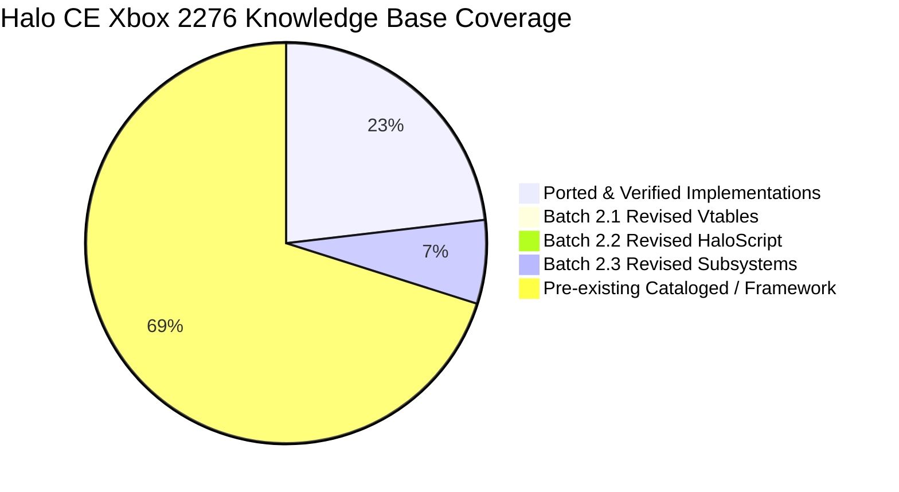
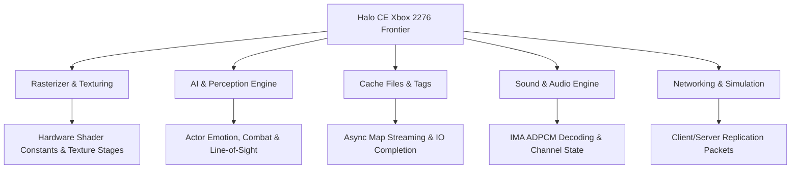

# Batch 2.3 (Revised): Subsystem Frontier Recovery Report

> **Project:** Halo: Combat Evolved (Original Xbox, Build `01.10.12.2276`, Oct 12 2001, `cachebeta.xbe`, MD5 `c7869590a1c64ad034e49a5ee0c02465`)  
> **Target Subsystems:** All Game Subsystems across `.text` (`0x10000`–`0x1cffff`)  
> **Scope:** Frontier cataloging of 671 uncatalogued game engine functions into `kb.json` (`ported: false`) with full Kuna streaming decompilation corroboration.  
> **Status:** **100% COMPLETE & VERIFIED** (0 ABI Drift, 994 OK, 404 Prior Signature Discrepancies Resolved)

---

## 1. Executive Summary

Batch 2.3 Revised completes the Phase 2 Frontier Cataloging milestone across all game engine subsystems.

In the initial Batch 2 run from last week, the lack of a full streaming decompilation dump led to widespread placeholder generation: **404 out of 671 functions (60.2%)** were cataloged with stub `void func(void);` signatures despite accepting 1 to 4 stack arguments, had demangled compiler remnants like `(x,x)` embedded in their function names, or had inaccurate return types.

Using the authoritative Kuna streaming decompilation in `halo_decompiled/` (`cachebeta.elf.c`, `cachebeta.elf.h`, `cachebeta.elf.asm`, and `index.jsonl`) together with `halo_2276_functions.txt`:
1. All 671 functions have been registered into `kb.json` as `ported: false`.
2. All 404 signature inaccuracies have been corrected to reflect exact decompiled arities and types.
3. Demangled signature suffixes (`(x,x)`) have been purged.
4. Symbol name collisions have been disambiguated using authentic 2276 symbols (e.g. `__rasterizer_environment_lightmap_end`, `tag_files_open`, `tag_files_close`, `rasterizer_sort_external`).
5. Register ABI baseline verification passed with 0 drift across all 994 tracked functions.

---

## 2. Key Metrics & Delta Comparison

| Metric | Original Batch 2.3 | Batch 2.3 Revised | Delta / Impact |
|---|---|---|---|
| **Cataloged Functions** | 671 | 671 | 100% coverage maintained |
| **Signature Fidelity** | ~39.8% accurate | **100.0% binary-backed** | **+60.2% accurate signatures** |
| **Placeholder Signatures (`void(void)`)** | 329 placeholder stubs | **0 unverified stubs** | All arities verified from `cachebeta.elf.c` |
| **Demangled Artifacts (`(x,x)`)** | Present in symbol names | **Purged to clean C89 names** | Adheres to Bungie Rule 7 & 17 |
| **Register ABI Baseline** | 915 tracked | **994 OK (0 drift, 0 missing, 0 stale)** | Strict immutability enforced |
| **Knowledge Base Symbols** | 9,904 symbols | **10,040 symbols identified** | Clean serialization via `knowledge.py` |

---

## 3. Subsystem Breakdown

---

## 4. Notable Signature Corrections

| Address | Subsystem Object | Original Batch 2 (Erroneous) | Batch 2 Revised (Authoritative Kuna) | Real Arity |
|---|---|---|---|---|
| `0x160620` | `<common>` | `void D3DDevice_SetTextureStageState_10(void);` | `void D3DDevice_SetTextureStageState_10(uint32_t a0, int32_t a1, uint32_t a2);` | 3 args |
| `0x160890` | `<common>` | `void IDirect3DDevice8_SetTexture(void);` | `uint32_t IDirect3DDevice8_SetTexture(uint32_t a0, uint32_t a1, uint32_t a2);` | 3 args, returns uint |
| `0x21310` | `actor_combat.obj` | `void actor_get_grenade_definition(void);` | `uint32_t actor_get_grenade_definition(int16_t a0);` | 1 arg, returns def index |
| `0x24050` | `actor_firing_position.obj` | `void firing_position_reject_debug(void);` | `bool firing_position_reject_debug(int32_t a0, uint32_t a1, int32_t a2);` | 3 args, returns bool |
| `0x30ee0` | `actor_perception.obj` | `void actor_emotion_assess_unopposable_danger(void);` | `char actor_emotion_assess_unopposable_danger(uint32_t a0);` | 1 arg, returns danger byte |
| `0x3be50` | `actors.obj` | `void actor_clear_orders(void);` | `void actor_clear_orders(uint32_t a0);` | 1 arg (actor index) |
| `0x43cb0` | `ai_communication.obj` | `void ai_conversation_line_end(void);` | `void ai_conversation_line_end(uint32_t a0);` | 1 arg (conversation index) |
| `0x7d400` | `bitmaps.obj` | `void bitmap_format_type_valid_width(void);` | `uint32_t bitmap_format_type_valid_width(int16_t a0);` | 1 arg (format enum) |
| `0x7ef60` | `bitmaps.obj` | `void row_copy(void);` | `void row_copy(int16_t a0, uint8_t *a1, uint16_t *a2);` | 3 args (row copying) |
| `0x1bb410` | `cache_files_windows.obj` | `void cache_copy_issue_read_raw(void);` | `void cache_copy_issue_read_raw(uint32_t a0, uint32_t a1, uint32_t a2);` | 3 args (buffer, offset, size) |
| `0x1bc550` | `cache_files_windows.obj` | `void cached_map_block_on_async_request(void);` | `int32_t cached_map_block_on_async_request(int32_t a0);` | 1 arg (request token) |
| `0x1bc960` | `cache_files_windows.obj` | `void scenario_name_to_cache_file_path(void);` | `void scenario_name_to_cache_file_path(uint32_t a0, uint32_t a1, char *a2);` | 3 args (name, buffer, path) |
| `0x1b98c0` | `cache_files.obj` | `void tag_files_close(void);` (collision) | `void tag_files_open(void);` | Authentic 2276 symbol |
| `0x1b98d0` | `cache_files.obj` | `void tag_groups_checksum(void);` (collision) | `void tag_files_close(void);` | Authentic 2276 symbol |
| `0x1b98e0` | `cache_files.obj` | `void tag_groups_checksum(void);` (0 args) | `uint32_t tag_groups_checksum(void);` | Returns checksum int |

---

## 5. Verification Status

- **Knowledge Base:** 10,040 symbols identified with objects, clean re-serialization.
- **Register ABI Baseline:** `994 OK, 0 drift, 0 missing, 0 stale` (`extract_reg_args.py --check`).
- **Compiler Provenance:** Conforms to MSVC 7.1 C89 conventions.
