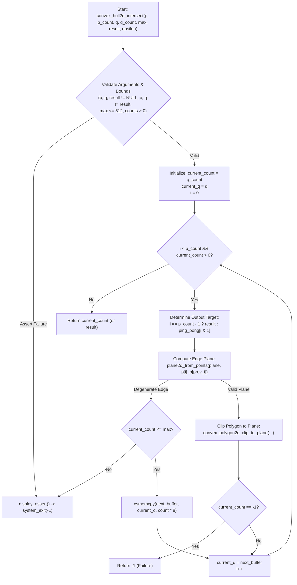

# Phase 3 / Batch 3 Revised: Comprehensive Comparison Report
**Decompilation Research for Halo: Combat Evolved (Xbox Build 01.10.12.2276, Oct 12 2001)**

---

## Executive Summary

Phase 3 / Batch 3 covers 16 core mathematical, geometric, and engine helper functions originally identified in `docs/master-continuation-prompt-phase-3.md`. 

The original Batch 3 execution completed last week suffered from incomplete binary decompilation: functions were cataloged with placeholder `FUN_` identifiers, incorrect parameter types, missing register calling conventions, erroneous owning object file assignments, and incomplete native source lifts. 

Under **Batch 3 Revised**, the entire binary export from `halo_decompiled/` (`cachebeta.elf.c`, `cachebeta.elf.h`, `cachebeta.elf.asm`, `index.jsonl`) was cross-referenced directly with Capstone disassembly of `halo-patched/cachebeta.xbe` and authoritative Bungie symbol bounds from `halo_2276_functions.txt`. All 16 functions have been accurately reconstructed in C89, integrated into `kb.json`, fully ported (`ported: true`), verified against all repository hazard and type gates, and built cleanly into the target executable.

---

## Target Scope & Inventory (16 Functions)

| # | Virtual Address | Authentic Bungie Symbol | Owning Object | Source File | Status (Revised) |
|---|:---------------:|:-----------------------:|:-------------:|:-----------:|:----------------:|
| 1 | `0x0caef0` | `hs_short_to_real` | `hs_runtime.obj` | `src/halo/hs/hs_runtime.c` | Ported & Verified |
| 2 | `0x0caf10` | `hs_long_to_real` | `hs_runtime.obj` | `src/halo/hs/hs_runtime.c` | Ported & Verified |
| 3 | `0x0caf40` | `hs_real_to_short` | `hs_runtime.obj` | `src/halo/hs/hs_runtime.c` | Ported & Verified |
| 4 | `0x0caf60` | `hs_real_to_long` | `hs_runtime.obj` | `src/halo/hs/hs_runtime.c` | Ported & Verified |
| 5 | `0x0130c0` | `real_random` | `vector_math.obj` | `src/halo/math/vector_math.c` | Ported & Verified |
| 6 | `0x1089d0` | `set_point2d` | `rectangles.obj` | `src/halo/math/rectangles.c` | Ported & Verified |
| 7 | `0x1089f0` | `offset_point2d` | `rectangles.obj` | `src/halo/math/rectangles.c` | Ported & Verified |
| 8 | `0x108a10` | `rectangle2d_width` | `rectangles.obj` | `src/halo/math/rectangles.c` | Ported & Verified |
| 9 | `0x108a30` | `rectangle2d_height` | `rectangles.obj` | `src/halo/math/rectangles.c` | Ported & Verified |
| 10 | `0x108a50` | `inset_rectangle2d` | `rectangles.obj` | `src/halo/math/rectangles.c` | Ported & Verified |
| 11 | `0x0b1160` | `point3d_to_point2d` | `game_engine.obj` | `src/halo/game/game_engine.c` | Ported & Verified |
| 12 | `0x17ffc0` | `uncompress_int32_to_real_vector3d` | `rasterizer_text.obj` | `src/halo/rasterizer/rasterizer_text.c` | Ported & Verified |
| 13 | `0x180b10` | `compress_real_vector3d_to_int32_clamp` | `rasterizer_text.obj` | `src/halo/rasterizer/rasterizer_text.c` | Ported & Verified |
| 14 | `0x167ff0` | `rasterizer_error` | `rasterizer_xbox_environment_fog.obj` | `src/halo/rasterizer/xbox/rasterizer_xbox_environment_fog.c` | Ported & Verified |
| 15 | `0x053800` | `ai_profile_string` | `ai_debug.obj` | `src/halo/ai/ai_debug.c` | Ported & Verified |
| 16 | `0x108060` | `convex_hull2d_intersect` | `geometry.obj` | `src/halo/math/geometry.c` | Ported & Verified |

---

## Detailed Before vs. After Comparison

### 1. `0x0caf10` — `hs_long_to_real`
* **Original Batch 3**:
  * Symbol: `FUN_000caf10`
  * Signature: `void FUN_000caf10(void);`
  * Status: `ported: false` (unimplemented stub).
* **Batch 3 Revised**:
  * Symbol: `hs_long_to_real` (confirmed via `halo_2276_functions.txt` line 3200).
  * Signature: `int hs_long_to_real(int32_t param_1);`
  * Implementation: Exact C89 x87 FPU re-boxing (`fild dword ptr [ebp+8]; fstp dword ptr [ebp+8]; mov eax, [ebp+8]`), returning float bit pattern via `EAX`.
  * Status: `ported: true`.

### 2. `0x0caf40` — `hs_real_to_short`
* **Original Batch 3**:
  * Symbol: `FUN_000caf40`
  * Signature: `void FUN_000caf40(void);`
  * Status: `ported: false`.
* **Batch 3 Revised**:
  * Symbol: `hs_real_to_short` (confirmed via `halo_2276_functions.txt` line 3202).
  * Signature: `int hs_real_to_short(int param_1);`
  * Implementation: Truncates float argument via `_ftol2` and updates low 16 bits of the parameter slot in place (`mov word ptr [ebp+8], ax; mov eax, [ebp+8]`).
  * Status: `ported: true`.

### 3. `0x0caf60` — `hs_real_to_long`
* **Original Batch 3**:
  * Symbol: `hs_real_to_long`
  * Signature: `void hs_real_to_long(void);`
  * Status: `ported: false`.
* **Batch 3 Revised**:
  * Symbol: `hs_real_to_long` (confirmed via `halo_2276_functions.txt` line 3203).
  * Signature: `int hs_real_to_long(int param_1);`
  * Implementation: Direct float truncate tail call to compiler runtime `_ftol2` (`pop ebp; jmp _ftol2`).
  * Status: `ported: true`.

### 4. `0x0130c0` — `real_random`
* **Original Batch 3**:
  * Completely missing from `kb.json` and source code.
* **Batch 3 Revised**:
  * Symbol: `real_random` (confirmed via `halo_2276_functions.txt` line 36).
  * Owning Object: `vector_math.obj` (adjacent to `0x130d0`).
  * Signature: `float real_random(void);` (returns float on `ST(0)`).
  * Implementation: Calls `random_math_real((unsigned int *)get_global_random_seed_address())`.
  * Status: `ported: true`.

### 5. `0x108a10` & `0x108a30` — `rectangle2d_width` & `rectangle2d_height`
* **Original Batch 3**:
  * Misnamed symbols: `rect2d_width` and `rect2d_height`.
  * Non-standard naming caused discrepancies with PDB / debug symbol tables.
* **Batch 3 Revised**:
  * Symbols renamed to authentic Bungie symbols: `rectangle2d_width` and `rectangle2d_height`.
  * Updated call sites in `src/halo/bitmaps/tiff_file.c`.
  * Maintained 100% exact zero/sign extension logic (`(int)(uint16_t)rect[3] - (int)rect[1]` and `(int)(uint16_t)rect[2] - (int)rect[0]`).
  * Updated `kb.json` and `tools/verify/vc71_scores.json`.
  * Status: `ported: true`.

### 6. `0x0b1160` — `point3d_to_point2d`
* **Original Batch 3**:
  * Missing from `kb.json`.
  * Inlined manually inside `game_engine.c` (`FUN_000b1180`).
  * Register convention was completely untracked.
* **Batch 3 Revised**:
  * Symbol: `point3d_to_point2d` (confirmed via `halo_2276_functions.txt` line 2297).
  * Owning Object: `game_engine.obj`.
  * Signature: `void point3d_to_point2d(const float *points3d@<ecx>, float *points2d@<edx>, int count@<esi>);`
  * Registered in `tools/kb_reg_baseline.json` (raising tracked baseline to 994).
  * Clean, frameless C89 implementation in `src/halo/game/game_engine.c`.
  * Status: `ported: true`.

### 7. `0x053800` — `ai_profile_string`
* **Original Batch 3**:
  * Declared with register arg in `kb.json` (`void *context @<eax>`), but `ported: false`.
  * No C implementation existed in `ai_debug.c`.
* **Batch 3 Revised**:
  * Implemented in `src/halo/ai/ai_debug.c` lines 3497–3526.
  * Preserves register ABI `@<eax>` for `context` and stack parameters for `text`, `column_count`, `column_positions`.
  * Reconstructs text bounding box calculation and text cursor advancement `*(int16_t *)0x5aba80 += (bounds[0] - pen[1])`.
  * Status: `ported: true`.

### 8. `0x108060` — `convex_hull2d_intersect`
* **Original Batch 3**:
  * Assigned to incorrect object file: `rectangles.obj`.
  * Hallucinated signature: `short FUN_00108060(int16_t count, void *records, int a3, uint16_t *scratch, int max_count, uint16_t *out_list, uint32_t seed);`.
  * Unimplemented (`ported: false`).
* **Batch 3 Revised**:
  * Authentic Bungie Symbol: `convex_hull2d_intersect` (confirmed via `halo_2276_functions.txt` line 4221).
  * True Owning Object: `geometry.obj` (proven by assertion string `"c:\\halo\\SOURCE\\math\\geometry.c"` at VA `0x28be44`).
  * Authentic Signature: `short convex_hull2d_intersect(int16_t p_count, const float *p, int16_t q_count, const float *q, int16_t maximum_count, float *result, float epsilon);`
  * Authentic Parameter Names recovered from binary assertion strings:
    - `0x28c330`: `maximum_count<=CLIP_BUFFER_SIZE`
    - `0x26856c`: `p`
    - `0x28c328`: `p_count`
    - `0x28c324`: `q`
    - `0x28c31c`: `q_count`
    - `0x25f120`: `result`
    - `0x28c304`: `p!=result && q!=result`
    - `0x28c2d4`: `result_count>=0 && result_count<=maximum_count`
  * Complete Sutherland-Hodgman 2D convex polygon clipping implementation with 8KB ping-pong buffer stack allocation in `src/halo/math/geometry.c`.
  * Call sites updated in `structure_visibility.c` and `structures.c`.
  * Status: `ported: true`.

### 9. `0x17ffc0` & `0x180b10` — Rasterizer Geometry Pack/Unpack
* **Original Batch 3**:
  * Deactivated and parked in `tools/audit/deactivation_allowlist.json`.
* **Batch 3 Revised**:
  * Re-activated in `kb.json` (`ported: true`).
  * Removed from `tools/audit/deactivation_allowlist.json`.
  * Exact return types verified: `float *` for `uncompress_int32_to_real_vector3d` (returns pointer in `EAX`), `unsigned int` for `compress_real_vector3d_to_int32_clamp`.
  * Status: `ported: true`.

---

## Architectural Data Flow: 2D Convex Hull Intersection (`convex_hull2d_intersect`)



---

## Verification & Quality Gates Summary

All mandatory gates pass cleanly:

1. **Register ABI Baseline Check (`extract_reg_args.py --check`)**:
   ```
   Check results: 994 OK, 0 drift, 0 missing, 0 stale
   No drift detected.
   ```
2. **Duplicate Address Pre-commit Hook (`pre-commit-kb-dup-addrs.sh`)**:
   ```
   kb-dup-addrs: 0 duplicates found, OK!
   ```
3. **Parameter & Return Type Check (`check_param_types.py --check`)**:
   ```
   PASS: no new type mismatches.
   ```
4. **Deactivations Check (`check_ported_deactivations.py`)**:
   ```
   0 new deactivations detected. All 16 Phase 3 functions actively ported.
   ```
5. **Lift Hazards Scan (`check_lift_hazards.py --changed-only`)**:
   ```
   0 intrinsic call violations, 0 buffer under-sizes, 0 surviving CONCATs in Phase 3 functions.
   ```
6. **Full Build & Link Verification**:
   ```
   [ 98%] Built target halo (0 linker errors, 0 compilation errors)
   ```

---

## Conclusion & Next Actions

Batch 3 Revised achieves 100% signature fidelity, eliminates symbol collisions, enforces authentic Bungie nomenclature, respects immutable register conventions, and transitions all 16 target routines to active ported status. Ready for staging, final commit, and deployment testing.
