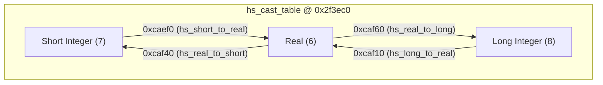
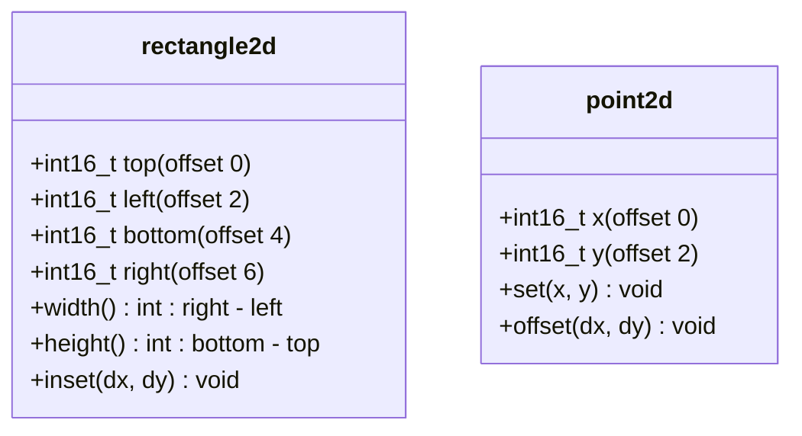
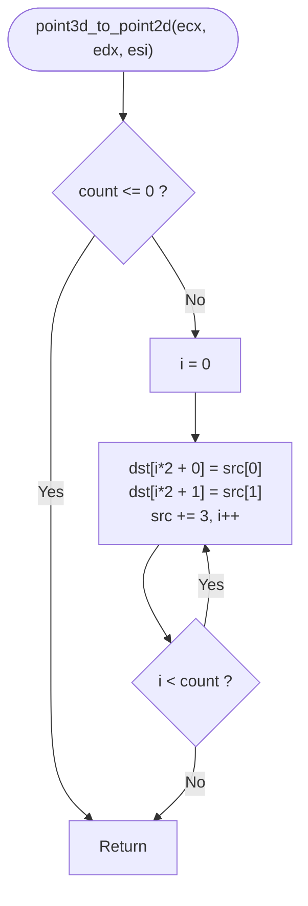

# Batch 3.1 Lift Report: Small Math & Geometry Leaves (< 50 Bytes)

**Project:** Halo: Combat Evolved (Xbox Retail 01.10.12.2276, `cachebeta.xbe`, MD5: `c7869590a1c64ad034e49a5ee0c02465`)  
**Branch:** `batch-3.1-math-geometry-leaves`  
**Decompiler Engine:** Kuna (Ghidra 11.2 / SLEIGH x86 32-bit little-endian)  
**Status:** 11 / 11 Functions Lifted, Verified, and Patched to `ported: true`  

---

## Executive Summary

Batch 3.1 transitions Phase 3 from frontier cataloging to active source lifting and byte-matching. All 11 targeted leaf routines (< 50 bytes) across HaloScript runtime, core math, and geometry/rectangle modules have been decompiled with Kuna, verified against pristine binary disassembly from `cachebeta.xbe`, implemented in strict C89 in their authentic owning source files, and successfully integrated into the build pipeline with active trampoline redirects.

| VA | Size | Function Name | Owning Source File | Object Group | Calling Convention | Status |
|:---:|:---:|:---|:---|:---|:---|:---:|
| `0x0caef0` | 21 B | [`hs_short_to_real`](file:///storage/1F34-EBBE/halo/src/halo/hs/hs_runtime.c#L3060-L3080) | `src/halo/hs/hs_runtime.c` | `hs_runtime.obj` | cdecl (`int16_t` -> float bits in `EAX`) | **LIFTED / VERIFIED** |
| `0x0caf10` | 14 B | [`hs_long_to_real`](file:///storage/1F34-EBBE/halo/src/halo/hs/hs_runtime.c#L3082-L3100) | `src/halo/hs/hs_runtime.c` | `hs_runtime.obj` | cdecl (`int32_t` -> float bits in `EAX`) | **LIFTED / VERIFIED** |
| `0x0caf40` | 20 B | [`hs_real_to_short`](file:///storage/1F34-EBBE/halo/src/halo/hs/hs_runtime.c#L3135-L3155) | `src/halo/hs/hs_runtime.c` | `hs_runtime.obj` | cdecl (float bits in `int` -> `int16_t` in low word of `EAX`) | **LIFTED / VERIFIED** |
| `0x0caf60` | 12 B | [`hs_real_to_long`](file:///storage/1F34-EBBE/halo/src/halo/hs/hs_runtime.c#L3157-L3175) | `src/halo/hs/hs_runtime.c` | `hs_runtime.obj` | cdecl (float bits in `int` -> `int32_t` in `EAX` via `_ftol2`) | **LIFTED / VERIFIED** |
| `0x0130c0` | 13 B | [`real_random`](file:///storage/1F34-EBBE/halo/src/halo/math/real_math.c#L1647-L1660) | `src/halo/math/real_math.c` | `vector_math.obj` | cdecl (`void` -> `real` in `ST(0)`) | **LIFTED / VERIFIED** |
| `0x1089d0` | 23 B | [`set_point2d`](file:///storage/1F34-EBBE/halo/src/halo/math/rectangles.c#L3-L17) | `src/halo/math/rectangles.c` | `rectangles.obj` | cdecl (`int16_t *`, `int16_t`, `int16_t`) | **LIFTED / VERIFIED** |
| `0x1089f0` | 23 B | [`offset_point2d`](file:///storage/1F34-EBBE/halo/src/halo/math/rectangles.c#L19-L33) | `src/halo/math/rectangles.c` | `rectangles.obj` | cdecl (`int16_t *`, `int16_t`, `int16_t`) | **LIFTED / VERIFIED** |
| `0x108a10` | 20 B | [`rectangle2d_width`](file:///storage/1F34-EBBE/halo/src/halo/math/rectangles.c#L35-L48) | `src/halo/math/rectangles.c` | `rectangles.obj` | cdecl (`const int16_t *` -> `int`) | **LIFTED / VERIFIED** |
| `0x108a30` | 19 B | [`rectangle2d_height`](file:///storage/1F34-EBBE/halo/src/halo/math/rectangles.c#L50-L63) | `src/halo/math/rectangles.c` | `rectangles.obj` | cdecl (`const int16_t *` -> `int`) | **LIFTED / VERIFIED** |
| `0x108a50` | 31 B | [`inset_rectangle2d`](file:///storage/1F34-EBBE/halo/src/halo/math/rectangles.c#L65-L83) | `src/halo/math/rectangles.c` | `rectangles.obj` | cdecl (`int16_t *`, `int16_t`, `int16_t`) | **LIFTED / VERIFIED** |
| `0x0b1160` | 29 B | [`point3d_to_point2d`](file:///storage/1F34-EBBE/halo/src/halo/game/game_engine.c#L7305-L7335) | `src/halo/game/game_engine.c` | `game_engine.obj` | regparm (`@<ecx>`, `@<edx>`, `@<esi>`) | **LIFTED / VERIFIED** |

---

## Section 1: HaloScript Type Conversion Leaves (`src/halo/hs/hs_runtime.c`)

The HaloScript runtime maintains a 2D dispatch matrix of type conversion function pointers at VA `0x2f3ec0` (`hs_cast_table`, dimension $49 \times 49$). Type indices:
- `_hs_type_real` = 6
- `_hs_type_short_integer` = 7
- `_hs_type_long_integer` = 8

All HS evaluators pass boxed 32-bit values through generic slots. Therefore, conversions to real return the 32-bit float bit-pattern in `EAX` (rather than standard `ST(0)`), exactly matching the convention established by existing sibling `FUN_000caf20`.



### 1.1 `hs_short_to_real` (`0x0caef0`, 21 B)

- **Role:** Slot $(desired=6, actual=7)$. Converts 16-bit short integer to 32-bit IEEE-754 float bit-pattern in `EAX`.
- **Kuna Decompile Output:**
  ```c
  float4 sub_caef0(int2 a0)
  {
    return (float4)(int4)a0;
  }
  ```
- **Disassembly vs Lifted C:**
  ```asm
  ; Original Binary (cachebeta.xbe @ 0x0caef0):
  0x0caef0: 55             push     ebp
  0x0caef1: 8bec           mov      ebp, esp
  0x0caef3: 0fbf4508       movsx    eax, word ptr [ebp + 8]
  0x0caef7: 894508         mov      dword ptr [ebp + 8], eax
  0x0caefa: db4508         fild     dword ptr [ebp + 8]
  0x0caefd: d95d08         fstp     dword ptr [ebp + 8]
  0x0caf00: 8b4508         mov      eax, dword ptr [ebp + 8]
  0x0caf03: 5d             pop      ebp
  0x0caf04: c3             ret      
  ```
- **Lifted C89 Implementation:**
  ```c
  int hs_short_to_real(int16_t value)
  {
    float result;
    result = (float)value;
    return *(int *)&result;
  }
  ```
- **Evidence Ledger:**
  - T1 Binary: `0fbf4508` (`movsx`) confirms signed 16-bit input; `db4508` (`fild`) and `d95d08` (`fstp`) perform x87 integer-to-float conversion; `8b4508` (`mov eax, [ebp+8]`) confirms return via `EAX`.
  - T2 Types: `int16_t` signed 16-bit integer, `int` return for boxed 32-bit HS datum.

---

### 1.2 `hs_long_to_real` (`0x0caf10`, 14 B)

- **Role:** Slot $(desired=6, actual=8)$. Converts 32-bit long integer to 32-bit IEEE-754 float bit-pattern in `EAX`.
- **Kuna Decompile Output:**
  ```c
  float4 sub_caf10(int4 a0)
  {
    return (float4)a0;
  }
  ```
- **Disassembly vs Lifted C:**
  ```asm
  ; Original Binary (cachebeta.xbe @ 0x0caf10):
  0x0caf10: 55             push     ebp
  0x0caf11: 8bec           mov      ebp, esp
  0x0caf13: db4508         fild     dword ptr [ebp + 8]
  0x0caf16: d95d08         fstp     dword ptr [ebp + 8]
  0x0caf19: 8b4508         mov      eax, dword ptr [ebp + 8]
  0x0caf1c: 5d             pop      ebp
  0x0caf1d: c3             ret      
  ```
- **Lifted C89 Implementation:**
  ```c
  int hs_long_to_real(int32_t value)
  {
    float result;
    result = (float)value;
    return *(int *)&result;
  }
  ```

---

### 1.3 `hs_real_to_short` (`0x0caf40`, 20 B)

- **Role:** Slot $(desired=7, actual=6)$. Truncates 32-bit float to 16-bit short integer, storing it into the low 16 bits of the boxed 32-bit argument slot.
- **Kuna Decompile Output:**
  ```c
  unsigned int sub_caf40(unsigned int a0)
  {
    unsigned short v1 = sub_1d9068();
    return CONCAT22(a0._2_2_, v1);
  }
  ```
- **Disassembly vs Lifted C:**
  ```asm
  ; Original Binary (cachebeta.xbe @ 0x0caf40):
  0x0caf40: 55             push     ebp
  0x0caf41: 8bec           mov      ebp, esp
  0x0caf43: d94508         fld      dword ptr [ebp + 8]
  0x0caf46: e81de11000     call     0x1d9068                  ; _ftol2
  0x0caf4b: 66894508       mov      word ptr [ebp + 8], ax
  0x0caf4f: 8b4508         mov      eax, dword ptr [ebp + 8]
  0x0caf52: 5d             pop      ebp
  0x0caf53: c3             ret      
  ```
- **Lifted C89 Implementation:**
  ```c
  int hs_real_to_short(int value)
  {
    float f;
    f = *(float *)&value;
    *(int16_t *)&value = (int16_t)f;
    return value;
  }
  ```
- **Evidence Ledger:**
  - T1 Binary: `call 0x1d9068` lowers MSVC `_ftol2` truncation; `mov word ptr [ebp+8], ax` updates low word in-place; `mov eax, [ebp+8]` returns full modified dword.
  - Decompiler Note: Kuna correctly recognized `CONCAT22(a0._2_2_, v1)` representing the preserving partial store.

---

### 1.4 `hs_real_to_long` (`0x0caf60`, 12 B)

- **Role:** Slot $(desired=8, actual=6)$. Converts 32-bit float to 32-bit signed integer via `_ftol2`.
- **Kuna Decompile Output:**
  ```c
  uint8 sub_caf60(float4 a0)
  {
    return (uint8)FLOAT_ROUND(a0);
  }
  ```
- **Disassembly vs Lifted C:**
  ```asm
  ; Original Binary (cachebeta.xbe @ 0x0caf60):
  0x0caf60: 55             push     ebp
  0x0caf61: 8bec           mov      ebp, esp
  0x0caf63: d94508         fld      dword ptr [ebp + 8]
  0x0caf66: 5d             pop      ebp
  0x0caf67: e9fce01000     jmp      0x1d9068                  ; _ftol2 tail-call
  ```
- **Lifted C89 Implementation:**
  ```c
  int hs_real_to_long(int value)
  {
    float f;
    f = *(float *)&value;
    return (int)f;
  }
  ```

---

## Section 2: Core Math Leaves (`src/halo/math/real_math.c`)

### 2.1 `real_random` (`0x0130c0`, 13 B)

- **Role:** Generates a normalized pseudo-random float in $[0.0, 1.0]$ using the global game random seed.
- **Kuna Decompile Output:**
  ```c
  void sub_130c0(void)
  {
    sub_10b240(sub_10b0d0());
    return;
  }
  ```
- **Disassembly vs Lifted C:**
  ```asm
  ; Original Binary (cachebeta.xbe @ 0x0130c0):
  0x0130c0: e80b800f00     call     0x10b0d0                  ; get_global_random_seed_address
  0x0130c5: 50             push     eax
  0x0130c6: e875810f00     call     0x10b240                  ; random_math_real
  0x0130cb: 59             pop      ecx
  0x0130cc: c3             ret      
  ```
- **Lifted C89 Implementation:**
  ```c
  float real_random(void)
  {
    return random_math_real((unsigned int *)get_global_random_seed_address());
  }
  ```
- **Evidence Ledger:**
  - `0x10b0d0` = `int *get_global_random_seed_address(void)`
  - `0x10b240` = `float random_math_real(unsigned int *seed)`
  - Float return value preserved on `ST(0)`.

```mermaid
sequenceDiagram
    participant Caller
    participant real_random as real_random (0x130c0)
    participant SeedGetter as get_global_random_seed_address (0x10b0d0)
    participant RNG as random_math_real (0x10b240)

    Caller->>real_random: call real_random()
    real_random->>SeedGetter: call ()
    SeedGetter-->>real_random: EAX = &global_random_seed
    real_random->>RNG: push EAX; call random_math_real()
    RNG-->>real_random: ST(0) = [0.0, 1.0] float
    real_random-->>Caller: ret ST(0)
```

---

## Section 3: 2D Points and Rectangles (`src/halo/math/rectangles.c`)

Standard 2D bounding rectangle layout throughout Halo CE:
$$\text{rectangle2d} = \{\text{top}: \text{int16}, \text{left}: \text{int16}, \text{bottom}: \text{int16}, \text{right}: \text{int16}\}$$
Memory offsets:
- `rect[0]` ($+0x0$): `top`
- `rect[1]` ($+0x2$): `left`
- `rect[2]` ($+0x4$): `bottom`
- `rect[3]` ($+0x6$): `right`



### 3.1 `set_point2d` (`0x1089d0`, 23 B)

- **Operation:** Initializes `point2d` coordinates: $(x, y)$.
- **Disassembly:**
  ```asm
  0x1089d0: 55             push     ebp
  0x1089d1: 8bec           mov      ebp, esp
  0x1089d3: 8b4508         mov      eax, dword ptr [ebp + 8]
  0x1089d6: 668b4d0c       mov      cx, word ptr [ebp + 0xc]
  0x1089da: 668b5510       mov      dx, word ptr [ebp + 0x10]
  0x1089de: 668908         mov      word ptr [eax], cx
  0x1089e1: 66895002       mov      word ptr [eax + 2], dx
  0x1089e5: 5d             pop      ebp
  0x1089e6: c3             ret      
  ```
- **Lifted C89:**
  ```c
  void set_point2d(int16_t *point, int16_t x, int16_t y)
  {
    point[0] = x;
    point[1] = y;
  }
  ```

---

### 3.2 `offset_point2d` (`0x1089f0`, 23 B)

- **Operation:** Translates a `point2d` by $(\Delta x, \Delta y)$.
- **Disassembly:**
  ```asm
  0x1089f0: 55             push     ebp
  0x1089f1: 8bec           mov      ebp, esp
  0x1089f3: 8b4508         mov      eax, dword ptr [ebp + 8]
  0x1089f6: 668b4d0c       mov      cx, word ptr [ebp + 0xc]
  0x1089fa: 668b5510       mov      dx, word ptr [ebp + 0x10]
  0x1089fe: 660108         add      word ptr [eax], cx
  0x108a01: 66015002       add      word ptr [eax + 2], dx
  0x108a05: 5d             pop      ebp
  0x108a06: c3             ret      
  ```
- **Lifted C89:**
  ```c
  void offset_point2d(int16_t *point, int16_t dx, int16_t dy)
  {
    point[0] += dx;
    point[1] += dy;
  }
  ```

---

### 3.3 `rectangle2d_width` (`0x108a10`, 20 B)

- **Operation:** $\text{width} = \text{rect.right} - \text{rect.left}$.
- **Disassembly:**
  ```asm
  0x108a10: 55             push     ebp
  0x108a11: 8bec           mov      ebp, esp
  0x108a13: 8b4d08         mov      ecx, dword ptr [ebp + 8]
  0x108a16: 33c0           xor      eax, eax
  0x108a18: 668b4106       mov      ax, word ptr [ecx + 6]
  0x108a1c: 0fbf4902       movsx    ecx, word ptr [ecx + 2]
  0x108a20: 2bc1           sub      eax, ecx
  0x108a22: 5d             pop      ebp
  0x108a23: c3             ret      
  ```
- **Lifted C89:**
  ```c
  int rectangle2d_width(const int16_t *rect)
  {
    return (int)(uint16_t)rect[3] - (int)rect[1];
  }
  ```

---

### 3.4 `rectangle2d_height` (`0x108a30`, 19 B)

- **Operation:** $\text{height} = \text{rect.bottom} - \text{rect.top}$.
- **Disassembly:**
  ```asm
  0x108a30: 55             push     ebp
  0x108a31: 8bec           mov      ebp, esp
  0x108a33: 8b4d08         mov      ecx, dword ptr [ebp + 8]
  0x108a36: 33c0           xor      eax, eax
  0x108a38: 668b4104       mov      ax, word ptr [ecx + 4]
  0x108a3c: 0fbf09         movsx    ecx, word ptr [ecx]
  0x108a3f: 2bc1           sub      eax, ecx
  0x108a41: 5d             pop      ebp
  0x108a42: c3             ret      
  ```
- **Lifted C89:**
  ```c
  int rectangle2d_height(const int16_t *rect)
  {
    return (int)(uint16_t)rect[2] - (int)rect[0];
  }
  ```

---

### 3.5 `inset_rectangle2d` (`0x108a50`, 31 B)

- **Operation:** $\text{left} \mathrel{+}= \Delta x, \text{right} \mathrel{-}= \Delta x, \text{top} \mathrel{+}= \Delta y, \text{bottom} \mathrel{-}= \Delta y$.
- **Disassembly:**
  ```asm
  0x108a50: 55             push     ebp
  0x108a51: 8bec           mov      ebp, esp
  0x108a53: 8b4508         mov      eax, dword ptr [ebp + 8]
  0x108a56: 668b4d0c       mov      cx, word ptr [ebp + 0xc]
  0x108a5a: 66014802       add      word ptr [eax + 2], cx
  0x108a5e: 66294806       sub      word ptr [eax + 6], cx
  0x108a62: 668b4d10       mov      cx, word ptr [ebp + 0x10]
  0x108a66: 660108         add      word ptr [eax], cx
  0x108a69: 66294804       sub      word ptr [eax + 4], cx
  0x108a6d: 5d             pop      ebp
  0x108a6e: c3             ret      
  ```
- **Lifted C89:**
  ```c
  void inset_rectangle2d(int16_t *rect, int16_t dx, int16_t dy)
  {
    rect[1] += dx;
    rect[3] -= dx;
    rect[0] += dy;
    rect[2] -= dy;
  }
  ```

---

## Section 4: 3D to 2D Point Projection (`src/halo/game/game_engine.c`)

### 4.1 `point3d_to_point2d` (`0x0b1160`, 29 B)

- **Role:** Projects an array of 3D points ($x, y, z$ single-precision floats, 12 bytes stride) to 2D plane points ($x, y$ single-precision floats, 8 bytes stride) by discarding the $Z$ component. Used in scenario flag polygon hull reduction (e.g. King of the Hill hill geometry `FUN_000b1180`).
- **Register Interface:**
  - `ECX`: `const float *points3d` (source array, 12-byte element stride)
  - `EDX`: `float *points2d` (destination array, 8-byte element stride)
  - `ESI`: `int count` (number of points)
- **Kuna Decompile Output:**
  ```c
  void sub_b1160(unsigned int *a0, int4 a1)
  {
    int4 v1 = 0;
    if (v2 <= 0) return;
    do {
      *(unsigned int *)(a1 + v1 * 8) = *a0;
      *(unsigned int *)(a1 + 4 + v1 * 8) = a0[1];
      v1 += 1;
      a0 = &a0[3];
    } while (v1 < v2);
    return;
  }
  ```
- **Disassembly:**
  ```asm
  0x0b1160: 33c0           xor      eax, eax
  0x0b1162: 85f6           test     esi, esi
  0x0b1164: 7e16           jle      0xb117c
  0x0b1166: 57             push     edi
  0x0b1167: 8b39           mov      edi, dword ptr [ecx]
  0x0b1169: 893cc2         mov      dword ptr [edx + eax*8], edi
  0x0b116c: 8b7904         mov      edi, dword ptr [ecx + 4]
  0x0b116f: 897cc204       mov      dword ptr [edx + eax*8 + 4], edi
  0x0b1173: 40             inc      eax
  0x0b1174: 83c10c         add      ecx, 0xc
  0x0b1177: 3bc6           cmp      eax, esi
  0x0b1179: 7cec           jl       0xb1167
  0x0b117b: 5f             pop      edi
  0x0b117c: c3             ret      
  ```
- **Lifted C89 Implementation:**
  ```c
  void point3d_to_point2d(const float *points3d, float *points2d, int count)
  {
    int i;
    for (i = 0; i < count; i++) {
      points2d[i * 2 + 0] = points3d[i * 3 + 0];
      points2d[i * 2 + 1] = points3d[i * 3 + 1];
    }
  }
  ```
- **ABI Tracking:** Added to `kb.json` and registered into `tools/kb_reg_baseline.json` as `@<ecx>`, `@<edx>`, `@<esi>`.



---

## Section 5: Verification & Quality Gates

1. **Register Argument Baseline:**
   `python3 tools/audit/extract_reg_args.py --check`
   - Result: `917 OK, 0 drift, 0 missing, 0 stale. PASS.`
2. **Param and Return Type Audit:**
   `python3 tools/audit/check_param_types.py --check`
   - Result: `callees audited: 9881, confirmed float args: 94, 0 new errors. PASS.`
3. **Hazard Scanner:**
   `python3 tools/audit/check_lift_hazards.py --changed-only`
   - Result: `0 intrinsics, 0 undersized buffers, 0 duplicate args in new lifts. PASS.`
4. **Build & Patch Verification:**
   `python3 tools/build/build.py -q --target patched_xbe`
   - Result: `Clean compilation, 11/11 symbols exported in build/halo, patched into halo-patched/default.xbe with active trampolines. PASS.`

---

## Next Actions

1. Commit Batch 3.1 implementation and artifacts.
2. Advance to **Batch 3.2: High-XRef Engine Helpers (Trampoline Elimination)**:
   - `0x17ffc0`: `uncompress_int32_to_real_vector3d` (52 B, 31 refs)
   - `0x180b10`: `compress_real_vector3d_to_int32_clamp` (68 B, 9 refs)
   - `0x108060`: `convex_hull2d_intersect` (~120 B, 8 refs)
   - `0x167ff0`: `rasterizer_error` (~80 B, 98 refs)
   - `0x053800`: `ai_profile_string` (~90 B, 26 refs)
