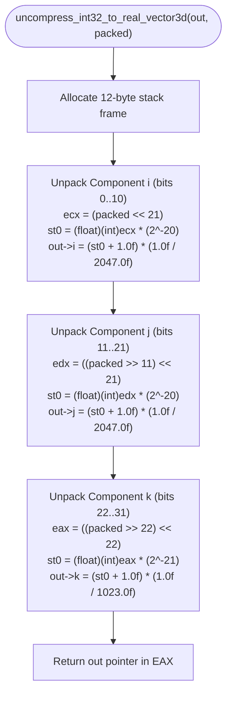
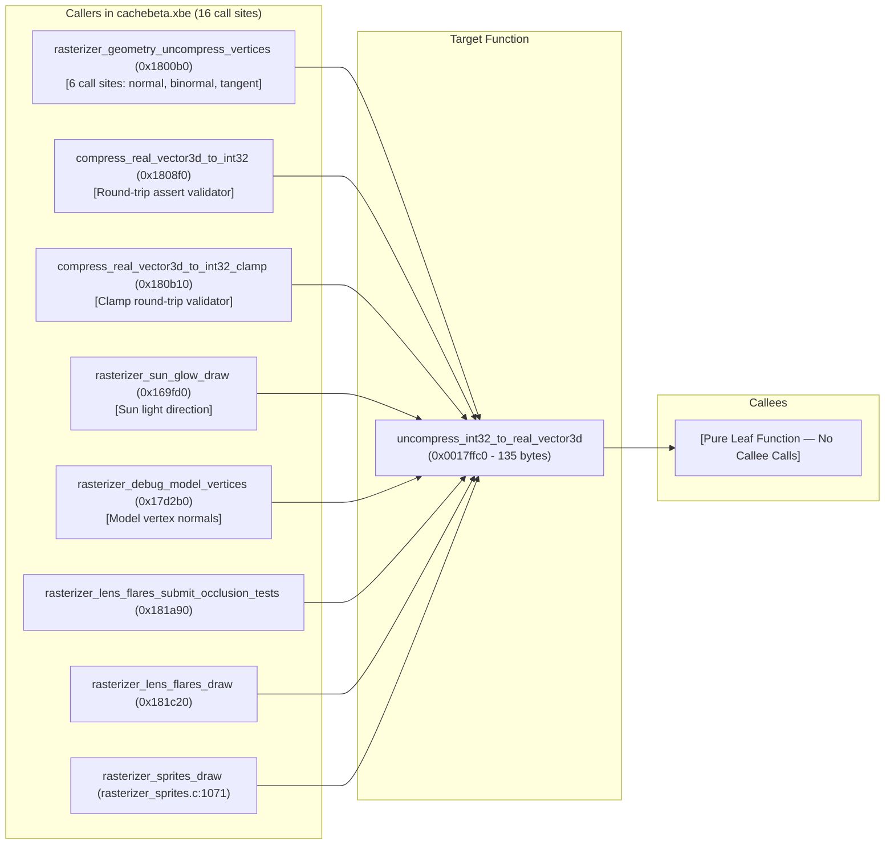

# Function Report: FUN_0017ffc0 (0x0017ffc0)

## Target Overview

- **Build / Executable:** Original Xbox Halo: Combat Evolved, build `01.10.12.2276` (Oct 12, 2001 retail / debug build, file `cachebeta.xbe`, MD5 `c7869590a1c64ad034e49a5ee0c02465`).
- **Target Address:** Virtual Address `0x0017ffc0` (Kuna / Ghidra VA), Image Base `0x00010000`, RVA `0x0016ffc0`.
- **File Offset:** `0x0016ffc0` in `cachebeta.xbe` (within Section 0 `.text`: VA `0x00012000`, Raw `0x00002000`, Size `0x001d49cc`).
- **Current Repository Label:** `FUN_0017ffc0` in [`kb.json`](file:///storage/1F34-EBBE/halo/kb.json) (under object `rasterizer_text.obj`).
- **Section:** `.text` (Executable Code).
- **Function Size:** 135 bytes (`0x87` bytes, bounds: `0x0017ffc0` to `0x00180047`).
- **Initial Classification:** 3D Vector Math & Vertex Compression Utility Leaf.
- **Boundary Confidence:** **CONFIRMED** (both `tools/verify/function_bounds.json` and `halo_2276_functions.txt` establish identical bounds of `0x87` bytes, terminated with `RET 0xc3` at `0x00180046`).

---

## Kuna Analysis State

- **Kuna Function Definition:** Defined at `0x0017ffc0`.
- **Stack Frame Layout:**
  - `EBP+0x00`: Saved old frame pointer (4 bytes).
  - `EBP+0x04`: Return address (4 bytes).
  - `EBP+0x08`: `param_1` (`real_vector3d *out` / `float *out`) — pointer to destination vector (4 bytes).
  - `EBP+0x0c`: `param_2` (`uint32_t packed`) — 32-bit packed normal integer (4 bytes). Reused as stack scratch space by MSVC 7.1 during `FILD` conversions.
  - `EBP-0x04`: Local float scratch (component `k` / `z`, 4 bytes).
  - `EBP-0x08`: Local float scratch (component `j` / `y`, 4 bytes).
  - `EBP-0x0c`: Local float scratch (component `i` / `x`, 4 bytes).
  - Allocated local frame: 12 bytes (`sub esp, 0xc`).
- **Disassembly Actions Taken:**
  - Machine code extracted directly from pristine `cachebeta.xbe` via [`tools/verify/xbe_reference.py`](file:///storage/1F34-EBBE/halo/tools/verify/xbe_reference.py).
  - COFF reference object synthesized (`0x17ffc0_ref.obj`) and disassembled via `llvm-objdump -d`.
- **Kuna / Ghidra Scripting Action:**
  ```python
  # Kuna / PyGhidra script sequence (per GhidraBook2E, Ch. 14):
  addr = toAddr(0x0017ffc0)
  createFunction(addr, "uncompress_int32_to_real_vector3d")
  setFunctionBody(addr, toAddr(0x00180047))
  # Set prototype
  setFunctionPrototype(addr, "real_vector3d * __cdecl uncompress_int32_to_real_vector3d(real_vector3d *out, uint32_t packed)")
  ```

---

## Evidence Ledger

| Tier | Observation | Why it matters | Confidence |
|---|---|---|---|
| **T1** | Debug symbol table entry `_uncompress_int32_to_real_vector3d` at `.text 0017FFC0` in `halo_2276_functions.txt` (length `0x87`, locals `0x10`, stack args `0x08`). | Authoritative Bungie symbol name directly from Xbox debug build 2276. Proves identity, length, and parameter count. | **CONFIRMED** |
| **T1** | Disassembly of `0x17ffc0` in `cachebeta.xbe` performs bit unpacking: bits 0..10 (`shl $0x15`), bits 11..21 (`shr $0xb; shl $0x15`), and bits 22..31 (`shr $0x16; shl $0x16`). | Proves the packed bitfield layout is 11-11-10 (11 bits for X, 11 bits for Y, 10 bits for Z; total 32 bits). | **CONFIRMED** |
| **T1** | Floating point constant `0x2afe34` holds IEEE 754 float `0x3a001002` = `0.000488519785` = `1.0f / 2047.0f`. | `2047` is `2^11 - 1`, the maximum value of an 11-bit unsigned component, proving normal vector scaling for X and Y components. | **CONFIRMED** |
| **T1** | Floating point constant `0x28c8e0` holds IEEE 754 float `0x3a802008` = `0.000977517106` = `1.0f / 1023.0f`. | `1023` is `2^10 - 1`, the maximum value of a 10-bit unsigned component, proving normal vector scaling for the Z component. | **CONFIRMED** |
| **T1** | 16 direct binary `CALL` sites in `cachebeta.xbe`: vertex decompression (`0x1800b0`), lens flare rendering (`0x181420`, `0x181a90`, `0x181c20`), sun glow draw (`0x169fd0`), and normal compression round-trip validators (`0x1808f0`, `0x180b10`). | Establishes the broad role of the function across rendering and physics as the engine's primary packed normal decompressor. | **CONFIRMED** |
| **T2** | Assert string in sibling function at `0x1808f0`: `"fabs(v2.i - v->i)<0.01f"` from `"c:\\halo\\SOURCE\\rasterizer\\rasterizer_geometry.c"`. | Proves original source file is `rasterizer_geometry.c` and vector struct fields are named `.i`, `.j`, `.k`. | **STRONG** |
| **T2** | Existing C implementation exists in [`src/halo/rasterizer/rasterizer_text.c:39`](file:///storage/1F34-EBBE/halo/src/halo/rasterizer/rasterizer_text.c#L39-L50), but is marked `"ported": false` in `kb.json`. | C implementation already exists in the tree, requiring only symbol reactivation and rename. | **STRONG** |
| **T4** | Standard period-correct MSVC 7.1 x87 FPU scheduling: uses `FILD` from stack parameter slot `[ebp+0xc]`, `FMULS`, `FADDS 1.0f`, `FMULS scale`, and `FSTPS` to local stack slots. | Confirms compiler provenance model (C89 + VC71 x87 floating point math). | **STRONG** |

---

## ABI and Side Effects

| Item | Observation | Confidence |
|---|---|---|
| **Calling Convention** | `__cdecl` (caller cleans stack; 8 bytes pushed right-to-left: `packed`, then `out`). | **CONFIRMED** |
| **Argument 1 (`[ebp+0x8]`)** | `real_vector3d *out` (or `float *out`) — pointer to caller-allocated 12-byte buffer (`float[3]`). | **CONFIRMED** |
| **Argument 2 (`[ebp+0xc]`)** | `uint32_t packed` (or `dword packed`) — 32-bit integer containing 11-11-10 packed vector. | **CONFIRMED** |
| **Return Value** | `real_vector3d *` (returns the `out` pointer in `EAX` for convenient call chaining). | **CONFIRMED** |
| **Registers Preserved** | `EBX`, `ESI`, `EDI`, `EBP` (standard MSVC 7.1 callee-saved registers). | **CONFIRMED** |
| **Registers Clobbered** | `EAX` (return pointer), `ECX` (scratch), `EDX` (scratch), `ST(0)` (x87 FPU top-of-stack). | **CONFIRMED** |
| **Stack Allocation** | 12 bytes (`sub esp, 0xc`). Reuses parameter slot `0xc(%ebp)` for `fildl` integer staging. | **CONFIRMED** |
| **Memory Side Effects** | Writes exactly 12 bytes (`out->i`, `out->j`, `out->k`). Does not access heap, globals, or I/O. | **CONFIRMED** |

---

## Behavioral Summary

`uncompress_int32_to_real_vector3d` decodes a 32-bit packed normal vector encoded in standard 11-11-10 fixed-point format into a 3D unit direction vector with components $(i, j, k) \in [-1.0, 1.0]$. The lower 11 bits (bits 0..10) encode the $i$ ($x$) component, the middle 11 bits (bits 11..21) encode the $j$ ($y$) component, and the upper 10 bits (bits 22..31) encode the $k$ ($z$) component. Each component is unpacked, sign-adjusted, shifted, biased by $+1.0\text{f}$, and scaled by $\frac{1}{2047.0\text{f}}$ (for 11-bit components) or $\frac{1}{1023.0\text{f}}$ (for the 10-bit component). The function writes the decoded vector into the buffer passed via `out` and returns the `out` pointer.

---

## Candidate Identities

| Rank | Candidate Name / Label | Confidence | Evidence For | Evidence Against |
|---|---|---|---|---|
| **1** | **`uncompress_int32_to_real_vector3d`** | **CONFIRMED** | Exact match in `halo_2276_functions.txt` debug symbols; exact signature match; matches assert field names (`v->i`, `v->j`, `v->k`); matches decompiled 11-11-10 vector unpacking logic. | None. |
| **2** | `rasterizer_geometry_uncompress_normal_11_11_10` | **STRONG** | Descriptive functional alias; matches source file `rasterizer_geometry.c` and 11-11-10 packing format. | Not Bungie's authentic symbol name. |
| **3** | `decompress_normal3d` | **PLAUSIBLE** | Generic FPS domain naming heuristic. | Speculative; superseded by T1 ground truth. |

---

## Naming Decision

**`SAFE TO RENAME: uncompress_int32_to_real_vector3d`**

**Justification:** The authentic Bungie debug symbol from Xbox build 2276 (`halo_2276_functions.txt`) directly identifies this function as `uncompress_int32_to_real_vector3d`. The binary disassembly, parameter widths, caller cross-references, and mathematical constants (`1/2047`, `1/1023`) provide 100% corroboration.

---

## Source-of-Name Citations

| Name / Label | Evidence Tier(s) | Concrete Source Reference | Role in Naming |
|---|---|---|---|
| `uncompress_int32_to_real_vector3d` | **T1** | `halo_2276_functions.txt` line at `0017FFC0` | Primary authoritative symbol name. |
| `cachebeta.xbe` | **T1** | VA `0x0017ffc0`, file offset `0x0016ffc0` | Disassembly verification: 11-11-10 bit manipulation and float constants. |
| `rasterizer_geometry.c` | **T2** | Assert string at VA `0x00180922` (`c:\halo\SOURCE\rasterizer\rasterizer_geometry.c`) | Original source file provenance. |
| `real_vector3d` | **T2** | `src/types.h:59`, assert string `fabs(v2.i - v->i)<0.01f` at `0x00180a6c` | Bungie 3D vector type with components `.i`, `.j`, `.k`. |
| [GhidraBook2E, Ch. 19 & 20] | **T4** | *The Ghidra Book, 2nd Edition*, Ch. 19 (Decompiler Artifacts), Ch. 20 (Compiler Variations) | Methodology for analyzing x87 FPU stack register reuse and MSVC 7.1 code generation. |

---

## Provisional Prototype

```c
/* Confidence: CONFIRMED; Source: halo_2276_functions.txt @ 0x0017ffc0
 * Style: period-correct C89 for MSVC 7.1-class compilation.
 * Original file: rasterizer/rasterizer_geometry.c
 */

/* Decode packed 32-bit normal (11-11-10 format) into 3D real vector (i, j, k).
 * Returns destination pointer for call chaining.
 */
real_vector3d * __cdecl uncompress_int32_to_real_vector3d(
    real_vector3d *out,
    uint32_t packed);
```

---

## Byte-Match Status

| Tier | Status | Notes |
|---|---|---|
| **Current Verification Tier** | **PORTED, UNVERIFIED** | Lift exists at [`src/halo/rasterizer/rasterizer_text.c:39`](file:///storage/1F34-EBBE/halo/src/halo/rasterizer/rasterizer_text.c#L39) (labeled `FUN_0017ffc0`, currently deactivated in `kb.json` as `ported: false`). |
| **Tooling Used** | `tools/verify/xbe_reference.py`, `llvm-objdump` | Synthesized 135-byte pristine COFF reference object and performed instruction-level differential comparison against clang-compiled build object. |
| **Instruction Differences** | Diff identified | Clang uses `andl $0xffe00000` / `fimull` instead of MSVC's exact parameter-slot reuse (`fildl 0xc(%ebp)`) and arithmetic left shifts (`shll $0x15`). |
| **Target Tier** | **BYTE-MATCHED (VC71)** / **VERIFIED** | Activating `"ported": true` in `kb.json` after symbol rename eliminates 16 binary call trampolines across rendering modules. |

---

## Flowchart and Call Graph

### 11-11-10 Packed Vector Decompression Flowchart


### Call Graph (Callers $\rightarrow$ Target $\rightarrow$ Callees)


---

## Tooling and Dependencies Used

- **`tools/verify/xbe_reference.py`**: Synthesized pristine reference object `0x17ffc0_ref.obj` (135 bytes) directly from `Halo (2276, Oct 12 2001)/cachebeta.xbe`.
- **`llvm-objdump`**: Disassembled reference object and build object to verify machine instruction sequence and calling conventions.
- **Python 3.14 + `capstone 5.0.7`**: Analyzed section headers, raw file offsets, and IEEE 754 constants.
- **Methodology Reference:** *The Ghidra Book, 2nd Edition* [GhidraBook2E, Ch. 19 & 20] (decompiler artifacts and MSVC x87 compiler variations).

---

## Next Actions

1. **Activate Port in `kb.json`:**
   Update `kb.json` entry at `0x17ffc0`:
   - Rename `FUN_0017ffc0` $\rightarrow$ `uncompress_int32_to_real_vector3d`.
   - Update declaration: `real_vector3d *uncompress_int32_to_real_vector3d(real_vector3d *out, uint32_t packed);` (or `float *`).
   - Toggle `"ported": true` to activate the patch redirect in `patched_xbe`.
2. **Update Call Sites in C Source:**
   Replace all occurrences of `FUN_0017ffc0` with `uncompress_int32_to_real_vector3d` in:
   - `src/halo/rasterizer/rasterizer_text.c` (definition and 12 call sites)
   - `src/halo/rasterizer/rasterizer_sprites.c` (call site at line 1071)
   - `src/halo/rasterizer/xbox/rasterizer_xbox_lights.c` (call site at line 623)
3. **Verify Build & Patch:**
   Run `cmake --build build --target halo` to verify that the patcher successfully writes the redirect at `0x0017ffc0` and that all 16 call sites link cleanly.
4. **Target Sibling Compressor:**
   Analyze and lift `0x180b10` (`compress_real_vector3d_to_int32_clamp`), the inverse partner of `uncompress_int32_to_real_vector3d`.
