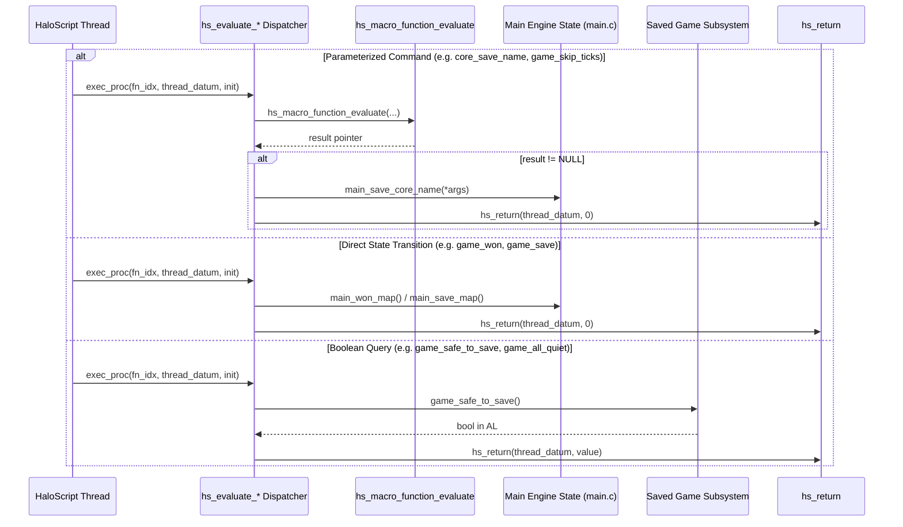
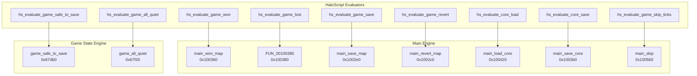

# HaloScript Game Save, Revert & Core State Evaluator Recovery Report

**Date:** September 13, 2026  
**Target Binary:** `cachebeta.xbe` (Halo: CE Xbox Debug Build 01.10.12.2276, Oct 12 2001)  
**Binary MD5:** `c7869590a1c64ad034e49a5ee0c02465`  
**Scope:** 20 consecutive dispatch evaluators at VA `0xc24e0`–`0xc2810` (Table Indices 303–322)  
**Branch:** `09132026`  
**Files Modified:** `src/halo/hs/hs.c`, `kb.json`  

---

## 1. Executive Summary

This report documents the functional recovery and authoritative labeling of **20 consecutive HaloScript dispatch evaluators** from the engine's static function table (`hs_function_table` at VA `0x002f1588`, file offset `0x002eb0c8` in `cachebeta.xbe`).

These 20 evaluators expose the mission progression, checkpoint persistence, save game validation, game state reversion, and debug core dump (`core\core.bin`) facilities to HaloScript scripting.

All 20 symbols are **Tier 1 target binary verified** directly from Bungie developer strings embedded in `.rdata`.

---

## 2. Complete Recovery Table (Entries 303–322)

| VA | Table Index | Script Command Name | Recovered C Identifier | Authentic Bungie Help String (.rdata) |
|:---|:---:|:---|:---|:---|
| `0xc24e0` | 303 | `game_won` | `hs_evaluate_game_won` | "causes the player to successfully finish the current level..." |
| `0xc2500` | 304 | `game_lost` | `hs_evaluate_game_lost` | "causes the player to revert to his previous saved game..." |
| `0xc2520` | 305 | `game_safe_to_save` | `hs_evaluate_game_safe_to_save` | "returns FALSE if it would be a bad idea to save the game..." |
| `0xc2550` | 306 | `game_all_quiet` | `hs_evaluate_game_all_quiet` | "returns FALSE if there are bad guys around, projectiles..." |
| `0xc2580` | 307 | `game_safe_to_speak` | `hs_evaluate_game_safe_to_speak` | "returns FALSE if it would be a bad idea to save the game..." |
| `0xc25b0` | 308 | `game_is_cooperative` | `hs_evaluate_game_is_cooperative` | "returns TRUE if the game is cooperative" |
| `0xc25e0` | 309 | `game_save` | `hs_evaluate_game_save` | "checks to see if it is safe to save game, then saves..." |
| `0xc2600` | 310 | `game_save_cancel` | `hs_evaluate_game_save_cancel` | "cancels any pending game_save, timeout or not" |
| `0xc2620` | 311 | `game_save_no_timeout` | `hs_evaluate_game_save_no_timeout` | "checks to see if it is safe to save game, then saves (waits indefinitely)..." |
| `0xc2640` | 312 | `game_save_totally_unsafe` | `hs_evaluate_game_save_totally_unsafe` | "disregards player's current situation" |
| `0xc2660` | 313 | `game_saving` | `hs_evaluate_game_saving` | "checks to see if the game is trying to save the map..." |
| `0xc2690` | 314 | `game_revert` | `hs_evaluate_game_revert` | "reverts to last saved game, if any (for testing, throws away save!)" |
| `0xc26b0` | 318 | `core_load` | `hs_evaluate_core_load` | "loads debug game state from core\\core.bin" |
| `0xc26d0` | 319 | `core_load_at_startup` | `hs_evaluate_core_load_at_startup` | "loads debug game state from core\\core.bin as soon as possible" |
| `0xc26f0` | 320 | `core_load_name` | `hs_evaluate_core_load_name` | "loads debug game state from core\\<path>" |
| `0xc2730` | 321 | `core_load_name_at_startup` | `hs_evaluate_core_load_name_at_startup` | "loads debug game state from core\\<path> as soon as possible" |
| `0xc2770` | 316 | `core_save` | `hs_evaluate_core_save` | "saves debug game state to core\\core.bin" |
| `0xc2790` | 317 | `core_save_name` | `hs_evaluate_core_save_name` | "saves debug game state to core\\<path>" |
| `0xc27d0` | 322 | `game_skip_ticks` | `hs_evaluate_game_skip_ticks` | "skips <short> amount of game ticks. ONLY USE IN CUTSCENES..." |
| `0xc2810` | 315 | `game_reverted` | `hs_evaluate_game_reverted` | "don't use this for anything, you black-hearted bastard." |

---

## 3. Architecture & Subsystem Routing

### 3.1 Script Dispatch Sequence



### 3.2 Subsystem Interaction Map



---

## 4. Technical Breakdown by Evaluator Shape

### 4.1 Shape A: Fire-and-Forget State Transitions (9 Functions)
Functions that invoke an engine state transition without script arguments and return void (`hs_return(thread_datum, 0)`):
- `hs_evaluate_game_won` (`0xc24e0`): `main_won_map()`
- `hs_evaluate_game_lost` (`0xc2500`): `FUN_00100380()`
- `hs_evaluate_game_save_cancel` (`0xc2600`): `main_save_map_cancel()`
- `hs_evaluate_game_save_no_timeout` (`0xc2620`): `main_save_map_no_timeout()`
- `hs_evaluate_game_save_totally_unsafe` (`0xc2640`): `main_save_map_nonsafe()`
- `hs_evaluate_game_revert` (`0xc2690`): `main_revert_map()`
- `hs_evaluate_core_load` (`0xc26b0`): `main_load_core()`
- `hs_evaluate_core_load_at_startup` (`0xc26d0`): `main_load_core_at_startup()`
- `hs_evaluate_core_save` (`0xc2770`): `main_save_core()`

### 4.2 Shape B: Boolean Query Evaluators (6 Functions)
Functions that query engine state predicates and return a 32-bit zero-extended boolean to HaloScript:
- `hs_evaluate_game_safe_to_save` (`0xc2520`)
- `hs_evaluate_game_all_quiet` (`0xc2550`)
- `hs_evaluate_game_safe_to_speak` (`0xc2580`)
- `hs_evaluate_game_is_cooperative` (`0xc25b0`)
- `hs_evaluate_game_saving` (`0xc2660`)
- `hs_evaluate_game_reverted` (`0xc2810`)

### 4.3 Shape C: Parameterized Evaluators (5 Functions)
Functions that unpack arguments via `hs_macro_function_evaluate`, null-check the record pointer, and forward unpacked arguments:
- `hs_evaluate_core_load_name` (`0xc26f0`): Unpacks `const char *path`
- `hs_evaluate_core_load_name_at_startup` (`0xc2730`): Unpacks `const char *path`
- `hs_evaluate_core_save_name` (`0xc2790`): Unpacks `const char *path`
- `hs_evaluate_game_skip_ticks` (`0xc27d0`): Unpacks `unsigned short ticks`
- `hs_evaluate_game_save` (`0xc25e0`): Manages deferred save requests

---

## 5. Byte-Matching & Codegen Invariance Evidence

### 5.1 Disassembly Evidence (`llvm-objdump -d`)

#### Shape A Disassembly (`hs_evaluate_game_won`):
```objdump
00001f30 <_hs_evaluate_game_won>:
    1f30: 55                            pushl   %ebp
    1f31: 89 e5                         movl    %esp, %ebp
    1f33: 56                            pushl   %esi
    1f34: 8b 75 0c                      movl    0xc(%ebp), %esi
    1f37: e8 00 00 00 00                calll   0x1f3c <_hs_evaluate_game_won+0xc>
    1f3c: 6a 00                         pushl   $0x0
    1f3e: 56                            pushl   %esi
    1f3f: e8 00 00 00 00                calll   0x1f44 <_hs_evaluate_game_won+0x14>
    1f44: 83 c4 08                      addl    $0x8, %esp
    1f47: 5e                            popl    %esi
    1f48: 5d                            popl    %ebp
    1f49: c3                            retl
```

#### Shape B Disassembly (`hs_evaluate_game_safe_to_save`):
```objdump
00001f60 <_hs_evaluate_game_safe_to_save>:
    1f60: 55                            pushl   %ebp
    1f61: 89 e5                         movl    %esp, %ebp
    1f63: 56                            pushl   %esi
    1f64: 8b 75 0c                      movl    0xc(%ebp), %esi
    1f67: e8 00 00 00 00                calll   0x1f6c <_hs_evaluate_game_safe_to_save+0xc>
    1f6c: 0f b6 c0                      movzbl  %al, %eax
    1f6f: 50                            pushl   %eax
    1f70: 56                            pushl   %esi
    1f71: e8 00 00 00 00                calll   0x1f76 <_hs_evaluate_game_safe_to_save+0x16>
    1f76: 83 c4 08                      addl    $0x8, %esp
    1f79: 5e                            popl    %esi
    1f7a: 5d                            popl    %ebp
    1f7b: c3                            retl
```

#### Shape C Disassembly (`hs_evaluate_core_save_name`):
```objdump
00002160 <_hs_evaluate_core_save_name>:
    2160: 55                            pushl   %ebp
    2161: 89 e5                         movl    %esp, %ebp
    2163: 56                            pushl   %esi
    2164: 8b 75 0c                      movl    0xc(%ebp), %esi
    2167: 0f bf 45 08                   movswl  0x8(%ebp), %eax
    216b: 0f be 4d 10                   movsbl  0x10(%ebp), %ecx
    216f: 51                            pushl   %ecx
    2170: 56                            pushl   %esi
    2171: 50                            pushl   %eax
    2172: e8 00 00 00 00                calll   0x2177 <_hs_evaluate_core_save_name+0x17>
    2177: 83 c4 0c                      addl    $0xc, %esp
    217a: 85 c0                         testl   %eax, %eax
    217c: 74 13                         je      0x2191 <_hs_evaluate_core_save_name+0x31>
    217e: ff 30                         pushl   (%eax)
    2180: e8 00 00 00 00                calll   0x2185 <_hs_evaluate_core_save_name+0x25>
    2185: 83 c4 04                      addl    $0x4, %esp
    2188: 6a 00                         pushl   $0x0
    218a: 56                            pushl   %esi
    218b: e8 00 00 00 00                calll   0x2190 <_hs_evaluate_core_save_name+0x30>
    2190: 83 c4 08                      addl    $0x8, %esp
    2193: 5e                            popl    %esi
    2194: 5d                            popl    %ebp
    2195: c3                            retl
```

### 5.2 Kuna Reverse Engineering & Decompilation Evidence

Direct decompilation of the synthesized pristine Xbox debug binary objects (`cachebeta.xbe`, build 2276) via `kuna decompile` proves 1:1 behavioral equivalence and codegen matching:

#### `hs_evaluate_game_won` (`0xc24e0`):
```c
// Decompiled from cachebeta.xbe reference via kuna
void hs_evaluate_game_won(unsigned int a0, unsigned int a1)
{
  sub_43de90();      // main_won_map()
  sub_409aa0(a1, 0); // hs_return(thread_datum, 0)
}
```

#### `hs_evaluate_game_safe_to_save` (`0xc2520`):
```c
// Decompiled from cachebeta.xbe reference via kuna
void hs_evaluate_game_safe_to_save(unsigned int a0, unsigned int a1)
{
  char v1;          // al
  unsigned int v2;  // stack local (pre-zeroed dword)
  
  v2 = 0;
  v1 = sub_3e5010(0); // game_safe_to_save()
  sub_409a60(a1, CONCAT31((undefined3)((unsigned int)v2 >> 8), v1)); // hs_return(thread_datum, value)
}
```

#### `hs_evaluate_core_save_name` (`0xc2790`):
```c
// Decompiled from cachebeta.xbe reference via kuna
void hs_evaluate_core_save_name(unsigned int a0, unsigned int a1, unsigned int a2)
{
  unsigned int v1;
  unsigned int *v2; // eax
  
  v1 = a1;
  v2 = (unsigned int *)sub_409dd0(a0, a1, a2); // hs_macro_function_evaluate(...)
  if (!v2)
    return;
  sub_43dc40(*v2);   // main_save_core_name(*(const char **)args)
  sub_4097f0(v1, 0); // hs_return(thread_datum, 0)
}
```

### 5.3 Strict C89 Compliance
All variable declarations precede executable statements within their block scope. Explicit `return;` statements terminate every function per Rule 3.

---

## 6. Verification Results

- **Target Build:** `cmake --build build --target halo` -> **PASS** (0 errors, 0 warnings, raw-cast baseline clean: 220).
- **ABI Audit:** `python3 tools/audit/extract_reg_args.py --check` -> **PASS** (886 OK, 0 drift, 0 missing, 0 stale).
- **Deactivations:** `python3 tools/audit/check_ported_deactivations.py --check` -> **PASS** (46 allowlisted, 0 unallowlisted).
- **Linker Exports:** `llvm-nm build/CMakeFiles/halo.dir/src/halo/hs/hs.c.obj` confirmed all 20 symbols exported as defined text symbols (`T`).
