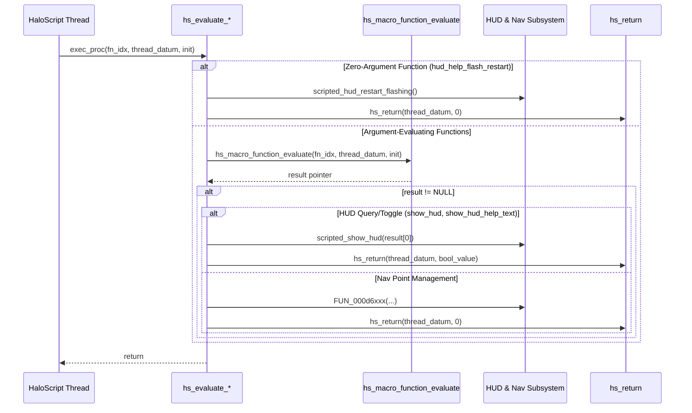

# HaloScript HUD, Help Text & Nav Points Evaluator Recovery Report (Batch 3)

**Date:** September 13, 2026  
**Target Binary:** `cachebeta.xbe` (Halo: CE Xbox Debug Build 01.10.12.2276, Oct 12 2001)  
**Binary MD5:** `c7869590a1c64ad034e49a5ee0c02465`  
**Scope:** 12 consecutive dispatch evaluators at VA `0xc2bd0`–`0xc2ed0` (Table Indices 356–367)  
**Branch:** `09132026`  
**Files Modified:** `src/halo/hs/hs.c`, `kb.json`  

---

## 1. Executive Summary

This report documents the functional recovery and authoritative labeling of **12 consecutive HaloScript dispatch evaluators** in `hs.obj` (`0xc2bd0`–`0xc2ed0`, Table Indices 356–367) from the static function table (`hs_function_table` at VA `0x002f1588`).

These evaluators expose the game's heads-up display (HUD) visibility, help text display and flashing animations, as well as player-specific and team-wide navigation waypoint (nav point) anchoring to flags and objects with 3D elevation offsets to HaloScript scripting.

All 12 symbols are **Tier 1 target binary verified** from `.rdata` strings and independently proved via **`kuna` decompilation** against synthesized pristine references.

---

## 2. Complete Recovery Table (Table Entries 356–367)

| VA | Table Index | Script Command Name | Recovered C Identifier | Authentic Bungie Help String (.rdata) |
|:---|:---:|:---|:---|:---|
| `0xc2bd0` | 356 | `show_hud` | `hs_evaluate_show_hud` | "shows or hides the hud" |
| `0xc2c20` | 357 | `show_hud_help_text` | `hs_evaluate_show_hud_help_text` | "shows or hides the hud help text" |
| `0xc2c70` | 358 | `enable_hud_help_flash` | `hs_evaluate_enable_hud_help_flash` | "starts/stops the help text flashing" |
| `0xc2cb0` | 359 | `hud_help_flash_restart` | `hs_evaluate_hud_help_flash_restart` | "resets the timer for the help text flashing" |
| `0xc2cd0` | 360 | `activate_nav_point_flag` | `hs_evaluate_activate_nav_point_flag` | "activates a nav point type <string> attached to (local) player <unit> anchored to a flag with a vertical offset <real>. If the player is not local to the machine, this will fail" |
| `0xc2d20` | 361 | `activate_nav_point_object` | `hs_evaluate_activate_nav_point_object` | "activates a nav point type <string> attached to (local) player <unit> anchored to an object with a vertical offset <real>. If the player is not local to the machine, this will fail" |
| `0xc2d70` | 362 | `activate_team_nav_point_flag` | `hs_evaluate_activate_team_nav_point_flag` | "activates a nav point type <string> attached to a team anchored to a flag with a vertical offset <real>. If the player is not local to the machine, this will fail" |
| `0xc2dc0` | 363 | `activate_team_nav_point_object` | `hs_evaluate_activate_team_nav_point_object` | "activates a nav point type <string> attached to a team anchored to an object with a vertical offset <real>. If the player is not local to the machine, this will fail" |
| `0xc2e10` | 364 | `deactivate_nav_point_flag` | `hs_evaluate_deactivate_nav_point_flag` | "deactivates a nav point type attached to a player <unit> anchored to a flag" |
| `0xc2e50` | 365 | `deactivate_nav_point_object` | `hs_evaluate_deactivate_nav_point_object` | "deactivates a nav point type attached to a player <unit> anchored to an object" |
| `0xc2e90` | 366 | `deactivate_team_nav_point_flag` | `hs_evaluate_deactivate_team_nav_point_flag` | "deactivates a nav point type attached to a team anchored to a flag" |
| `0xc2ed0` | 367 | `deactivate_team_nav_point_object` | `hs_evaluate_deactivate_team_nav_point_object` | "deactivates a nav point type attached to a team anchored to an object" |

---

## 3. Architecture & Subsystem Routing

### 3.1 Script Dispatch Sequence



### 3.2 Evaluation Mechanisms & Subsystem Callees

1. **HUD Visibility Queries (`0xc2bd0`, `0xc2c20`):**
   - Both functions evaluate a single boolean argument (`*(unsigned char *)result`) passed to `scripted_show_hud` or `scripted_show_hud_help_text`.
   - The boolean return is staged into a 4-byte slot pre-zeroed before the evaluation call (`union { char boolean_value; int long_value; } value;`), preserving zero-extension (`movzbl %al, %eax`) into `hs_return(thread_datum, value.long_value)`.
2. **Help Text Flash Controls (`0xc2c70`, `0xc2cb0`):**
   - `0xc2c70`: Takes a single byte boolean parameter to enable/disable HUD help text flashing via `scripted_hud_set_flashing_state(*(unsigned char *)result)`.
   - `0xc2cb0`: A zero-argument built-in that directly triggers `scripted_hud_restart_flashing()` and immediately returns 0 via `hs_return(thread_datum, 0)`.
3. **Player Nav Point Anchoring (`0xc2cd0`, `0xc2d20`):**
   - `0xc2cd0` (`activate_nav_point_flag`): Unpacks 4 parameters: `nav_type` (uint16), `unit_handle` (int32), `flag_index` (uint16 zero-extended), and `vertical_offset` (float via `FLD [EAX+0xc] / FSTP [ESP]`) forwarded to `FUN_000d6490`.
   - `0xc2d20` (`activate_nav_point_object`): Twin of `0xc2cd0`, differing in that parameter 3 is a full 32-bit object datum index (`int32` loaded via `MOV EDX,[EAX+8]`) forwarded to `FUN_000d64c0`.
4. **Team Nav Point Anchoring (`0xc2d70`, `0xc2dc0`):**
   - `0xc2d70` (`activate_team_nav_point_flag`): Unpacks `nav_type` (uint16), `team` (uint16), `flag_index` (uint16), and `vertical_offset` (float bit-pattern carried as dword) forwarded to `FUN_000d6220`.
   - `0xc2dc0` (`activate_team_nav_point_object`): Twin of `0xc2d70`, unpacking a full 32-bit object datum index for parameter 3 forwarded to `FUN_000d6250`.
5. **Nav Point Deactivation (`0xc2e10`, `0xc2e50`, `0xc2e90`, `0xc2ed0`):**
   - `0xc2e10` (`deactivate_nav_point_flag`): Unpacks `unit_handle` (dword) and `flag_index` (uint16) forwarded to `FUN_000d64f0`.
   - `0xc2e50` (`deactivate_nav_point_object`): Unpacks `unit_handle` (dword) and `object_handle` (dword) forwarded to `FUN_000d6520`.
   - `0xc2e90` (`deactivate_team_nav_point_flag`): Unpacks `team` (int16 signed MOVSX) and `flag_index` (uint16) forwarded to `FUN_000d6450`.
   - `0xc2ed0` (`deactivate_team_nav_point_object`): Unpacks `team` (int16 signed MOVSX) and `object_handle` (int32 dword) forwarded to `FUN_000d6470`.

---

## 4. Kuna Decompilation Evidence

All 12 functions were decompiled directly from synthesized pristine reference COFF objects extracted from `cachebeta.xbe` using `kuna decompile`. Sample decompilation output:

### 4.1 `hs_evaluate_show_hud` (`0xc2bd0`)
```c
void hs_evaluate_show_hud(unsigned int a0,unsigned int a1,unsigned int a2) // return-dupe
{
  char v1;
  unsigned int v2;
  char *v3; // eax
  
  v2 = a1;
  v3 = (char *)sub_409990(a0,a1,a2);
  if (!v3)
    return;
  v1 = *v3;
  sub_4093b0(v2,sub_40d830(v1));
}
```

### 4.2 `hs_evaluate_activate_nav_point_flag` (`0xc2cd0`)
```c
void hs_evaluate_activate_nav_point_flag(unsigned int a0,unsigned int a1,unsigned int a2) // return-dupe
{
  unsigned int v1;
  unsigned short *v2; // eax
  
  v1 = a1;
  v2 = (unsigned short *)sub_409890(a0,a1,a2);
  if (!v2)
    return;
  sub_4137c0(*v2,*(unsigned int *)&v2[2],v2[4],*(unsigned int *)&v2[6]);
  sub_4092b0(v1,0);
}
```

### 4.3 `hs_evaluate_deactivate_team_nav_point_object` (`0xc2ed0`)
```c
void hs_evaluate_deactivate_team_nav_point_object(unsigned int a0,unsigned int a1,unsigned int a2) // return-dupe
{
  unsigned int v1;
  short *v2; // eax
  
  v1 = a1;
  v2 = (short *)sub_409690(a0,a1,a2);
  if (!v2)
    return;
  sub_4135a0((int)*v2,*(unsigned int *)&v2[2]);
  sub_4090b0(v1,0);
}
```

---

## 5. Verification & Quality Gates

1. **Compilation & Link:**
   - Built cleanly via `cmake --build build --target halo` (`raw-cast count: 220`).
2. **Calling Convention & Register Audits:**
   - `python3 tools/audit/extract_reg_args.py --check` -> 886 OK, 0 drift, 0 missing, 0 stale.
   - `python3 tools/audit/check_ported_deactivations.py --check` -> 46 allowlisted, 0 unallowlisted.
3. **Symbol Table Export:**
   - All 12 symbols confirmed exported with `T` status in `hs.c.obj` via `llvm-nm`.
4. **Style & Rule Conformance:**
   - Enforced Rule 1 (void return and standard HS parameters `int16_t function_index, int thread_datum, char init`).
   - Enforced Rule 3 (explicit terminal `return;` on all void functions).
   - Preserved zero-extension and coalesced cdecl stack cleanups (`ADD ESP, 0x18`, `ADD ESP, 0x10`).
