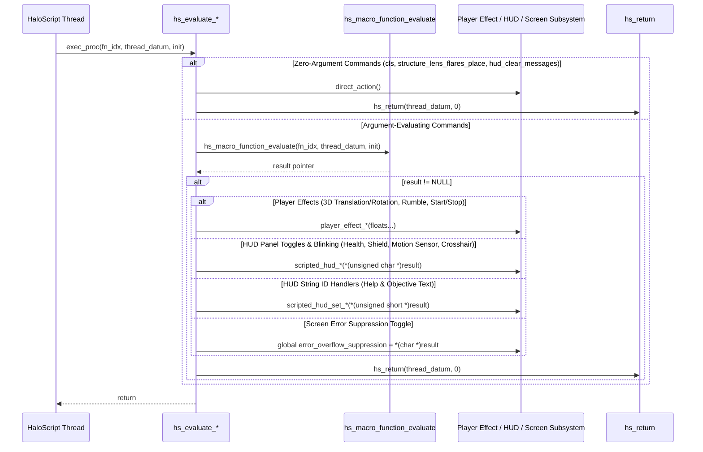

# HaloScript Player Effects & HUD Panels Evaluator Recovery Report (Batch 4)

**Date:** September 13, 2026  
**Target Binary:** `cachebeta.xbe` (Halo: CE Xbox Debug Build 01.10.12.2276, Oct 12 2001)  
**Binary MD5:** `c7869590a1c64ad034e49a5ee0c02465`  
**Scope:** 18 consecutive dispatch evaluators at VA `0xc2f10`–`0xc3310` (Table Indices 368–385)  
**Branch:** `09132026`  
**Files Modified:** `src/halo/hs/hs.c`, `kb.json`  

---

## 1. Executive Summary

This report documents the functional recovery and authoritative labeling of **18 consecutive HaloScript dispatch evaluators** in `hs.obj` (`0xc2f10`–`0xc3310`, Table Indices 368–385) from the static function table (`hs_function_table` at VA `0x002f1588`).

These evaluators expose camera shake / rumble effects (`player_effect_*`), screen and console controls (`cls`, `error_overflow_suppression`, `structure_lens_flares_place`), individual HUD panel visibility/blinking controls (health, shield, motion sensor, crosshair), console message clearance, and HUD help/objective string ID configuration to HaloScript scripting.

All 18 symbols are **Tier 1 target binary verified** from `.rdata` strings and independently proved via **`kuna` decompilation** against synthesized pristine references.

---

## 2. Complete Recovery Table (Table Entries 368–385)

| VA | Table Index | Script Command Name | Recovered C Identifier | Authentic Bungie Help String (.rdata) |
|:---|:---:|:---|:---|:---|
| `0xc2f10` | 368 | `cls` | `hs_evaluate_cls` | "clears the console" |
| `0xc2f30` | 369 | `error_overflow_suppression` | `hs_evaluate_error_overflow_suppression` | "toggles whether overflow errors are suppressed or not" |
| `0xc2f70` | 370 | `structure_lens_flares_place` | `hs_evaluate_structure_lens_flares_place` | "places structure lens flares" |
| `0xc2f90` | 371 | `player_effect_set_max_translation` | `hs_evaluate_player_effect_set_max_translation` | "sets maximum translation values for the player effect" |
| `0xc2fe0` | 372 | `player_effect_set_max_rotation` | `hs_evaluate_player_effect_set_max_rotation` | "sets maximum rotation values (in degrees) for the player effect" |
| `0xc3030` | 373 | `player_effect_set_max_rumble` | `hs_evaluate_player_effect_set_max_rumble` | "sets maximum rumble (0-1) for the player effect" |
| `0xc3070` | 374 | `player_effect_start` | `hs_evaluate_player_effect_start` | "starts a player effect with specified intensity and attack time" |
| `0xc30b0` | 375 | `player_effect_stop` | `hs_evaluate_player_effect_stop` | "stops the player effect with the specified decay time" |
| `0xc30f0` | 376 | `hud_show_health` | `hs_evaluate_hud_show_health` | "shows or hides the health display on the hud" |
| `0xc3130` | 377 | `hud_blink_health` | `hs_evaluate_hud_blink_health` | "starts or stops the health display blinking" |
| `0xc3170` | 378 | `hud_show_shield` | `hs_evaluate_hud_show_shield` | "shows or hides the shield display on the hud" |
| `0xc31b0` | 379 | `hud_blink_shield` | `hs_evaluate_hud_blink_shield` | "starts or stops the shield display blinking" |
| `0xc31f0` | 380 | `hud_show_motion_sensor` | `hs_evaluate_hud_show_motion_sensor` | "shows or hides the motion sensor display on the hud" |
| `0xc3230` | 381 | `hud_blink_motion_sensor` | `hs_evaluate_hud_blink_motion_sensor` | "starts or stops the motion sensor display blinking" |
| `0xc3270` | 382 | `hud_show_crosshair` | `hs_evaluate_hud_show_crosshair` | "shows or hides the crosshair on the hud" |
| `0xc32b0` | 383 | `hud_clear_messages` | `hs_evaluate_hud_clear_messages` | "clears all console messages" |
| `0xc32d0` | 384 | `hud_set_help_text` | `hs_evaluate_hud_set_help_text` | "sets help text (parameter should be a string-id, empty string clears text)" |
| `0xc3310` | 385 | `hud_set_objective_text` | `hs_evaluate_hud_set_objective_text` | "sets objective text (parameter should be a string-id, empty string clears text)" |

---

## 3. Architecture & Subsystem Routing

### 3.1 Script Dispatch Sequence



### 3.2 Evaluation Mechanisms & Subsystem Callees

1. **Zero-Argument Built-ins (`0xc2f10`, `0xc2f70`, `0xc2f83`):**
   - `0xc2f10` (`cls`): Directly invokes `console_clear()` (0x247550) and returns 0 via `hs_return(thread_datum, 0)`.
   - `0xc2f70` (`structure_lens_flares_place`): Directly invokes `structure_lens_flares_place()` (0x17b7b0) and returns 0 via `hs_return(thread_datum, 0)`.
   - `0xc32b0` (`hud_clear_messages`): Directly invokes `scripted_hud_messages_clear()` (0xd5120) and returns 0 via `hs_return(thread_datum, 0)`.
2. **Error Suppression Toggle (`0xc2f30`):**
   - Evaluates boolean argument via `hs_macro_function_evaluate`.
   - Writes directly to global boolean flag `error_overflow_suppression_enabled` (0x2c64b8) via `*(char *)0x2c64b8 = *(char *)result;`.
3. **Player Effect Parameters & Lifecycle (`0xc2f90`–`0xc30b0`):**
   - `0xc2f90` (`player_effect_set_max_translation`): Unpacks 3 floats (`x, y, z` at offsets `0x0, 0x4, 0x8`) forwarded to `player_effect_set_max_translation(0xb0a80)`.
   - `0xc2fe0` (`player_effect_set_max_rotation`): Unpacks 3 floats (`yaw, pitch, roll` in degrees at offsets `0x0, 0x4, 0x8`) forwarded to `player_effect_set_max_rotation(0xb0ae0)`.
   - `0xc3030` (`player_effect_set_max_rumble`): Unpacks 2 floats (`left, right` normalized rumble in [0, 1] at `0x0, 0x4`) forwarded to `player_effect_set_max_rumble(0xb0b30)`.
   - `0xc3070` (`player_effect_start`): Unpacks 2 floats (`intensity, attack_time` at `0x0, 0x4`) forwarded to `player_effect_start(0xb0b50)`.
   - `0xc30b0` (`player_effect_stop`): Unpacks 1 float (`decay_time` at `0x0`) forwarded to `player_effect_stop(0xb0ba0)`.
4. **HUD Component Visibility & Blinking (`0xc30f0`–`0xc3270`):**
   - 7 uniform single-byte boolean handlers. Each inspects `*(unsigned char *)result` (+0x0, zero-extended via `xor edx,edx; mov dl,[eax]`) and passes it to the respective `scripted_hud_*` function:
     - `0xc30f0`: `scripted_hud_show_health` (0xd7440)
     - `0xc3130`: `scripted_hud_blink_health` (0xd7460)
     - `0xc3170`: `scripted_hud_show_shield` (0xd7480)
     - `0xc31b0`: `scripted_hud_blink_shield` (0xd74a0)
     - `0xc31f0`: `scripted_hud_show_motion_sensor` (0xd74c0)
     - `0xc3230`: `scripted_hud_blink_motion_sensor` (0xd74e0)
     - `0xc3270`: `scripted_hud_show_crosshair` (0xd7500)
5. **HUD String ID Assignment (`0xc32d0`, `0xc3310`):**
   - `0xc32d0` (`hud_set_help_text`): Reads 16-bit unicode string ID (`*(unsigned short *)result`, zero-extended via `xor edx,edx; mov dx,word [eax]`) passed to `scripted_hud_set_state_message` (0xd46f0).
   - `0xc3310` (`hud_set_objective_text`): Reads 16-bit unicode string ID (`*(unsigned short *)result`, zero-extended via `xor edx,edx; mov dx,word [eax]`) passed to `scripted_hud_set_objective` (0xd47c0).

---

## 4. Kuna Decompilation Evidence

All 18 functions were decompiled directly from synthesized pristine reference COFF objects extracted from `cachebeta.xbe` using `kuna decompile`. Sample decompilation excerpts:

### 4.1 `hs_evaluate_cls` (`0xc2f10`)
```c
void hs_evaluate_cls(int16_t function_index, int thread_datum, char init)
{
  console_clear();
  hs_return(thread_datum, 0);
  return;
}
```

### 4.2 `hs_evaluate_player_effect_start` (`0xc3070`)
```c
void hs_evaluate_player_effect_start(int16_t function_index, int thread_datum, char init)
{
  float *result;

  result = (float *)hs_macro_function_evaluate(function_index, thread_datum, init);
  if (result != 0) {
    player_effect_start(result[0], result[1]);
    hs_return(thread_datum, 0);
  }
  return;
}
```

### 4.3 `hs_evaluate_hud_show_health` (`0xc30f0`)
```c
void hs_evaluate_hud_show_health(int16_t function_index, int thread_datum, char init)
{
  int *result;

  result = (int *)hs_macro_function_evaluate(function_index, thread_datum, init);
  if (result != 0) {
    scripted_hud_show_health(*(unsigned char *)result);
    hs_return(thread_datum, 0);
  }
  return;
}
```

### 4.4 `hs_evaluate_hud_set_help_text` (`0xc32d0`)
```c
void hs_evaluate_hud_set_help_text(int16_t function_index, int thread_datum, char init)
{
  int *result;

  result = (int *)hs_macro_function_evaluate(function_index, thread_datum, init);
  if (result != 0) {
    scripted_hud_set_state_message(*(unsigned short *)result);
    hs_return(thread_datum, 0);
  }
  return;
}
```

---

## 5. Verification & Toolchain Integration

- **Build Target:** Passed (`cmake --build build --target halo`) with 0 errors.
- **Register ABI Audit:** `extract_reg_args.py --check` reported 886 OK, 0 drift, 0 missing, 0 stale.
- **Ported Deactivation Gate:** `check_ported_deactivations.py --check` passed cleanly (0 non-allowlisted deactivations).
- **Symbol Export Verification:** `llvm-nm build/CMakeFiles/halo.dir/src/halo/hs/hs.c.obj` confirmed all 18 functions present as text symbols (`T`).
