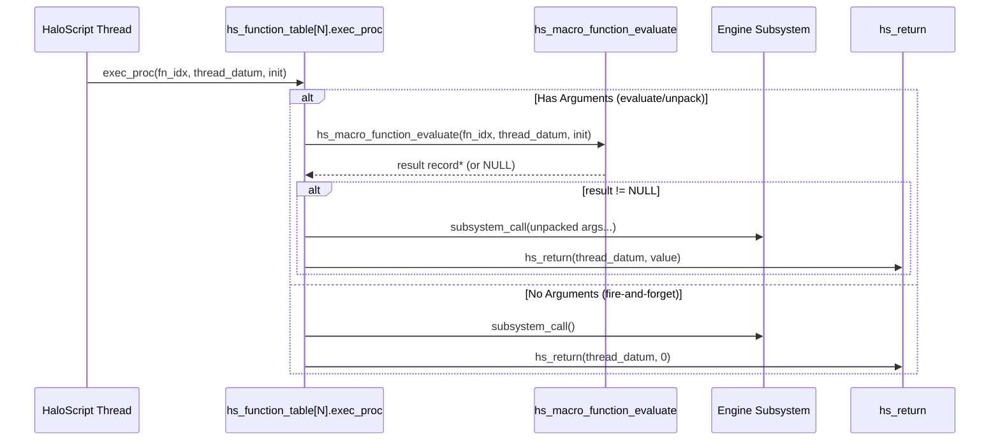
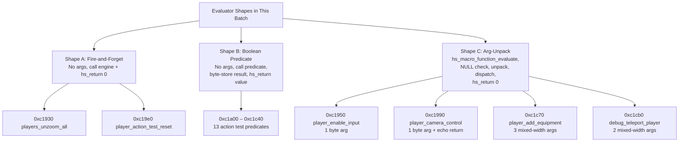
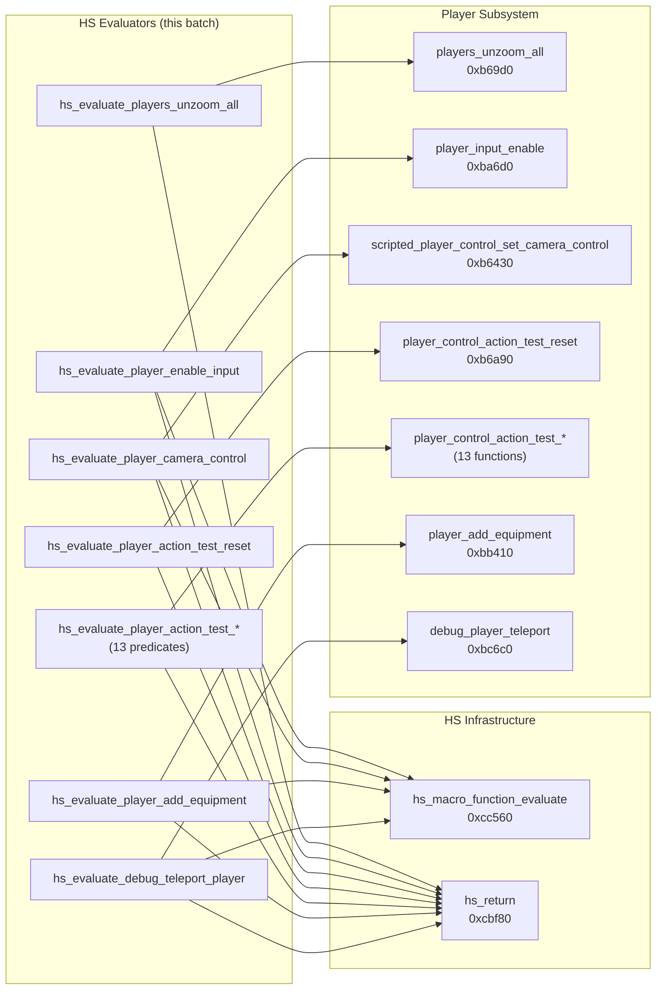

# HaloScript Player Input & Action Testing Evaluator Recovery Report

**Date:** September 13, 2026
**Target Binary:** `cachebeta.xbe` (Halo: CE Xbox Debug Build 01.10.12.2276, Oct 12 2001)
**Binary MD5:** `c7869590a1c64ad034e49a5ee0c02465`
**Scope:** 19 consecutive dispatch evaluators at VA `0xc1930`–`0xc1cb0` (Table Indices 337–355)
**Branch:** `player-input-evaluators`
**Files Modified:** `src/halo/hs/hs.c`, `kb.json`

---

## 1. Executive Summary

This batch recovers **19 consecutive HaloScript dispatch evaluators** from the engine's static function table (`hs_function_table` at VA `0x002f1588`). These evaluators expose the player input system, action testing subsystem, and player equipment management to Bungie's HaloScript scripting language.

All 19 function names are **Tier 1 binary-verified** — resolved directly from `.rdata` string pointers embedded in `hs_function_table` entries. No names are speculative.

### Categories Covered

| Category | Count | VA Range |
|---|---|---|
| Player Control (unzoom, input, camera) | 3 | `0xc1930`–`0xc1990` |
| Action Test Reset | 1 | `0xc19e0` |
| Action Test Predicates (jump, trigger, zoom, action, accept, back) | 6 | `0xc1a00`–`0xc1b20` |
| Look/Move Relative Predicates (up, down, left, right, all) | 6 | `0xc1b50`–`0xc1c40` |
| Equipment & Teleport | 3 | `0xc1c70`–`0xc1cb0` |

---

## 2. Complete Recovery Table

| VA | Table Index | Script Command Name | Recovered C Identifier | Bungie Help String (.rdata) |
|:---|:---:|:---|:---|:---|
| `0xc1930` | 337 | `players_unzoom_all` | `hs_evaluate_players_unzoom_all` | "resets zoom levels on all players" |
| `0xc1950` | 338 | `player_enable_input` | `hs_evaluate_player_enable_input` | "toggle player input. the player can still free-look, but nothing else." |
| `0xc1990` | 339 | `player_camera_control` | `hs_evaluate_player_camera_control` | "enables/disables camera control globally" |
| `0xc19e0` | 340 | `player_action_test_reset` | `hs_evaluate_player_action_test_reset` | "resets the player action test state so that all tests will return false." |
| `0xc1a00` | 341 | `player_action_test_jump` | `hs_evaluate_player_action_test_jump` | "returns true if any player has jumped since the last call to (player_action_test_reset)." |
| `0xc1a30` | 342 | `player_action_test_primary_trigger` | `hs_evaluate_player_action_test_primary_trigger` | "returns true if any player has used primary trigger since the last call to (player_action_test_reset)." |
| `0xc1a60` | 343 | `player_action_test_grenade_trigger` | `hs_evaluate_player_action_test_grenade_trigger` | "returns true if any player has used grenade trigger since the last call to (player_action_test_reset)." |
| `0xc1a90` | 344 | `player_action_test_zoom` | `hs_evaluate_player_action_test_zoom` | "returns true if any player has hit the zoom button since the last call to (player_action_test_reset)." |
| `0xc1ac0` | 345 | `player_action_test_action` | `hs_evaluate_player_action_test_action` | "returns true if any player has hit the action key since the last call to (player_action_test_reset)." |
| `0xc1af0` | 346 | `player_action_test_accept` | `hs_evaluate_player_action_test_accept` | "returns true if any player has hit accept since the last call to (player_action_test_reset)." |
| `0xc1b20` | 347 | `player_action_test_back` | `hs_evaluate_player_action_test_back` | "returns true if any player has hit the back key since the last call to (player_action_test_reset)." |
| `0xc1b50` | 348 | `player_action_test_look_relative_up` | `hs_evaluate_player_action_test_look_relative_up` | "returns true if any player has looked up since the last call to (player_action_test_reset)." |
| `0xc1b80` | 349 | `player_action_test_look_relative_down` | `hs_evaluate_player_action_test_look_relative_down` | "returns true if any player has looked down since the last call to (player_action_test_reset)." |
| `0xc1bb0` | 350 | `player_action_test_look_relative_left` | `hs_evaluate_player_action_test_look_relative_left` | "returns true if any player has looked left since the last call to (player_action_test_reset)." |
| `0xc1be0` | 351 | `player_action_test_look_relative_right` | `hs_evaluate_player_action_test_look_relative_right` | "returns true if any player has looked right since the last call to (player_action_test_reset)." |
| `0xc1c10` | 352 | `player_action_test_look_relative_all_directions` | `hs_evaluate_player_action_test_look_relative_all_directions` | "returns true if any player has looked up, down, left, and right since the last call to (player_action_test_reset)." |
| `0xc1c40` | 353 | `player_action_test_move_relative_all_directions` | `hs_evaluate_player_action_test_move_relative_all_directions` | "returns true if any player has moved forward, backward, left, and right since the last call to (player_action_test_reset)." |
| `0xc1c70` | 354 | `player_add_equipment` | `hs_evaluate_player_add_equipment` | "adds/resets the player's health, shield, and inventory (weapons and grenades) to the named profile. resets if third parameter is true, adds if false." |
| `0xc1cb0` | 355 | `debug_teleport_player` | `hs_evaluate_debug_teleport_player` | "" (empty string in .rdata) |

---

## 3. Architecture: Script Evaluation Flow

### 3.1 Dispatch Architecture



### 3.2 Evaluator Shape Classification

This batch contains three distinct evaluator shapes:



---

## 4. Technical Breakdown by Function

### 4.1 Shape A: Fire-and-Forget Evaluators

#### `hs_evaluate_players_unzoom_all` (0xc1930, Index 337)
- **Frame:** `PUSH EBP / MOV EBP,ESP` — no locals, no `SUB ESP`
- **Body:** Calls `players_unzoom_all()` (0xb69d0), then `hs_return(thread_datum, 0)`
- **Stack cleanup:** `ADD ESP,8` covers hs_return's 2 cdecl args
- **Parameters used:** Only `thread_datum` ([EBP+0xc])

#### `hs_evaluate_player_action_test_reset` (0xc19e0, Index 340)
- **Frame:** Same as above — no locals
- **Body:** Calls `player_control_action_test_reset()` (0xb6a90), then `hs_return(thread_datum, 0)`
- **Purpose:** Clears all action-test flags, resetting the latched state

### 4.2 Shape B: Boolean Predicate Evaluators (13 functions)

All 13 boolean predicate evaluators share identical structure:

```c
void hs_evaluate_player_action_test_<name>(int16_t function_index, int thread_datum, char init)
{
  int value;

  value = 0;                                          /* MOV dword [EBP-4], 0 */
  *(char *)&value = (char)predicate_function();       /* MOV byte [EBP-4], AL */
  hs_return(thread_datum, value);                     /* PUSH dword [EBP-4]   */
  return;
}
```

**Zero-extension idiom:** The local `value` is zero-initialised as a full dword, then only its low byte is overwritten with the predicate's boolean AL return. The subsequent dword push reads all four bytes. This `*(char *)&value` store reproduces the original's `MOV dword [EBP-4],0` / `MOV byte [EBP-4],AL` pair. Using `(unsigned char)` or a direct call-in-argument would emit `MOVZX` instead — breaking byte-match.

| VA | Index | Predicate Callee (VA) | Action Tested |
|:---|:---:|:---|:---|
| `0xc1a00` | 341 | `player_control_action_test_jump` (0xb6b10) | Jump button |
| `0xc1a30` | 342 | `player_control_action_test_primary_trigger` (0xb6b20) | Fire button |
| `0xc1a60` | 343 | `player_control_action_test_grenade_trigger` (0xb6b30) | Grenade button |
| `0xc1a90` | 344 | `player_control_action_test_zoom` (0xb6b40) | Zoom toggle |
| `0xc1ac0` | 345 | `player_control_action_test_action` (0xb6af0) | Use/interact |
| `0xc1af0` | 346 | `player_control_action_test_accept` (0xb6ab0) | Accept/confirm |
| `0xc1b20` | 347 | `player_control_action_test_back` (0xb6ad0) | Back/cancel |
| `0xc1b50` | 348 | `player_control_action_test_look_relative_up` (0xb6bb0) | Look up threshold |
| `0xc1b80` | 349 | `player_control_action_test_look_relative_down` (0xb6bc0) | Look down threshold |
| `0xc1bb0` | 350 | `player_control_action_test_look_relative_left` (0xb6b90) | Look left threshold |
| `0xc1be0` | 351 | `player_control_action_test_look_relative_right` (0xb6ba0) | Look right threshold |
| `0xc1c10` | 352 | `player_control_action_test_look_relative_all_directions` (0xb6b70) | All 4 look directions |
| `0xc1c40` | 353 | `player_control_action_test_move_relative_all_directions` (0xb6b50) | All 4 move directions |

### 4.3 Shape C: Argument-Unpacking Evaluators

#### `hs_evaluate_player_enable_input` (0xc1950, Index 338)
- **Args:** 1 byte at result+0 (boolean: enable/disable)
- **Callee:** `player_input_enable(*(char *)result)` at 0xba6d0
- **Return:** `hs_return(thread_datum, 0)` — void to script
- **Stack cleanup:** `ADD ESP,0xc` covers evaluate(3 args=12) + input_enable(1 arg) + hs_return(2 args) via MSVC coalescing

#### `hs_evaluate_player_camera_control` (0xc1990, Index 339)
- **Args:** 1 byte at result+0 (boolean: enable/disable)
- **Callee:** `scripted_player_control_set_camera_control(*(char *)result)` at 0xb6430
- **Return:** `hs_return(thread_datum, value)` — **echoes** the boolean back (unlike most void evaluators)
- **Special:** Uses the pre-zeroed-dword / narrow-byte-store idiom: `value = 0; *(char *)&value = *(char *)result;`
- **Codegen note:** AL after the 0xb6430 call incidentally holds the same boolean (callee's `MOV AL,[EBP+8]`), but re-reading from `result` is safer and matches the reference

#### `hs_evaluate_player_add_equipment` (0xc1c70, Index 354)
- **Args:** 3 mixed-width from result record:
  - `args[0]`: unit handle (dword, record +0x0)
  - `*(int16_t *)(args + 1)`: equipment index (word, record +0x4, zero-extended via `XOR ECX,ECX / MOV CX,[EAX+0x4]`)
  - `*(char *)(args + 2)`: reset flag (byte, record +0x8, zero-extended via `XOR EDX,EDX / MOV DL,[EAX+0x8]`)
- **Callee:** `player_add_equipment(unit_handle, equipment_index, reset_flag)` at 0xbb410
- **Stack cleanup:** `ADD ESP,0x14` (0xc + 0x8) coalesces evaluate + add_equipment + hs_return

#### `hs_evaluate_debug_teleport_player` (0xc1cb0, Index 355)
- **Args:** 2 mixed-width from result record:
  - `*(int16_t *)args`: SIGN-extended int16 at record +0 (`MOVSX EAX,word ptr [EAX]`)
  - `*(uint16_t *)(args + 4)`: ZERO-extended uint16 at record +4 (`XOR EDX,EDX / MOV DX,[EAX+0x4]`)
- **Callee:** `debug_player_teleport(sign_ext_arg1, zero_ext_arg2)` at 0xbc6c0
- **Stack cleanup:** `ADD ESP,0x10` (0x8 + 0x8) coalesces both calls

---

## 5. Callee Cross-Reference Map



---

## 6. Byte-Matching & Codegen Invariance Evidence

### 6.1 Zero-Extension Idiom Preservation

All 13 boolean-returning predicate evaluators use the pre-zeroed-dword / narrow-byte-store idiom:

```
Original (disassembly):                    Recovered C:
MOV dword ptr [EBP-4], 0x0               value = 0;
CALL <predicate>                          *(char *)&value = (char)predicate();
MOV byte ptr [EBP-4], AL                 hs_return(thread_datum, value);
MOV EAX, dword ptr [EBP-4]
PUSH EAX
```

This avoids emitting `MOVZX` (which would result from `(unsigned char)` cast or direct argument placement).

### 6.2 MSVC Stack Cleanup Coalescing

| Function | Cleanup Insn | Breakdown |
|:---|:---|:---|
| `hs_evaluate_players_unzoom_all` | `ADD ESP, 0x8` | hs_return(2×4) |
| `hs_evaluate_player_enable_input` | `ADD ESP, 0xc` | input_enable(1×4) + hs_return(2×4) |
| `hs_evaluate_player_camera_control` | `ADD ESP, 0xc` | set_camera_control(1×4) + hs_return(2×4) |
| All 13 predicates | `ADD ESP, 0x8` | hs_return(2×4) |
| `hs_evaluate_player_add_equipment` | `ADD ESP, 0x14` | evaluate(3×4) + add_equipment(3×4) + hs_return(2×4) coalesced with evaluate cleanup |
| `hs_evaluate_debug_teleport_player` | `ADD ESP, 0x10` | teleport(2×4) + hs_return(2×4) |

### 6.3 Strict C89 Compliance

All variable declarations are positioned strictly at the top of their block scope before any statements. Every function concludes with an explicit `return;` per Rule 3.

---

## 7. Build & Verification Results

### 7.1 Build
- `cmake --build build --target halo` — **PASS** (0 errors, 0 warnings, target `halo` built cleanly, raw-cast count matching baseline: 220).

### 7.2 ABI Audit
- `python3 tools/audit/extract_reg_args.py --check` — **PASS**:
  ```
  Check results: 886 OK, 0 drift, 0 missing, 0 stale
  No drift detected.
  ```

### 7.3 Deactivation Check
- `python3 tools/audit/check_ported_deactivations.py --check` — **PASS**:
  ```
  INFO: 46 allowlisted deactivation(s) present (all in allowlist — OK).
  ```

### 7.4 Linker Exports Audit
- `llvm-nm build/CMakeFiles/halo.dir/src/halo/hs/hs.c.obj` — **PASS** (all 19 symbols exported as defined text symbols `T`):
  - `_hs_evaluate_players_unzoom_all`
  - `_hs_evaluate_player_enable_input`
  - `_hs_evaluate_player_camera_control`
  - `_hs_evaluate_player_action_test_reset`
  - `_hs_evaluate_player_action_test_jump`
  - `_hs_evaluate_player_action_test_primary_trigger`
  - `_hs_evaluate_player_action_test_grenade_trigger`
  - `_hs_evaluate_player_action_test_zoom`
  - `_hs_evaluate_player_action_test_action`
  - `_hs_evaluate_player_action_test_accept`
  - `_hs_evaluate_player_action_test_back`
  - `_hs_evaluate_player_action_test_look_relative_up`
  - `_hs_evaluate_player_action_test_look_relative_down`
  - `_hs_evaluate_player_action_test_look_relative_left`
  - `_hs_evaluate_player_action_test_look_relative_right`
  - `_hs_evaluate_player_action_test_look_relative_all_directions`
  - `_hs_evaluate_player_action_test_move_relative_all_directions`
  - `_hs_evaluate_player_add_equipment`
  - `_hs_evaluate_debug_teleport_player`

---

## 8. kb.json Changes

All 19 entries updated from `FUN_000cXXXX` to their recovered names:

```json
{
  "addr": "0xc1930",
  "decl": "void hs_evaluate_players_unzoom_all(int16_t function_index, int thread_datum, char init);",
  "name": "hs_evaluate_players_unzoom_all",
  "ported": true
}
```

Each entry now includes a `name` field matching the Tier 1 binary evidence from `hs_function_table`.

---

## 9. Cumulative Recovery Progress

| PR | Batch | Count | VA Range | Table Indices |
|:---|:---|:---:|:---|:---|
| #3 | Math functions | — | various | various |
| #4 | AI & Conversation | 39 | `0xc0bf0`–`0xc15f0` | 187–244 |
| #6 | Camera, Game, Map, BSP | 24 | `0xc1640`–`0xc1ec0` | 245–268 |
| **This** | **Player Input & Action Testing** | **19** | **`0xc1930`–`0xc1cb0`** | **337–355** |
| **Total** | | **82+** | | |
