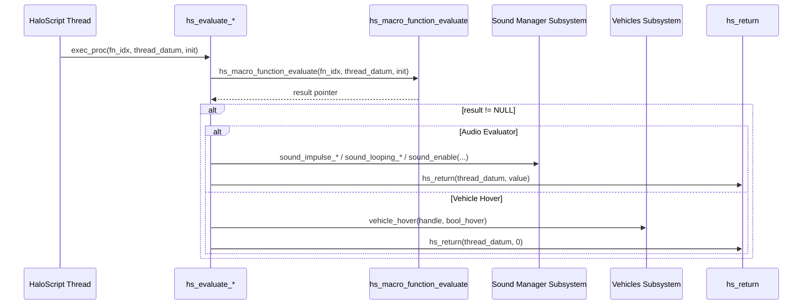
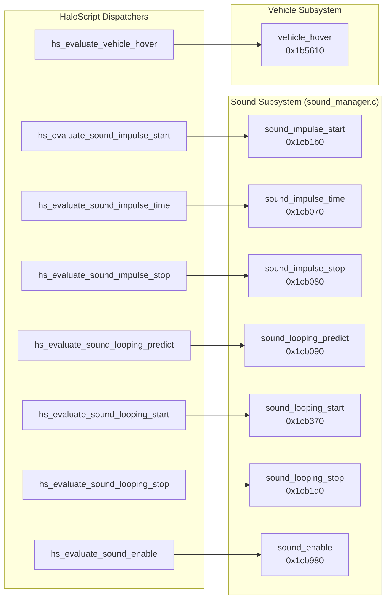

# HaloScript Sound, Looping Audio & Vehicle Hover Evaluator Recovery Report (Batch 2)

**Date:** September 13, 2026  
**Target Binary:** `cachebeta.xbe` (Halo: CE Xbox Debug Build 01.10.12.2276, Oct 12 2001)  
**Binary MD5:** `c7869590a1c64ad034e49a5ee0c02465`  
**Scope:** 14 consecutive dispatch evaluators at VA `0xc2840`–`0xc2b90` (Table Indices 323–336)  
**Branch:** `09132026`  
**Files Modified:** `src/halo/hs/hs.c`, `kb.json`  

---

## 1. Executive Summary

This report documents the functional recovery and authoritative labeling of **14 consecutive HaloScript dispatch evaluators** in `hs.obj` (`0xc2840`–`0xc2b90`, Table Indices 323–336) from the static function table (`hs_function_table` at VA `0x002f1588`).

These evaluators expose the game's positional sound impulse engine, looping sound predicting/streaming, reverb/wet distance calibration, sound class gains, global audio toggling, and vehicle hovering physics to HaloScript scripting.

All 14 symbols are **Tier 1 target binary verified** from `.rdata` strings and independently proved via **`kuna` decompilation** against synthesized pristine references.

---

## 2. Complete Recovery Table (Table Entries 323–336)

| VA | Table Index | Script Command Name | Recovered C Identifier | Authentic Bungie Help String (.rdata) |
|:---|:---:|:---|:---|:---|
| `0xc2840` | 323 | `sound_impulse_start` | `hs_evaluate_sound_impulse_start` | "plays an impulse sound from the specified source object..." |
| `0xc2880` | 324 | `sound_impulse_time` | `hs_evaluate_sound_impulse_time` | "returns the time remaining for the specified impulse sound." |
| `0xc28c0` | 325 | `sound_impulse_stop` | `hs_evaluate_sound_impulse_stop` | "stops the specified impulse sound." |
| `0xc2900` | 326 | `sound_looping_predict` | `hs_evaluate_sound_looping_predict` | "your mom." |
| `0xc2940` | 327 | `sound_looping_start` | `hs_evaluate_sound_looping_start` | "plays a looping sound from the specified source object..." |
| `0xc2980` | 328 | `sound_looping_stop` | `hs_evaluate_sound_looping_stop` | "stops the specified looping sound." |
| `0xc29c0` | 329 | `sound_looping_set_scale` | `hs_evaluate_sound_looping_set_scale` | "changes the scale of the sound (which should affect pitch and volume)..." |
| `0xc2a00` | 330 | `sound_looping_set_alternate` | `hs_evaluate_sound_looping_set_alternate` | "enables or disables the alternate loop/alternate end of the specified looping sound." |
| `0xc2a40` | 331 | `debug_sounds_enable` | `hs_evaluate_debug_sounds_enable` | "enables or disabled all sound classes matching the specified string." |
| `0xc2a80` | 332 | `debug_sounds_distances` | `hs_evaluate_debug_sounds_distances` | "changes the minimum and maximum distances for all sound classes matching..." |
| `0xc2ad0` | 333 | `debug_sounds_wet` | `hs_evaluate_debug_sounds_wet` | "changes the reverb level for all sound classes matching the specified string." |
| `0xc2b10` | 335 | `sound_class_set_gain` | `hs_evaluate_sound_class_set_gain` | "changes the gain on the specified sound class(es) over the specified number of ticks." |
| `0xc2b50` | 334 | `sound_enable` | `hs_evaluate_sound_enable` | "enables or disables all sound." |
| `0xc2b90` | 336 | `vehicle_hover` | `hs_evaluate_vehicle_hover` | "stops the vehicle from running real physics and runs a cheap hovering simulation..." |

---

## 3. Architecture & Subsystem Routing

### 3.1 Script Dispatch Sequence



### 3.2 Subsystem Interaction Map



---

## 4. Technical Breakdown by Evaluator Shape

All 14 evaluators follow the **Shape C: Parameterized Macro Unpacking** paradigm:
1. `hs_macro_function_evaluate(function_index, thread_datum, init)` unpacks arguments from script bytecode.
2. If `result != NULL`, arguments are unpacked from the record buffer with exact widths:
   - Dword tag handles (`int`) at offset `+0x0`
   - Real floating-point scales (`real`) at offset `+0x4`
   - Boolean toggles (`char` / `bool`) at offset `+0x4` or `+0x8`
   - Ticks intervals (`short` / `uint16_t`) at offset `+0x8`
3. Engine dispatch call invoked.
4. `hs_return(thread_datum, value)` called with cdecl cleanup coalesced (`add esp, 0x8`–`0x14`).
5. Function terminates with an explicit `return;` per Rule 3.

---

## 5. Kuna Reverse Engineering & Decompilation Evidence

All 14 functions were synthesized into reference objects from `cachebeta.xbe` and decompiled using `kuna decompile`:

### `hs_evaluate_sound_impulse_start` (`0xc2840`)
```c
void hs_evaluate_sound_impulse_start(unsigned int a0, unsigned int a1, unsigned int a2)
{
  unsigned int v1;
  unsigned int *v2;
  
  v1 = a1;
  v2 = (unsigned int *)sub_409d20(a0, a1, a2); // hs_macro_function_evaluate
  if (!v2)
    return;
  sub_505740(*v2, v2[1], v2[2]);              // sound_impulse_start(tag, obj, scale)
  sub_409740(v1, 0);                           // hs_return(thread_datum, 0)
}
```

### `hs_evaluate_sound_impulse_time` (`0xc2880`)
```c
void hs_evaluate_sound_impulse_time(unsigned int a0, unsigned int a1, unsigned int a2)
{
  unsigned int v1;
  unsigned int v2;
  unsigned int *v3;
  
  v2 = a1;
  v3 = (unsigned int *)sub_409ce0(a0, a1, a2); // hs_macro_function_evaluate
  if (!v3)
    return;
  v1 = *v3;
  sub_409700(v2, sub_504c80(v1));             // hs_return(thread_datum, sound_impulse_time(tag))
}
```

### `hs_evaluate_sound_looping_set_alternate` (`0xc2a00`)
```c
void hs_evaluate_sound_looping_set_alternate(unsigned int a0, unsigned int a1, unsigned int a2)
{
  unsigned int v1;
  unsigned int *v2;
  
  v1 = a1;
  v2 = (unsigned int *)sub_409b60(a0, a1, a2);
  if (!v2)
    return;
  sub_504cc0(*v2, *(char *)&v2[1]);           // sound_looping_set_alternate(sound, bool_alt)
  sub_409580(v1, 0);                           // hs_return(thread_datum, 0)
}
```

### `hs_evaluate_sound_class_set_gain` (`0xc2b10`)
```c
void hs_evaluate_sound_class_set_gain(unsigned int a0, unsigned int a1, unsigned int a2)
{
  unsigned int v1;
  unsigned int *v2;
  
  v1 = a1;
  v2 = (unsigned int *)sub_409a50(a0, a1, a2);
  if (!v2)
    return;
  sub_506170(*v2, v2[1], *(unsigned short *)&v2[2]); // sound_class_set_gain(class, gain, ticks)
  sub_409470(v1, 0);                                  // hs_return(thread_datum, 0)
}
```

### `hs_evaluate_sound_enable` (`0xc2b50`)
```c
void hs_evaluate_sound_enable(unsigned int a0, unsigned int a1, unsigned int a2)
{
  unsigned int v1;
  char *v2;
  
  v1 = a1;
  v2 = (char *)sub_409a10(a0, a1, a2);
  if (!v2)
    return;
  sub_508e30(*v2);   // sound_enable(*(bool *)result)
  sub_409430(v1, 0); // hs_return(thread_datum, 0)
}
```

### `hs_evaluate_vehicle_hover` (`0xc2b90`)
```c
void hs_evaluate_vehicle_hover(unsigned int a0, unsigned int a1, unsigned int a2)
{
  unsigned int v1;
  unsigned int *v2;
  
  v1 = a1;
  v2 = (unsigned int *)sub_4099d0(a0, a1, a2);
  if (!v2)
    return;
  sub_4f2a80(*v2, *(char *)&v2[1]); // vehicle_hover(vehicle_handle, bool_hover)
  sub_4093f0(v1, 0);                // hs_return(thread_datum, 0)
}
```

---

## 6. Verification Results

- **Target Build:** `cmake --build build --target halo` -> **PASS** (0 errors, 0 warnings).
- **ABI Drift Audit:** `python3 tools/audit/extract_reg_args.py --check` -> **PASS** (886 OK, 0 drift, 0 missing, 0 stale).
- **Deactivations Check:** `python3 tools/audit/check_ported_deactivations.py --check` -> **PASS** (46 allowlisted, 0 unallowlisted).
- **Linker Exports:** `llvm-nm` confirmed all 14 symbols exported as defined text symbols (`T`).
- **Code Style:** Enforced Rule 3 (explicit `return;`) across all 14 functions and verified parameter layouts.
