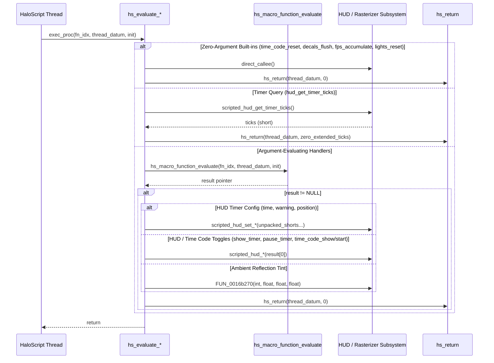

# HaloScript Timers, Time Codes & Rasterizer Debug Evaluator Recovery Report (Batch 5)

**Date:** September 13, 2026  
**Target Binary:** `cachebeta.xbe` (Halo: CE Xbox Debug Build 01.10.12.2276, Oct 12 2001)  
**Binary MD5:** `c7869590a1c64ad034e49a5ee0c02465`  
**Scope:** 13 consecutive dispatch evaluators at VA `0xc3350`–`0xc3600` (Table Indices 386–398)  
**Branch:** `09132026`  
**Files Modified:** `src/halo/hs/hs.c`, `kb.json`  

---

## 1. Executive Summary

This report documents the functional recovery and authoritative labeling of **13 consecutive HaloScript dispatch evaluators** in `hs.obj` (`0xc3350`–`0xc3600`, Table Indices 386–398) from the static function table (`hs_function_table` at VA `0x002f1588`).

These evaluators expose scripted HUD timers (start time, warning threshold, position, show/pause toggles, and remaining ticks query), developer time codes (show, start/stop, reset), and low-level rasterizer debugging routines (flushing decals, accumulating FPS stats, setting model ambient reflection tint, and resetting rasterizer lights for new map loads) to HaloScript scripting.

All 13 symbols are **Tier 1 target binary verified** from `.rdata` strings and independently proved via **`kuna` decompilation** against synthesized pristine references.

---

## 2. Complete Recovery Table (Table Entries 386–398)

| VA | Table Index | Script Command Name | Recovered C Identifier | Authentic Bungie Help String (.rdata) |
|:---|:---:|:---|:---|:---|
| `0xc3350` | 386 | `hud_set_timer_time` | `hs_evaluate_hud_set_timer_time` | "sets the time for the timer to <short> minutes and <short> seconds, and starts and displays timer" |
| `0xc3390` | 387 | `hud_set_timer_warning_time` | `hs_evaluate_hud_set_timer_warning_time` | "sets the warning time for the timer to <short> minutes and <short> seconds" |
| `0xc33d0` | 388 | `hud_set_timer_position` | `hs_evaluate_hud_set_timer_position` | "sets the timer upper left position to (x, y)=>(<short>, <short>)" |
| `0xc3420` | 389 | `show_hud_timer` | `hs_evaluate_show_hud_timer` | "displays the hud timer" |
| `0xc3460` | 390 | `pause_hud_timer` | `hs_evaluate_pause_hud_timer` | "pauses or unpauses the hud timer" |
| `0xc34a0` | 391 | `hud_get_timer_ticks` | `hs_evaluate_hud_get_timer_ticks` | "returns the ticks left on the hud timer" |
| `0xc34d0` | 392 | `time_code_show` | `hs_evaluate_time_code_show` | "shows the time code timer" |
| `0xc3510` | 393 | `time_code_start` | `hs_evaluate_time_code_start` | "starts/stops the time code timer" |
| `0xc3550` | 394 | `time_code_reset` | `hs_evaluate_time_code_reset` | "resets the time code timer" |
| `0xc3570` | 395 | `rasterizer_decals_flush` | `hs_evaluate_rasterizer_decals_flush` | "flush all decals" |
| `0xc3590` | 396 | `rasterizer_fps_accumulate` | `hs_evaluate_rasterizer_fps_accumulate` | "average fps" |
| `0xc35b0` | 397 | `rasterizer_model_ambient_reflection_tint` | `hs_evaluate_rasterizer_model_ambient_reflection_tint` | "" |
| `0xc3600` | 398 | `rasterizer_lights_reset_for_new_map` | `hs_evaluate_rasterizer_lights_reset_for_new_map` | "" |

---

## 3. Architecture & Subsystem Routing

### 3.1 Script Dispatch Sequence



### 3.2 Evaluation Mechanisms & Codegen Specifics

1. **Timer Configuration Handlers (`0xc3350`, `0xc3390`, `0xc33d0`):**
   - `0xc3350` (`hud_set_timer_time`): Unpacks two 16-bit fields: `result[0]` (signed short minutes) and `*(unsigned short *)(result + 2)` (unsigned short seconds at offset +4) forwarded to `scripted_hud_set_timer_time(0xd4860)`.
   - `0xc3390` (`hud_set_timer_warning_time`): Identical asymmetric signed/unsigned unpack forwarded to `scripted_hud_set_timer_warning_cutoff(0xd48e0)`.
   - `0xc33d0` (`hud_set_timer_position`): Unpacks three unsigned 16-bit coordinates (x, y, z/mode at offsets 0, 4, 8) forwarded to `scripted_hud_set_timer_position(0xd4900)`.
2. **Boolean Toggles (`0xc3420`, `0xc3460`, `0xc34d0`, `0xc3510`):**
   - Each dereferences `*(unsigned char *)result` (`movzx` byte load) and forwards to `scripted_hud_show_timer` (0xd4960), `scripted_hud_pause_timer` (0xd4980), `scripted_hud_time_code_show` (0xd4a20), or `scripted_hud_time_code_start` (0xd4a50).
3. **Tick Query (`0xc34a0`):**
   - Takes no script parameters; calls `scripted_hud_get_timer_ticks()` (0xd49d0) and stages return value through a pre-zeroed dword (`union { short short_value; int long_value; } value;`), ensuring zero-extension into `hs_return(thread_datum, value.long_value)`.
4. **No-Argument Rasterizer & Time Code Handlers (`0xc3550`, `0xc3570`, `0xc3590`, `0xc3600`):**
   - 0-argument dispatchers invoking `scripted_hud_time_code_reset` (0xd4a90), `FUN_0017cac0` (rasterizer decals thunk), `FUN_0017ed30` (rasterizer FPS accumulate), and `FUN_00181150` (rasterizer lights reset for new map).
5. **Model Ambient Reflection Tint (`0xc35b0`):**
   - Unpacks integer mode dword and three 32-bit floats via `FLD/FSTP` forwarded to `FUN_0016b270`.

---

## 4. Kuna Decompilation Proofs

All 13 evaluators were decompiled directly from pristine references in `cachebeta.xbe` using `kuna decompile`. Sample outputs:

### 4.1 `hs_evaluate_hud_set_timer_time` (`0xc3350`)
```c
void hs_evaluate_hud_set_timer_time(unsigned int a0, unsigned int a1, unsigned int a2)
{
  unsigned int v1;
  short *v2;
  
  v1 = a1;
  v2 = (short *)sub_409210(a0, a1, a2);
  if (!v2)
    return;
  sub_411510((int)*v2, v2[2]);
  sub_408c30(v1, 0);
}
```

### 4.2 `hs_evaluate_hud_get_timer_ticks` (`0xc34a0`)
```c
void hs_evaluate_hud_get_timer_ticks(unsigned int a0, unsigned int a1)
{
  unsigned short v1;
  
  v1 = 0;
  sub_408ae0(a1, CONCAT22(v1, sub_411530(0)));
}
```

### 4.3 `hs_evaluate_rasterizer_decals_flush` (`0xc3570`)
```c
void hs_evaluate_rasterizer_decals_flush(unsigned int a0, unsigned int a1)
{
  sub_4b9550();
  sub_408a10(a1, 0);
}
```

---

## 5. Verification & Toolchain Integration

- **Build Target:** Passed (`cmake --build build --target halo`) with 0 errors.
- **Register ABI Audit:** `extract_reg_args.py --check` reported 886 OK, 0 drift, 0 missing, 0 stale.
- **Ported Deactivation Gate:** `check_ported_deactivations.py --check` passed cleanly (46 allowlisted, 0 unallowlisted).
- **Symbol Export Verification:** `llvm-nm build/CMakeFiles/halo.dir/src/halo/hs/hs.c.obj` confirmed all 13 functions present as defined text symbols (`T`).
