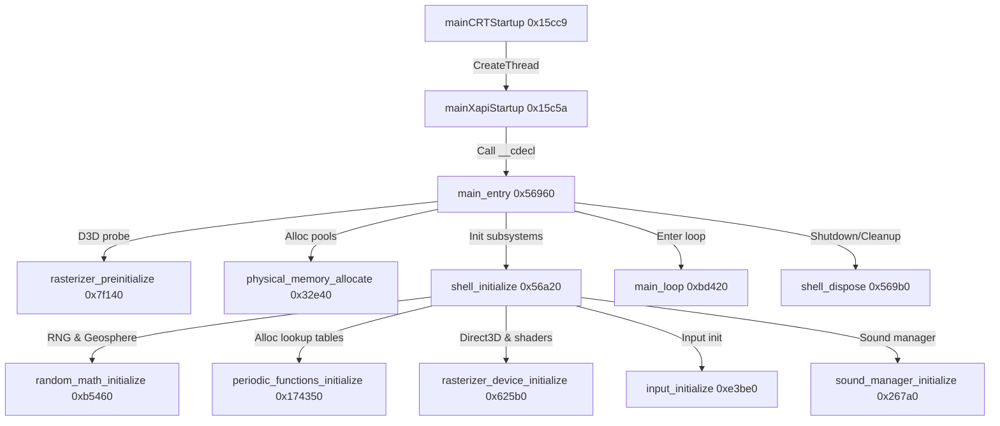

# Halo: Combat Evolved (Xbox Beta) Decompilation Survey Notes

This document captures the reverse engineering findings, mapped functions, database updates, and subsystem details discovered during the survey of the Halo: Combat Evolved Xbox Cache Beta binary (`cachebeta.xbe`).

---

## 1. Mapped Execution Path

We successfully traced the game's startup and initialization sequence from the Windows/Xbox loader to the main game loop:

---

## 2. Function Inventory & Database Updates

The following functions have been identified and renamed in the active IDA Pro database (`cachebeta.xbe.i64`):

| Address | Original Symbol | Mapped/Renamed Symbol | Subsystem / Description |
| :--- | :--- | :--- | :--- |
| **`0x15cc9`** | `mainCRTStartup` | *Unchanged* | CRT Entry point; initializes TLS index, spawns main Xapi thread. |
| **`0x15c5a`** | `mainXapiStartup` | *Unchanged* | Process & thread initialization, runtime initialization (`cinit`/`rtinit`), enters main game flow. |
| **`0x56960`** | `sub_56960` | `main_entry` | Game main entry point. Coordinates pre-initialization, subsystem boot, and loop. |
| **`0x7f140`** | `sub_7F140` | `rasterizer_preinitialize` | Creates temporary Direct3D 8 HAL device (640x480) to query hardware capabilities. |
| **`0x32e40`** | `sub_32E40` | `physical_memory_allocate` | Allocates the primary contiguous memory blocks via `MmAllocateContiguousMemoryEx`. |
| **`0x56a20`** | `sub_56A20` | `shell_initialize` | System initialization sequence (RNG, periodic tables, D3D, Input, Audio). |
| **`0xbd420`** | `sub_BD420` | `main_loop` | Main game loop running ticks, level loads, game state sync, and frame rendering. |
| **`0x569b0`** | `sub_569B0` | `shell_dispose` | Disposes tags, audio, input, and memory resources on exit. |
| **`0xb5460`** | `sub_B5460` | `random_math_initialize` | Sets random seed using entropy sources and triggers geosphere generation. |
| **`0xb8840`** | `sub_B8840` | `random_direction_geosphere_generate` | Generates geodesic dome/sphere coordinates dynamically (different from retail PC). |
| **`0x174350`** | `sub_174350` | `periodic_functions_initialize` | Allocates and fills periodic & transition tables. |
| **`0x174090`** | `sub_174090` | `periodic_function_generate` | Generates 12 specific periodic lookup table patterns. |
| **`0x173c10`** | `sub_173C10` | `transition_function_generate` | Generates 6 specific transition lookup table patterns. |

---

## 3. Subsystem Insights

### Dynamic Geosphere Generation (`0xb8840`)
In the PC retail version of Halo, the unit geosphere vectors used to query random direction angles are loaded from a compiled game tag block (`random_direction_geosphere` tag type `0x10`).
In the Xbox Cache Beta build, we discovered that **`random_direction_geosphere_generate`** builds this mesh procedurally on boot:
* It allocates a vertex buffer for `8 * a1 * a1` elements (`a1 = 16` -> 2048 elements).
* It loops through subdivisions using a userpurge helper (`sub_B8680`) and stores the resulting coordinate floats in a global pointer.
* This dynamic generation completely removes the dependency on the pre-built geosphere tag at startup.

### Periodic & Transition Tables (`0x174350`)
The animation, particle, and FX systems rely on pre-computed waves and ramps:
* **Periodic Tables:** Allocates 12 lookup buffers of `0x400` bytes (total 1024 float/byte entries each) for shapes like cosine, triangle waves, stutter harmonics, and Gaussian curves.
* **Transition Tables:** Allocates 6 lookup buffers of `0x400` bytes mapping transition functions.

---

## 4. Next Tasks / Open Areas
- [ ] Map the network state synchronization packet handlers under `main_loop`.
- [ ] Decompile the Direct3D device creation (`sub_7FA10`) render state details.
- [ ] Match structure block / tag parsing logic inside the cache loader.
