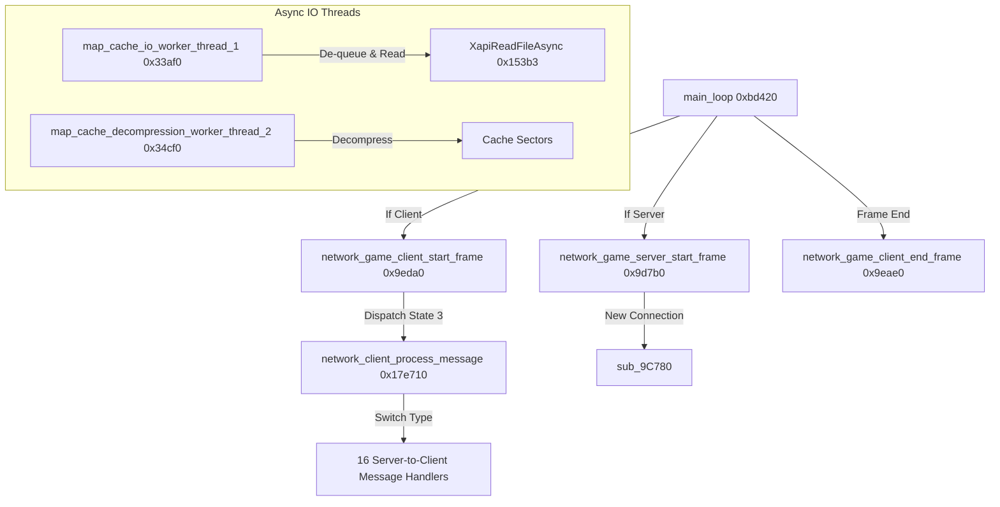

# Halo: Combat Evolved (Xbox Beta) Decompilation Survey Notes (Part 2)

This document captures the second phase of reverse engineering findings on the Halo: Combat Evolved Xbox Cache Beta (`cachebeta.xbe`). We focus on the network message loops, asynchronous file system I/O, and Xbox-specific NV2A Direct3D render states.

---

## 1. Mapped Execution Path

The diagram below details the execution path of the network tick loop and background asynchronous I/O threads:

---

## 2. Function Inventory & Database Updates

The following functions have been identified, renamed, and commented in the active IDA Pro database (`cachebeta.xbe.i64`):

| Address | Original Symbol | Mapped/Renamed Symbol | Subsystem / Description |
| :--- | :--- | :--- | :--- |
| **`0x9eda0`** | `sub_9EDA0` | `network_game_client_start_frame` | Client start frame; manages connection state updates and processes packets. |
| **`0x9d7b0`** | `sub_9D7B0` | `network_game_server_start_frame` | Server start frame; monitors link status and accepts incoming client joins. |
| **`0x9eae0`** | `sub_9EAE0` | `network_game_client_end_frame` | Client end frame; handles packet finalization and transmit queues. |
| **`0x17e710`** | `sub_17E710` | `network_client_process_message` | Client-side network message dispatcher; parses packet headers. |
| **`0x17e200`** | `sub_17E200` | `handle_message_server_game_advertise` | Client handler for incoming server advertise messages (Type 2). |
| **`0x17e1a0`** | `sub_17E1A0` | `handle_message_server_pong` | Client handler for ping response messages (Type 3). |
| **`0x17e0f0`** | `sub_17E0F0` | `handle_message_server_machine_accepted` | Client handler for join machine accepted messages (Type 4). |
| **`0x17e040`** | `sub_17E040` | `handle_message_server_machine_rejected` | Client handler for join machine rejected messages (Type 5). |
| **`0x17e4e0`** | `sub_17E4E0` | `handle_message_server_game_settings_update` | Client handler for settings synchronization messages (Type 6). |
| **`0x17dfa0`** | `sub_17DFA0` | `handle_message_server_pregame_countdown` | Client handler for pregame start countdown status (Type 7). |
| **`0x17e5b0`** | `sub_17E5B0` | `handle_message_server_begin_game` | Client handler for server starting gameplay transition (Type 8). |
| **`0x17ddd0`** | `sub_17DDD0` | `handle_message_server_graceful_game_exit_pregame` | Client handler for pregame graceful disconnect (Type 9). |
| **`0x17df10`** | `sub_17DF10` | `handle_message_server_pregame_keep_alive` | Client handler for pregame keepalive ping (Type 10). |
| **`0x17de80`** | `sub_17DE80` | `handle_message_server_postgame_keep_alive` | Client handler for postgame keepalive ping (Type 11). |
| **`0x17e410`** | `sub_17E410` | `handle_message_server_game_update` | Client handler for in-game state sync packet payload (Type 20). |
| **`0x17e350`** | `sub_17E350` | `handle_message_server_add_player_ingame` | Client handler for dynamic player join announcements (Type 21). |
| **`0x17e290`** | `sub_17E290` | `handle_message_server_remove_player_ingame` | Client handler for dynamic player quit announcements (Type 22). |
| **`0x17dd40`** | `sub_17DD40` | `handle_message_server_game_over` | Client handler for match game-over announcements (Type 23). |
| **`0x17e660`** | `sub_17E660` | `handle_message_server_switch_to_pregame` | Client handler for postgame transition back to lobby (Type 30). |
| **`0x17dc80`** | `sub_17DC80` | `handle_message_server_graceful_game_exit_postgame` | Client handler for postgame lobby exit/cleanup status (Type 31). |
| **`0x14640`** | `sub_14640` | `XapiCreateFile` | standard wrapper translating parameters to NT Native `NtCreateFile`. |
| **`0x15455`** | `sub_15455` | `XapiGetFileSize` | Wrapper mapping standard Win32 file size query logic. |
| **`0x15375`** | `sub_15375` | `XapiGetFileSizeEx` | Calls `NtQueryInformationFile` for standard size attributes. |
| **`0x150a4`** | `sub_150A4` | `XapiSetFilePointer` | Calls `NtSetInformationFile` for current file pointer update. |
| **`0x15020`** | `sub_15020` | `XapiSetEndOfFile` | Calls `NtSetInformationFile` to truncate/adjust file size. |
| **`0x153b3`** | `sub_153B3` | `XapiReadFileAsync` | Asynchronous file read callback wrapper calling `NtReadFile`. |
| **`0x15404`** | `sub_15404` | `XapiWriteFileAsync` | Asynchronous file write callback wrapper calling `NtWriteFile`. |
| **`0x331d0`** | `sub_331D0` | `XapiExecuteAsyncIo` | Standard async I/O loop worker coordinating pending APC queues. |
| **`0x33af0`** | `StartAddress` | `map_cache_io_worker_thread_1` | Worker thread prioritizing and submitting file read requests. |
| **`0x34cf0`** | `sub_34CF0` | `map_cache_decompression_worker_thread_2` | Worker thread decompressing streamed map sectors in background. |
| **`0x625b0`** | `sub_625B0` | `rasterizer_device_initialize` | Sets up memory contexts and starts Direct3D hardware device. |
| **`0x7fa10`** | `sub_7FA10` | `rasterizer_device_initialize_internal` | Allocates textures, sets shader constant mode, and configures GPU render states. |

---

## 3. Subsystem Insights

### Dynamic Geosphere Generation (`0xb8840`)
In the PC retail version of Halo, the unit geosphere vectors used to query random direction angles are loaded from a compiled game tag block (`random_direction_geosphere` tag type `0x10`).
In the Xbox Cache Beta build, we discovered that **`random_direction_geosphere_generate`** builds this mesh procedurally on boot:
* It allocates a vertex buffer for `8 * a1 * a1` elements (`a1 = 16` -> 2048 elements).
* It loops through subdivisions using a userpurge helper (`sub_B8680`) and stores the resulting coordinate floats in a global pointer.
* This dynamic generation completely removes the dependency on the pre-built geosphere tag at startup.

### Periodic & Transition Tables (`0x174350`)
The animation, particle, and FX systems rely on pre-computed waves and ramps:
* **Periodic Tables:** Allocates 12 lookup buffers of `0x400` bytes (total 1024 float/byte entries each) for shapes like cosine, triangle waves, stutter harmonics, and Gaussian curves.
* **Transition Tables:** Allocates 6 lookup buffers of `0x400` bytes mapping transition functions.

---

## 4. Xbox NV2A D3D Render States

During D3D device setup in **`rasterizer_device_initialize_internal` (`0x7fa10`)**, we mapped the following Xbox-specific registers and render states:

* **Alpha Blend Enable (`0x40304` / `820`):** Set to 1 to enable alpha blending.
* **Alpha Blend Source/Destination (`0x40344` / `836`):** Standard blending multipliers.
* **Alpha Blend Op (`0x40348` / `840`):** Set to `0x8006` (`D3DBLENDOP_ADD`).
* **Depth/Z-Comparison Function (`0x40354` / `852`):** Set to `515` (`0x203` -> `D3DCMP_LESSEQUAL`).
* **Logical Op (`0x4035c` / `860`):** Direct GPU logical raster operations.
* **Soft Display & Flicker Filters:** Xbox TV output encoders configured to use flicker filtering.
