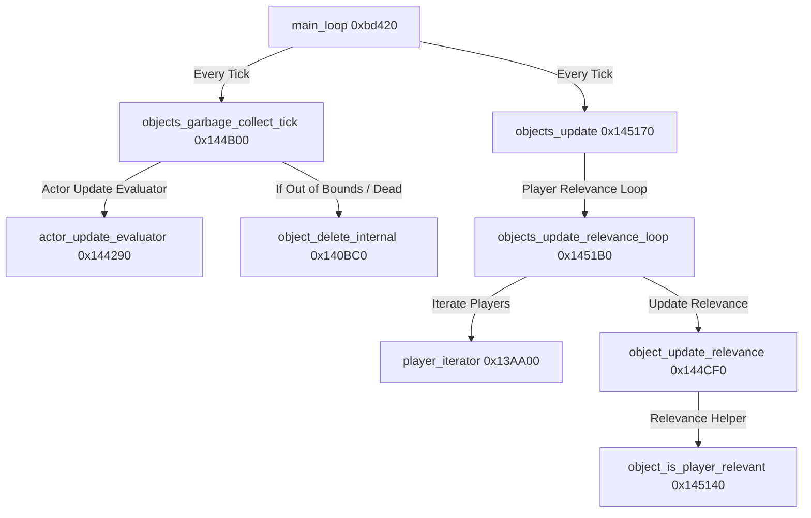
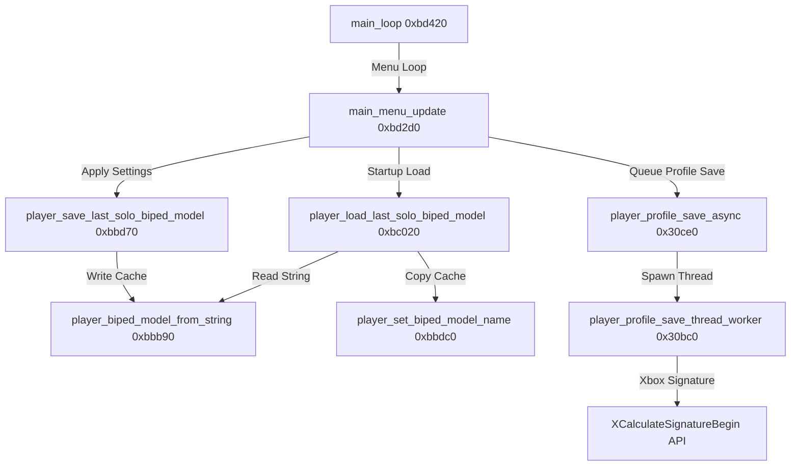

# Halo: Combat Evolved (Xbox Beta) Decompilation Survey Notes (Part 3)

This document captures the third phase of reverse engineering findings on the Halo: Combat Evolved Xbox Cache Beta (`cachebeta.xbe`). We focus on the Object Table Manager subsystem, Xbox player profiles (async disk I/O, signing), and multiplayer biped configuration paths.

---

## 1. Mapped Execution Paths

### Object Update & Garbage Collection Flow
The diagram below details the interaction flow between player tick updates, relevance determination, and the garbage collection of dead/unreachable game entities:

### Profile Saving & Biped Selection Flow
The diagram below illustrates how player character model updates are written to the local filesystem (`z:\last_solo.txt`) and asynchronously signed and saved to the Xbox hard disk:

---

## 2. Function Inventory & Database Updates

The following functions have been identified, renamed, and commented in the active IDA Pro database (`cachebeta.xbe.i64`):

| Address | Original Symbol | Mapped/Renamed Symbol | Subsystem / Description |
| :--- | :--- | :--- | :--- |
| **`0x30BC0`** | `sub_30BC0` | `player_profile_save_thread_worker` | Async thread worker that calculates savegame signatures and writes profiles to disk. |
| **`0x30CE0`** | `sub_30CE0` | `player_profile_save_async` | Initiates asynchronous player profile saves using Xbox worker threads. |
| **`0x13AA00`** | `sub_13AA00` | `player_iterator` | Iterator helper that traverses active player indices inside player tables. |
| **`0x140BC0`** | `sub_140BC0` | `object_delete_internal` | Main function that tears down unit references, cleans attachments, and deletes objects. |
| **`0x143C00`** | `sub_143C00` | `object_new` | Instantiates new objects and registers headers inside the global data tables. |
| **`0x144290`** | `sub_144290` | `actor_update_evaluator` | Handles per-tick evaluations of player-to-actor visibility and updates. |
| **`0x144B00`** | `sub_144B00` | `objects_garbage_collect_tick` | Ticks periodic dynamic entity cleanup loops and monitors overall memory pressure. |
| **`0x144CF0`** | `sub_144CF0` | `object_update_relevance` | Inner relevance routine evaluating distances, visibility, and state of players. |
| **`0x145140`** | `sub_145140` | `object_is_player_relevant` | Checks if a given player is near or relevant (e.g. within 5.0 units distance). |
| **`0x1451B0`** | `sub_1451B0` | `objects_update_relevance_loop` | Outer relevance loop checking player relationship tables for updates. |
| **`0x1453A0`** | `sub_1453A0` | `objects_update_visibility_loop` | Checks player-to-player visibility changes and updates player relationship indices. |
| **`0xBBB90`** | `sub_BBB90` | `player_biped_model_from_string` | Parses string representations of multiplayer characters (e.g. `"a10"`, `"b30"`) to index `0-9`. |
| **`0xBBD70`** | `sub_BBD70` | `player_save_last_solo_biped_model` | Saves the chosen player model name string to the Xbox cache file `z:\last_solo.txt`. |
| **`0xBBDC0`** | `sub_BBDC0` | `player_set_biped_model_name` | Copies the chosen biped model string name to the global memory buffer. |
| **`0xBC020`** | `sub_BC020` | `player_load_last_solo_biped_model` | Reads `z:\last_solo.txt` at boot to restore the last configured character model. |
| **`0xBD2D0`** | `sub_BD2D0` | `main_menu_update` | Main loop sub-helper executing menu screens, title music, and biped changes. |

---

## 3. Subsystem Insights

### Dynamic Entity Garbage Collection (`0x144B00`)
The game engine maintains system stability by performing a periodic garbage collection sweep of objects. Under `objects_garbage_collect_tick`:
* It iterates through active actors/units using `player_iterator` structures.
* It checks if entities are dead or marked for deletion (using unit shield/body vitality checks or out-of-bounds map checks).
* If an entity is marked for deletion or fails active presence checks, it calls `object_delete_internal` to clean up parent/child attachments and release its slots from the `player_data` array.

### Player Relevance & Update Rates (`0x1451B0` & `0x144CF0`)
The engine dynamically adjusts update rates based on spatial relationship and PVS (Potentially Visible Set) state:
* Local players and entities in the same PVS sector are marked as high relevance and update every tick.
* Remote/distant players are checked via `object_is_player_relevant` against a distance threshold (e.g., `5.0` units).
* If a remote player is too far away or outside the active PVS, updates are throttled to save bandwidth and FPU computation time.

### Xbox Biped Cache & Profiles (`0xBBB90` & `0xBC020`)
Xbox Halo manages local client customization profiles differently from standard PC builds:
* **Model Choices**: The biped/model indices are mapped from strings: `"a10"`, `"a30"`, `"a50"`, `"b30"`, `"b40"`, `"c10"`, `"c20"`, `"c40"`, `"d20"`, `"d40"`.
* **FS Cache**: It saves the last chosen biped model choice directly to `z:\last_solo.txt`. The `Z:` drive represents the Xbox DVD cache utility partition, allowing fast startup configuration reads without mounting large content paths.
* **Async Profiles**: When saving player settings, the engine executes `player_profile_save_async` to spawn a worker thread (`player_profile_save_thread_worker`). This worker thread uses the Xbox XDK `XCalculateSignatureBegin` API family to append tamper-proof SHA1 signatures to savegames before flushing them to the hard disk.
