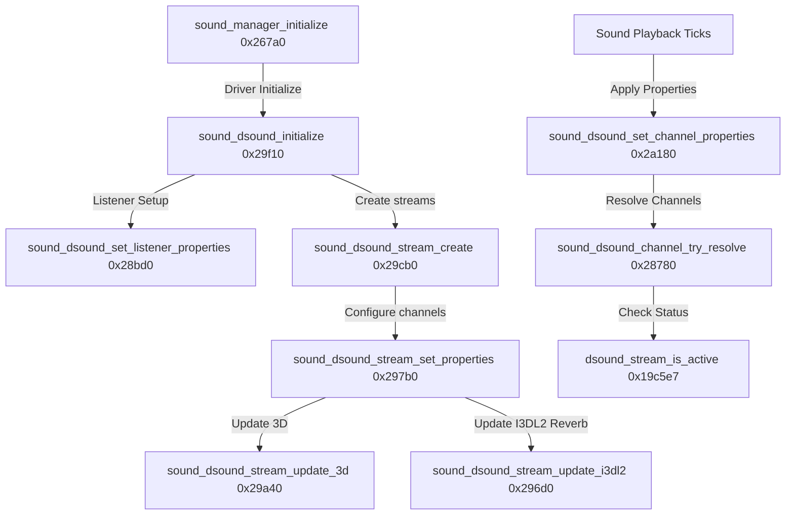

# Halo: Combat Evolved (Xbox Beta) Decompilation Survey Notes (Part 4)

This document captures the fourth phase of reverse engineering findings on the Halo: Combat Evolved Xbox Cache Beta (`cachebeta.xbe`). We focus on the DirectSound audio engine layer, Xbox-specific hardware voices, environmental reverb (I3DL2), and kernel-level stream status tracking.

---

## 1. Mapped Execution Path

The diagram below details the DirectSound initialization, stream configuration, and channel resolution pipelines:

---

## 2. Function Inventory & Database Updates

The following functions have been identified, renamed, and commented in the active IDA Pro database (`cachebeta.xbe.i64`):

| Address | Original Symbol | Mapped/Renamed Symbol | Subsystem / Description |
| :--- | :--- | :--- | :--- |
| **`0x285A0`** | `sub_285A0` | `sound_dsound_dispose` | Disposes DirectSound objects and cleans up active audio buffers. |
| **`0x28780`** | `sub_28780` | `sound_dsound_channel_try_resolve` | Searches for inactive actual channels to bind to a virtual channel request. |
| **`0x28840`** | `sub_28840` | `sound_dsound_log_error` | Outputs detailed DirectSound warning and error HRESULT diagnostic logs. |
| **`0x28BD0`** | `sub_28BD0` | `sound_dsound_set_listener_properties` | Configures 3D listener positions, velocity vectors, and environmental reverb. |
| **`0x296D0`** | `sub_296D0` | `sound_dsound_stream_update_i3dl2` | Submits I3DL2 (Interactive 3D Audio Level 2) room reflection parameters to hardware. |
| **`0x297B0`** | `sub_297B0` | `sound_dsound_stream_set_properties` | DirectSound stream updater processing pitch, volume, and cone attenuation properties. |
| **`0x29A40`** | `sub_29A40` | `sound_dsound_stream_update_3d` | Calculates and applies updated 3D coordinate matrices to active streams. |
| **`0x29CB0`** | `sub_29CB0` | `sound_dsound_stream_create` | Allocates and boots hardware voice streams using `IDirectSound_CreateSoundStream`. |
| **`0x29F10`** | `sub_29F10` | `sound_dsound_initialize` | Initializer creating the DirectSound COM instance, configuring distance factors, and loading DSP image. |
| **`0x2A180`** | `sub_2A180` | `sound_dsound_set_channel_properties` | Translates sound manager channel index into a stream property update command. |
| **`0x19C5E7`** | `sub_19C5E7` | `dsound_stream_is_active` | Direct kernel memory reader verifying stream status bits against mask `0x10000002`. |

---

## 3. Subsystem Insights

### DSP Image Downloading (`0x29F10`)
Unlike standard Win32 PC platforms, Xbox uses a specialized NV2A hardware audio processor (MCPX) requiring custom DSP microcode images:
* `sound_dsound_initialize` uses the Xbox-only API `IDirectSound_DownloadEffectsImage` to download a compiled DSP image payload (`unk_1DCA38`, size `14940` bytes) directly onto the hardware.
* This DSP image configures the hardware mix bins for Dolby Digital, HRTF spatialization filters, and I3DL2 environment parameters.

### I3DL2 Reverb Integration (`0x28BD0` & `0x296D0`)
The engine translates positional coordinates and material types into environmental reverb settings:
* Dynamic changes in rooms/ BSP geometry adjust room, reflection, and decay properties.
* The settings are formatted into the DirectSound structure and submitted via the Xbox COM method `IDirectSound_SetI3DL2Listener` (for the overall listener context) and `IDirectSoundStream_SetI3DL2Source` (for individual audio sources).

### Kernel-Level Stream Status Checking (`0x19C5E7`)
To check if a voice/stream is actively playing without blocking CPU execution, `dsound_stream_is_active` queries the Xbox audio processor's hardware channel registers:
* Instead of using high-level query APIs, it reads the status flags from the stream's memory structure offset `+36` and tests the kernel status bit mask `0x10000002`.
* Non-zero indicates the hardware voice is still processing samples, preventing premature channel eviction.
